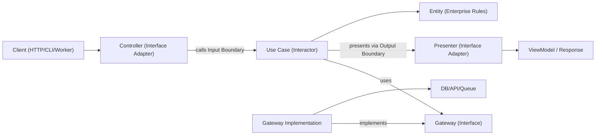
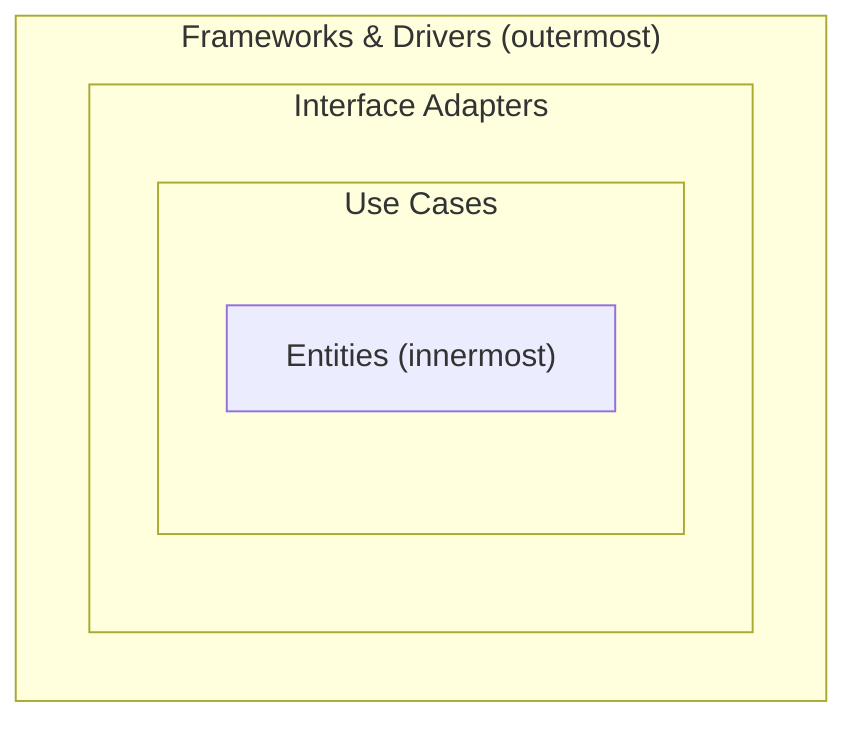

# Clean Architecture

Clean Architecture (Robert C. Martin) organizes code into concentric layers separated by the Dependency Rule: source code dependencies may point only inward. Entities sit at the center, surrounded by Use Cases, then Interface Adapters, then Frameworks & Drivers at the outermost ring. Business rules stay independent of UI, database, web framework, and external agencies.

## When to Use

- Building new features where long-term maintainability, testability, and independence from frameworks matter.
- Refactoring layered or framework-heavy code where business rules are entangled with delivery and persistence.
- Supporting multiple delivery mechanisms (HTTP, CLI, queue worker, scheduler) for the same use case.
- Replacing infrastructure (database, UI, external services) without rewriting enterprise rules.
- Establishing a clear vocabulary (Entity, Use Case, Boundary, Presenter, Controller, Gateway) across a team.

Use this skill when the request involves layered boundaries, the Dependency Rule, refactoring tightly coupled services, presenter/controller patterns, or decoupling business rules from delivery and persistence concerns.

## Core Concepts

- **Entities (Enterprise Business Rules)**: Critical business objects and rules that would exist even without this application. Pure code; no framework or infrastructure imports.
- **Use Cases (Application Business Rules)**: Application-specific workflows that orchestrate Entities. Define what the system does in terms of business outcomes.
- **Interface Adapters**: Convert data between the format most convenient for Use Cases/Entities and the format most convenient for external agencies (DB, web, UI). Includes **Controllers**, **Presenters**, **Gateways**, and **ViewModels**.
- **Frameworks & Drivers**: Outermost ring: web framework, ORM, database driver, message broker SDKs, UI framework. Mostly glue and configuration.
- **Input Boundary**: Interface that exposes a Use Case to the outer ring (the entry contract). Implemented by the Use Case.
- **Output Boundary**: Interface that the Use Case calls to deliver results. Implemented by a Presenter in the outer ring.
- **Input Data / Output Data (Request/Response Models)**: Plain data structures that cross boundaries. They must not be Entities or framework types.
- **Gateways (Data Access Interfaces)**: Interfaces declared in the Use Case layer for any external data source. Implemented by adapters using ORM/SQL/HTTP/SDKs.
- **Composition root (Main)**: Single wiring location, in the outermost ring, where concrete adapters are bound to use cases.

The Dependency Rule is absolute and asymmetric:

- Frameworks & Drivers -> Interface Adapters
- Interface Adapters -> Use Cases
- Use Cases -> Entities
- Entities -> nothing external

Inner layers must not name anything from outer layers (no class names, function names, or variables from outer rings). When data flows outward, it crosses boundaries through interfaces using Dependency Inversion.

## How It Works

### Step 1: Identify Entities

Model the enterprise rules first as Entities (and Value Objects). These are the rules that would hold true regardless of how this app is delivered. No knowledge of databases, web requests, or frameworks.

### Step 2: Define the Use Case boundary

For each application workflow, define:

- An **Input Boundary** interface with a single method (e.g., `execute(input)`).
- A plain **Input Data** structure (no framework or transport types).
- A plain **Output Data** structure.
- An **Output Boundary** interface that the Use Case will call to present results.

The Use Case implements the Input Boundary and depends on the Output Boundary plus any Gateways.

### Step 3: Declare Gateways for every external need

Every database, external API, queue, clock, ID generator, or file system access is expressed as a Gateway interface in the Use Case layer. Use Cases never reference concrete infrastructure.

### Step 4: Implement the Use Case as pure orchestration

The Use Case validates application-level invariants, coordinates Entities, calls Gateways, then hands results to the Output Boundary (Presenter). It never builds HTTP responses, HTML, or JSON itself.

### Step 5: Build Interface Adapters

- **Controller** (inbound): converts protocol input (HTTP body, CLI args, queue payload) into Input Data and calls the Input Boundary.
- **Presenter** (outbound, for results): implements the Output Boundary, transforming Output Data into a ViewModel suited for the delivery mechanism (HTTP JSON, CLI text, GraphQL payload).
- **Gateway implementations**: map Use Case Gateway interfaces to ORM/SQL/HTTP/SDK calls.

### Step 6: Wire everything in Main (composition root)

The outermost ring instantiates Frameworks & Drivers, Interface Adapters, then injects them into Use Cases. Keep wiring centralized so dependencies do not leak inward.

### Step 7: Test per layer

- Unit-test Entities as pure rules.
- Unit-test Use Cases with fake Gateways and a spy Presenter.
- Contract/integration test Gateway implementations against real infrastructure.
- E2E test critical journeys through Controller -> Use Case -> Presenter.

## Architecture Diagram



## The Dependency Rule (Visualized)



Dependencies point inward only. No inner layer knows anything about an outer layer.

## Suggested Module Layout

Use feature-first organization with explicit layer boundaries:

```text
src/
  features/
    orders/
      entities/
        Order.ts
        OrderPolicy.ts
      use-cases/
        create-order/
          CreateOrderInputBoundary.ts
          CreateOrderInputData.ts
          CreateOrderOutputBoundary.ts
          CreateOrderOutputData.ts
          CreateOrderInteractor.ts
        gateways/
          OrderGateway.ts
          PaymentGateway.ts
      interface-adapters/
        controllers/
          CreateOrderController.ts
        presenters/
          CreateOrderHttpPresenter.ts
        gateways/
          PostgresOrderGateway.ts
          StripePaymentGateway.ts
      frameworks/
        http/
          createOrderRoute.ts
      main/
        ordersComposition.ts
```

## TypeScript Example

### Boundaries and data structures

```typescript
// Input Boundary: how the outer ring calls the Use Case.
export interface CreateOrderInputBoundary {
  execute(input: CreateOrderInputData): Promise<void>;
}

// Plain data crossing the boundary (no framework types).
export type CreateOrderInputData = {
  orderId: string;
  amountCents: number;
};

// Output Boundary: how the Use Case delivers results.
export interface CreateOrderOutputBoundary {
  presentSuccess(output: CreateOrderOutputData): void;
  presentFailure(error: CreateOrderError): void;
}

export type CreateOrderOutputData = {
  orderId: string;
  authorizationId: string;
};

export type CreateOrderError =
  | { kind: "InvalidAmount" }
  | { kind: "PaymentDeclined"; reason: string };
```

### Gateway interfaces (declared in the Use Case layer)

```typescript
export interface OrderGateway {
  save(order: Order): Promise<void>;
  findById(orderId: string): Promise<Order | null>;
}

export interface PaymentGateway {
  authorize(input: {
    orderId: string;
    amountCents: number;
  }): Promise<{ authorizationId: string }>;
}
```

### Use Case (Interactor)

```typescript
export class CreateOrderInteractor implements CreateOrderInputBoundary {
  constructor(
    private readonly orderGateway: OrderGateway,
    private readonly paymentGateway: PaymentGateway,
    private readonly presenter: CreateOrderOutputBoundary,
  ) {}

  async execute(input: CreateOrderInputData): Promise<void> {
    if (input.amountCents <= 0) {
      this.presenter.presentFailure({ kind: "InvalidAmount" });
      return;
    }

    const order = Order.create({
      id: input.orderId,
      amountCents: input.amountCents,
    });

    const auth = await this.paymentGateway.authorize({
      orderId: order.id,
      amountCents: order.amountCents,
    });

    // markAuthorized returns a new Order instance; it does not mutate in place.
    const authorizedOrder = order.markAuthorized(auth.authorizationId);
    await this.orderGateway.save(authorizedOrder);

    this.presenter.presentSuccess({
      orderId: order.id,
      authorizationId: auth.authorizationId,
    });
  }
}
```

### Presenter (Interface Adapter implementing the Output Boundary)

```typescript
export class CreateOrderHttpPresenter implements CreateOrderOutputBoundary {
  // ViewModel state collected for the Controller to send out.
  viewModel: { status: number; body: unknown } | null = null;

  presentSuccess(output: CreateOrderOutputData): void {
    this.viewModel = {
      status: 201,
      body: {
        orderId: output.orderId,
        authorizationId: output.authorizationId,
      },
    };
  }

  presentFailure(error: CreateOrderError): void {
    if (error.kind === "InvalidAmount") {
      this.viewModel = {
        status: 400,
        body: { message: "amount must be positive" },
      };
      return;
    }
    this.viewModel = { status: 402, body: { message: error.reason } };
  }
}
```

### Controller (Interface Adapter for inbound delivery)

```typescript
export class CreateOrderController {
  constructor(
    private readonly buildPresenter: () => CreateOrderHttpPresenter,
    private readonly buildInteractor: (
      presenter: CreateOrderOutputBoundary,
    ) => CreateOrderInputBoundary,
  ) {}

  async handle(request: { body: { orderId: string; amountCents: number } }) {
    const presenter = this.buildPresenter();
    const interactor = this.buildInteractor(presenter);

    await interactor.execute({
      orderId: request.body.orderId,
      amountCents: request.body.amountCents,
    });

    return presenter.viewModel;
  }
}
```

### Gateway implementation (Interface Adapter)

```typescript
export class PostgresOrderGateway implements OrderGateway {
  constructor(private readonly db: SqlClient) {}

  async save(order: Order): Promise<void> {
    await this.db.query(
      "insert into orders (id, amount_cents, status, authorization_id) values ($1, $2, $3, $4)",
      [order.id, order.amountCents, order.status, order.authorizationId],
    );
  }

  async findById(orderId: string): Promise<Order | null> {
    const row = await this.db.oneOrNone("select * from orders where id = $1", [
      orderId,
    ]);
    return row ? Order.rehydrate(row) : null;
  }
}
```

### Composition root (Main)

```typescript
export const buildCreateOrderController = (deps: {
  db: SqlClient;
  stripe: StripeClient;
}) => {
  const orderGateway = new PostgresOrderGateway(deps.db);
  const paymentGateway = new StripePaymentGateway(deps.stripe);

  return new CreateOrderController(
    () => new CreateOrderHttpPresenter(),
    (presenter) =>
      new CreateOrderInteractor(orderGateway, paymentGateway, presenter),
  );
};
```

## Multi-Language Mapping

Use the same Dependency Rule across ecosystems; only syntax and wiring style change.

- **TypeScript/JavaScript**
  - Boundaries and Gateways: interfaces/types in `use-cases/`.
  - Interactors: classes implementing the Input Boundary via constructor injection.
  - Controllers/Presenters/Gateways: under `interface-adapters/`.
  - Composition: explicit factory/container module; no hidden globals.
- **Java**
  - Packages: `entity`, `usecase` (interactors, boundaries, gateways as interfaces), `adapter.controller`, `adapter.presenter`, `adapter.gateway`, `frameworks`.
  - Input/Output Boundaries: interfaces in `usecase`.
  - Interactors: plain classes (Spring `@Service` is optional, never required by inner rings).
  - Composition: Spring configuration class or manual wiring in `main`; keep annotations out of Entities and Interactors when possible.
- **Kotlin**
  - Modules/packages mirror the Java split (`entity`, `usecase`, `adapter`, `frameworks`).
  - Boundaries and Gateways: Kotlin interfaces.
  - Interactors: classes with constructor injection (Koin/Dagger/Spring/manual).
  - Composition: module definitions or dedicated composition functions; avoid service locator patterns.
- **Go**
  - Packages: `internal/<feature>/entity`, `usecase`, `adapter/controller`, `adapter/presenter`, `adapter/gateway`, `frameworks`.
  - Boundaries and Gateways: small interfaces owned by the `usecase` package.
  - Interactors: structs with interface fields and explicit `New...` constructors.
  - Composition: wire in `cmd/<app>/main.go` (or a dedicated wiring package); keep constructors explicit.

## Anti-Patterns to Avoid

- Entities importing ORM models, web framework types, or SDK clients.
- Interactors reading directly from `req`, `res`, or queue metadata.
- Returning Entities or ORM rows directly to the outer ring instead of using Output Data.
- Presenters containing business logic (must only format Output Data into ViewModels).
- Controllers calling Gateways directly, bypassing the Use Case.
- Annotating Entities with framework-specific decorators (JPA, ORM mappings) that drag inner rings toward outer concerns.
- Spreading wiring across many files with hidden global singletons.
- Skipping the Output Boundary and returning values from `execute()` to keep code "shorter" (acceptable for simple cases, but lose the Presenter seam).

## Migration Playbook

1. Pick one vertical slice (single endpoint/job) with frequent change pain.
2. Extract Entities from the current model; remove framework/ORM coupling.
3. Define Input/Output Boundaries and Input/Output Data for the slice.
4. Introduce Gateways around existing infrastructure calls.
5. Move orchestration logic from controllers/services into a new Interactor.
6. Add a Presenter that converts Output Data into the existing response shape.
7. Keep old code paths, but make them delegate to the new Use Case.
8. Add tests around the new boundaries (Entities, Use Case with fakes, Gateway integration).
9. Repeat slice by slice; avoid full rewrites.

### Refactoring Existing Systems

- **Strangler approach**: keep current endpoints, route one use case at a time through new boundaries and adapters.
- **No big-bang rewrites**: migrate per feature slice and preserve behavior with characterization tests.
- **Facade first**: wrap legacy services behind Gateway interfaces before replacing internals.
- **Composition freeze**: centralize wiring early so new dependencies do not leak into Entities or Use Cases.
- **Slice selection rule**: prioritize high-churn, low-blast-radius flows first.
- **Rollback path**: keep a reversible toggle or route switch per migrated slice until production behavior is verified.

## Testing Guidance (Layered Boundaries)

- **Entity tests**: test enterprise rules as pure code (no mocks, no framework setup).
- **Use Case (Interactor) unit tests**: inject fake Gateways and a spy Presenter; assert business outcomes via the Output Boundary calls and Gateway interactions.
- **Gateway contract tests**: define a shared contract suite at the Gateway interface level and run it against each Gateway implementation.
- **Controller tests**: verify Input Data construction and that the Interactor is invoked correctly.
- **Presenter tests**: verify Output Data is converted into the expected ViewModel/response shape.
- **Adapter integration tests**: run against real infrastructure (DB/API/queue) for serialization, schema/query behavior, retries, and timeouts.
- **End-to-end tests**: cover critical user journeys through Controller -> Use Case -> Presenter.
- **Refactor safety**: add characterization tests before extraction; keep them until new boundary behavior is stable and equivalent.

## Best Practices Checklist

- Entities and Use Cases import only inner-layer types and boundary/gateway interfaces.
- Every external dependency is represented by a Gateway interface in the Use Case layer.
- Input Data and Output Data structures cross boundaries — never Entities or framework types.
- Presenters are Humble Objects that only format Output Data; no business decisions live there.
- Controllers translate transport input into Input Data without leaking framework types inward.
- Validation occurs at boundaries (Controller for transport-shape checks, Use Case for business invariants, Entity for enterprise rules).
- Immutable transformations: return new Entities/values instead of mutating shared state.
- Errors are translated across boundaries (infrastructure errors -> Use Case error variants -> presented errors).
- Composition root is explicit and easy to audit; no hidden service locator.
- Use Cases are testable with simple in-memory fakes for Gateways and a spy Presenter.
- Refactoring starts from one vertical slice with behavior-preserving tests.
- Framework and library specifics stay in Frameworks & Drivers and Interface Adapters, never in Entities or Use Cases.
