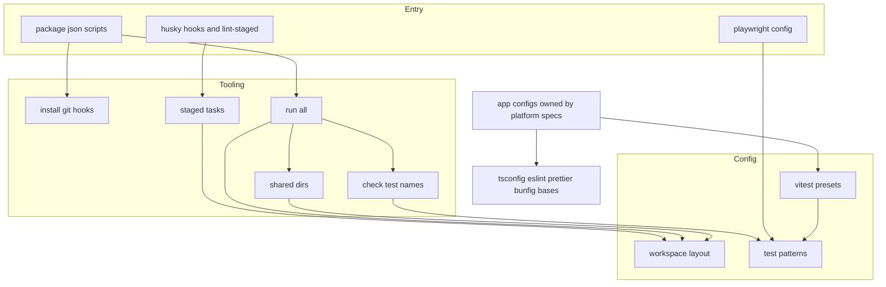
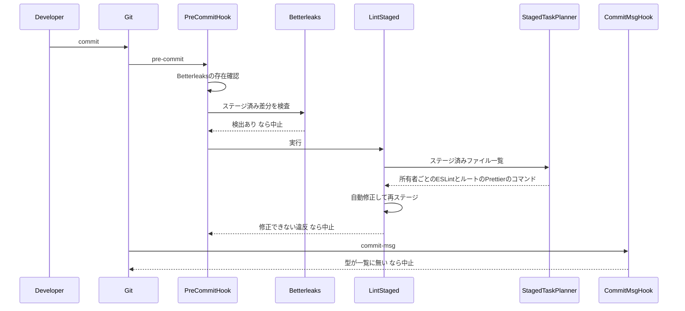
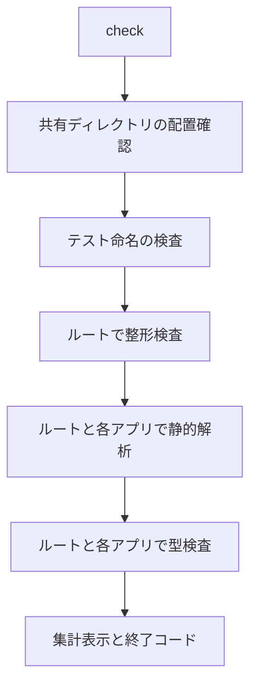

# Design Document

## Overview

**Purpose**: 全アプリを実装する開発者とAIエージェントに、同じ品質基準を自動で適用する開発ツール基盤を提供する。具体的には、コミット時の品質ゲート、静的解析・整形・型検査の基底設定と一括検査、4種のテストの実行規約とカバレッジ閾値、共有ディレクトリの依存解決、版固定方針、技術ドキュメントの土台を整える。

**Users**: 後続specでアプリを実装する開発者とAIエージェントは、基底設定の継承・テスト命名・一括コマンドを日々の作業に使う。infra-deliveryは、一括コマンドと共有ディレクトリ配置スクリプトをCIから呼び出す。

**Impact**: 次の点で現状を変える。

- ルートに`package.json`を新設し、`bun install`でGitフックが有効になるようにする。
- compose.yamlから、共有ディレクトリのnode_modulesを利用側に見せる4つのマウントを外す。
- bunfig.tomlにE2Eの除外とカバレッジの出力設定を加える。
- CLAUDE.mdの「後ほどdocs/GUIDES/techディレクトリに移す規則」節を、`docs/GUIDES/tech`へのリンク一覧に置き換える。

### Goals

- ルートでの`bun install`だけで、シークレット検出・整形・静的解析・コミットメッセージ検査がコミット時に動作する。
- 各アプリは、基底設定の継承と差分の指定、規約どおりのスクリプト名だけで一括検査とCIに参加できる。
- 共有ディレクトリの依存解決が、開発コンテナとCI相当環境で同じ結果になる(実験で検証済みの方式を採用する)。
- `docs/GUIDES/tech`の構成と索引があり、CLAUDE.mdの移設対象の規則が漏れなく汎用文書へ移っている。

### Non-Goals

- 各アプリの雛形、フレームワーク固有の静的解析規則、Vitestのプール・プロバイダの組み立て(backend-platform・frontend-platform)。
- GitHub Actionsのワークフロー、CIでのTruffleHog、ブランチ保護(infra-delivery)。
- 主要パッケージの版の一致の自動検査、コミットメッセージの言語・スコープ・長さの検査、E2Eのカバレッジ。
- `mockups`の整形・静的解析・基底設定への移行。

## Boundary Commitments

### This Spec Owns

- ルートの`package.json`・`bun.lock`と、ルートが提供する一括コマンド(`check`・`test:all:*`・`test:e2e`・`shared-dirs:*`・`check:test-names`)。
- Gitフック(`.husky/pre-commit`・`.husky/commit-msg`)、`lint-staged.config.ts`、`commitlint.config.ts`、`.betterleaksignore`。
- 基底設定: `tsconfig.base.json`、`eslint.config.base.ts`(モジュール注入型のファクトリ)、`prettier.config.ts`と`.prettierignore`(リポジトリ全体の整形設定)。
- テスト規約の単一定義(`config/test-patterns.ts`)、Vitestプリセット(`config/vitest/*.ts`)、`bunfig.toml`のテスト設定、E2E設定(`playwright.config.ts`・`e2e/support/*`)。
- アプリと共有ディレクトリの配置定義(`config/workspace-layout.ts`)、配置と確認のスクリプト(`scripts/tooling/shared-dirs.ts`)、compose.yamlの共有ディレクトリ関連のマウント。
- アプリが一括検査に参加するためのスクリプト契約(後述の「アプリのスクリプト契約」)。
- `docs/GUIDES/tech`の索引と、`coding`・`testing`の初版、CLAUDE.mdから移設した規則の文書、`docs/onboardings/project-values.md`。

### Out of Boundary

- 各アプリの`package.json`・`eslint.config.ts`・`tsconfig.json`・`vitest.*.config.ts`の作成(アプリ雛形のspecが本specの契約に従って作る)。
- アプリ固有の静的解析規則(React・Hono・Storybookなど)とPrettierプラグイン。
- `docs/GUIDES/tech`の各領域の、移設規則以外の文書(担当specが追記する)。
- CIワークフローの定義と、CI上のツール導入(Bun・Chromium)。
- Dockerfileのツール構成(Playwright関連の版の整合を除く)。

### Allowed Dependencies

- 既存の開発コンテナ(Dockerfile・compose.yaml・`scripts/setup-chromium.sh`)と、そこに導入済みのBun 1.4.2・Betterleaks 1.9.0・`CHROMIUM_PATH`。
- npmパッケージ: 技術スタック表に挙げた版に限る。
- 依存の方向(後述): `config/` → `scripts/tooling/` → 入口(`package.json`のスクリプト・`lint-staged.config.ts`・`.husky/*`・`playwright.config.ts`)。逆方向のimportは禁止する。
- 基底設定(`eslint.config.base.ts`・`config/vitest/*.ts`)は、パッケージを型としてのみimportし、値のimportを持たない。

### Revalidation Triggers

- `config/workspace-layout.ts`のアプリ一覧・共有ディレクトリの配置先・検査担当アプリの変更。
- `config/test-patterns.ts`の命名パターン・生成コードのパターン・閾値の変更。
- アプリのスクリプト契約(スクリプト名と意味)の変更。
- `createBaseConfig`の引数の形の変更、`tsconfig.base.json`の型検査・変換オプションの変更。
- 主要パッケージの一覧の版の変更(特にVitest・TypeScript・Playwright)。
- compose.yamlのマウント構成の変更。

## Architecture

### Existing Architecture Analysis

- 開発コンテナはBun 1.4.2のイメージで、`node`はBunへのシムである。node_modulesはアプリごとの名前付きボリュームで分離されている。
- 共有ディレクトリはbind mountで各アプリ内に配置される。bind mount先の実パスは配置先のパスのまま(`/proc/self/mountinfo`で確認済み)なので、解決結果は実体コピーと同じになる。
- `bunfig.toml`は、ブラウザ・Workersテストの除外と`coverageThreshold = 0.8`を持つ。
- `.claude/settings.json`は`--no-verify`・`HUSKY=0`・`core.hooksPath`・`.husky`の削除を拒否しており、フックの回避を防いでいる。

### Architecture Pattern & Boundary Map



**Architecture Integration**:

- 選んだパターン: 「データ定義(Config) → 純粋関数のツール(Tooling) → 薄い入口(Entry)」の3層。配置規則とテスト規約をデータとして1箇所に置き、フック・一括実行・E2E設定・プリセットがそれを参照する。
- 境界: 本specは基底とツールを所有し、アプリ側の設定ファイルは所有しない。アプリは「基底の継承」「スクリプト契約」「プリセットの取り込み」の3点だけで本specに依存する。
- 既存パターンの維持: bind mountによる共有ディレクトリ配置、名前付きボリュームによるnode_modules分離、`scripts/setup-chromium.sh`による共有Chromiumの導入。
- 新規コンポーネントの理由: 配置規則(アプリ一覧・共有ディレクトリ・mockups除外)を知る必要がある処理だけを自作し、それ以外は既製ツールを採用する(research.md「Build vs Adopt」)。

### Dependency Direction

`config/`(データ定義) → `scripts/tooling/`(ロジック) → 入口(`package.json`のスクリプト・`lint-staged.config.ts`・`.husky/*`・`playwright.config.ts`)の順にのみimportする。`config/`は`scripts/`をimportしない。`eslint.config.base.ts`・`config/vitest/*.ts`・`prettier.config.ts`は、npmパッケージを`import type`でのみ参照する。これはアプリから読み込まれたときに、ルート側のパッケージを実行時に解決しないためである。

### Technology Stack

| Layer                        | Choice / Version                                                                                                                                       | Role in Feature                                                          | Notes                                                                   |
| ---------------------------- | ------------------------------------------------------------------------------------------------------------------------------------------------------ | ------------------------------------------------------------------------ | ----------------------------------------------------------------------- |
| ランタイム                   | Bun 1.4.2(既存)                                                                                                                                        | スクリプト実行・単体テスト・ESLint/Prettier/commitlint/lint-stagedの起動 | ESLint・PrettierはNode上ではTS設定にjitiが要るため`bun --bun`で起動する |
| Gitフック                    | husky 9.1.7                                                                                                                                            | `core.hooksPath`の設定とフック実行                                       | `prepare`から自作スクリプト経由で呼ぶ                                   |
| ステージ済みファイルへの適用 | lint-staged 17.6.0                                                                                                                                     | 自動修正と再ステージ、部分ステージの保護                                 | 設定は関数形式で所有アプリごとに振り分ける                              |
| コミットメッセージ           | @commitlint/cli 21.2.3・@commitlint/types 21.2.3                                                                                                       | 型の一覧の検査                                                           | `@commitlint/config-conventional`は使わない                             |
| シークレット検出             | Betterleaks 1.9.0(既存)                                                                                                                                | ステージ済み差分の検出・伏せ字表示                                       | 許可リストは`.betterleaksignore`                                        |
| 静的解析                     | eslint 10.12.0・@eslint/js 10.0.1・typescript-eslint 8.71.0・eslint-config-prettier 10.1.8                                                             | 基底設定と、ルート所有ファイルの検査                                     | 各アプリも同じ版を導入する                                              |
| 整形                         | prettier 3.9.9                                                                                                                                         | リポジトリ全体の整形                                                     | 各アプリも同じ版を導入する(エディタ連携用)                              |
| 型検査                       | typescript 6.0.3                                                                                                                                       | `tsc`による型検査                                                        | typescript-eslintが6.1未満のみ対応のため7系は使わない                   |
| 型定義                       | @types/bun 1.4.2                                                                                                                                       | ルートのスクリプトと設定ファイルの型                                     |                                                                         |
| E2E                          | @playwright/test 1.63.0                                                                                                                                | E2Eの実行と、共有Chromiumのリビジョン決定                                | DockerfileのOS依存パッケージ版と一致させる                              |
| ブラウザ・Workersテスト      | vitest 4.1.11・@vitest/browser-playwright 4.1.11・@vitest/coverage-v8 4.1.11・@vitest/coverage-istanbul 4.1.11・@cloudflare/vitest-pool-workers 0.22.0 | プリセットが前提とする版                                                 | 導入はアプリ雛形のspec。本specは版と設定値を定める                      |

## File Structure Plan

### Directory Structure

```
/workspace
├── package.json                    # ルートの依存(Git運用・E2E・ルート所有ファイルの品質ツール)とスクリプト
├── bun.lock                        # 生成物
├── tsconfig.base.json              # 全アプリ共通の型検査基底設定
├── tsconfig.json                   # ルート所有ファイル(*.ts・config・scripts・e2e)の型検査、Bunの型
├── eslint.config.base.ts           # 静的解析基底設定のファクトリ(モジュール注入型)
├── eslint.config.base.unit.test.ts # 基底設定の規則の振る舞いを検証
├── eslint.config.ts                # ルート所有ファイル用の静的解析設定
├── prettier.config.ts              # リポジトリ全体の整形設定
├── .prettierignore                 # 整形対象外(mockups・外部由来・生成物・ロックファイル)
├── commitlint.config.ts            # コミットメッセージの型の一覧
├── commitlint.config.unit.test.ts  # 許可・拒否されるメッセージを検証
├── lint-staged.config.ts           # staged-tasksの計画をコマンドへ変換するだけの入口
├── playwright.config.ts            # E2E設定(対象アプリのプロジェクトと到達確認)
├── .betterleaksignore              # シークレット検出の許可リスト(fingerprint)
├── .husky/
│   ├── pre-commit                  # Betterleaksの存在確認と検出、その後lint-staged
│   └── commit-msg                  # commitlint
├── config/
│   ├── workspace-layout.ts         # アプリ一覧、共有ディレクトリの配置先と検査担当、品質ゲート対象外
│   ├── test-patterns.ts            # 4種の命名パターン、生成コードのパターン、カバレッジ閾値
│   └── vitest/
│       ├── browser.ts              # ブラウザテストのプリセット(V8カバレッジ・共有Chromium)
│       └── worker.ts               # Workers統合テストのプリセット(Istanbulカバレッジ)
├── scripts/tooling/
│   ├── install-git-hooks.ts        # prepare: CI・非Git環境ではフック導入を飛ばす
│   ├── staged-tasks.ts             # ステージ済みファイルを所有者ごとに振り分け、共有ディレクトリを配置先パスへ読み替え
│   ├── run-all.ts                  # 一括実行と集計表示
│   ├── shared-dirs.ts              # 共有ディレクトリの配置(CI)と確認
│   ├── check-test-names.ts         # 命名規約に一致しないテストファイルの検出
│   └── *.unit.test.ts              # 上記それぞれの単体テスト(同名で併置)
├── e2e/
│   └── support/
│       ├── targets.ts              # 対象アプリのURL解決と、テストのある対象だけのプロジェクト構成
│       ├── targets.unit.test.ts
│       └── reachability.setup.ts   # 対象アプリへの到達確認(セットアッププロジェクト)
└── docs/
    ├── GUIDES/tech/
    │   ├── README.md               # 全体索引
    │   ├── infra/README.md         # 以下9サブディレクトリはいずれも索引README.mdを持つ
    │   ├── infra/001-wrangler-conventions.md
    │   ├── infra/002-environments.md
    │   ├── external/README.md
    │   ├── db/README.md
    │   ├── db/001-drizzle-migrations-on-d1.md
    │   ├── db/002-d1-constraints.md
    │   ├── backend/README.md
    │   ├── backend/001-dependency-injection-on-workers.md
    │   ├── frontend/README.md
    │   ├── frontend/001-markup-conventions.md
    │   ├── frontend/002-tanstack-start-on-workers.md
    │   ├── coding/README.md
    │   ├── coding/001-javascript-typescript-conventions.md
    │   ├── coding/002-dependency-versions.md
    │   ├── coding/003-shared-directories.md
    │   ├── testing/README.md
    │   ├── testing/001-test-strategy.md
    │   ├── testing/002-browser-tool-versions.md
    │   ├── operations/README.md
    │   ├── security/README.md
    │   └── security/001-secret-management.md
    └── onboardings/project-values.md  # 汎用化で取り除いた本プロジェクト固有の値
```

### Modified Files

- `bunfig.toml`
  - `pathIgnorePatterns`に`**/*.e2e.test.ts`を加える。
  - `coverageReporter = ["text", "lcov"]`・`coverageDir = "coverage/unit"`・`coveragePathIgnorePatterns`(生成コード)を加える。
- `compose.yaml`
  - `node_modules_db`の`apps/api/db/node_modules`・`apps/event/db/node_modules`マウントを削除する。
  - `node_modules_frontend_lib`の`apps/client/lib/node_modules`・`apps/admin/lib/node_modules`マウントを削除する。
  - コメントに、利用側で解決する方式の理由を記す。
- `CLAUDE.md`
  - 「後ほどdocs/GUIDES/techディレクトリに移す規則」節を、リンク一覧の節「技術規則の参照先」に置き換える。
  - ディレクトリ構成に`config/`・`e2e/`・`scripts/tooling/`を追記し、ルート`package.json`の説明を更新する。
- `README.md`: 「ドキュメント索引」に技術ドキュメント(`docs/GUIDES/tech/`)の表を追加する。
- `docs/onboardings/README.md`
  - ルートの`bun install`でフックが有効になること、コミットはコンテナ内で行うこと、compose変更後にコンテナを再作成することを追記する。
  - 各アプリで品質ツールを導入する手順も追記する。
- `docs/onboardings/tech-stack.md`: 採用した付属パッケージ(typescript-eslint・@eslint/js・@commitlint/types・@types/bun・@vitest/browser-playwright・@vitest/coverage-v8・@vitest/coverage-istanbul)と、主要パッケージ一覧への参照を追記する。
- `scripts/merge-claude-trust-config.ts`: ルートの静的解析・整形の対象になるため、違反があれば修正する(振る舞いは変えない)。

## System Flows

### コミット時の検査



- シークレット検出をlint-stagedより前に置き、検出時にファイルを書き換えずに中止する。
- Betterleaksが見つからない環境(開発コンテナ外)では、検出を実行せずに中止する(3.5)。

### 一括検査



- 各段階は前段の失敗で止めず、すべて実行してから集計する(5.7)。
- アプリに`package.json`が無い場合と、該当スクリプトが無い場合は「飛ばした」と表示する(5.8)。
- `test:all:unit`・`test:all:browser`・`test:all:worker`も同じ集計の仕組みで、引数(`--coverage`など)を各アプリへ渡す。

## Requirements Traceability

| Requirement | Summary                                    | Components                                               | Interfaces                                                | Flows            |
| ----------- | ------------------------------------------ | -------------------------------------------------------- | --------------------------------------------------------- | ---------------- |
| 1.1         | インストールでフック有効化                 | GitHookInstaller                                         | `installGitHooks`                                         | —                |
| 1.2         | 非Git・CIでは飛ばして成功                  | GitHookInstaller                                         | `HookInstallResult`                                       | —                |
| 1.3         | フック定義をリポジトリで管理               | PreCommitHook・CommitMsgHook                             | `.husky/*`                                                | —                |
| 2.1         | ステージ済みだけ自動修正しコミットに含める | LintStagedConfig・StagedTaskPlanner                      | `planStagedTasks`・`toCommands`                           | コミット時の検査 |
| 2.2         | 修正不能な違反で中止                       | LintStagedConfig                                         | ESLintの終了コード                                        | コミット時の検査 |
| 2.3         | 部分ステージの保護                         | LintStagedConfig                                         | lint-stagedの退避機能                                     | コミット時の検査 |
| 2.4         | 対象外ファイルを変更しない                 | StagedTaskPlanner・PrettierConfig                        | `EXCLUDED_PATH_PREFIXES`・`.prettierignore`               | —                |
| 2.5         | マークダウン等も整形                       | StagedTaskPlanner・PrettierConfig                        | `--ignore-unknown`                                        | —                |
| 3.1         | ステージ済み差分のシークレット検出         | PreCommitHook                                            | `betterleaks git --pre-commit --staged`                   | コミット時の検査 |
| 3.2         | 検出で中止し場所と規則を表示               | PreCommitHook                                            | `--verbose`                                               | コミット時の検査 |
| 3.3         | 値を伏せる                                 | PreCommitHook                                            | `--redact`                                                | —                |
| 3.4         | 許可リスト                                 | SecretScanAllowlist                                      | `.betterleaksignore`                                      | —                |
| 3.5         | ツールが無ければ中止して案内               | PreCommitHook                                            | 存在確認                                                  | コミット時の検査 |
| 3.6         | mockups含む全ステージ済みファイル          | PreCommitHook                                            | パス指定なしの検査                                        | —                |
| 4.1         | 書式と型の検査                             | CommitlintConfig・CommitMsgHook                          | `type-enum`ほか                                           | コミット時の検査 |
| 4.2         | 違反内容と許可された型の表示               | CommitlintConfig                                         | commitlintの出力                                          | —                |
| 4.3         | 型一覧をGit規約と一致                      | CommitlintConfig                                         | `ALLOWED_COMMIT_TYPES`                                    | —                |
| 4.4         | スコープ・言語・長さで拒否しない           | CommitlintConfig                                         | 規則を3つに限定                                           | —                |
| 4.5         | マージ・リバートは受け入れ                 | CommitlintConfig                                         | commitlint既定の除外                                      | —                |
| 5.1         | 基底設定をルートに1つずつ                  | TsconfigBase・EslintBase・PrettierConfig                 | 各ファイル                                                | —                |
| 5.2         | 継承と差分で同基準                         | EslintBase・TsconfigBase                                 | `createBaseConfig`・`extends`                             | —                |
| 5.3         | JS系設定はTS形式                           | 全設定ファイル                                           | `*.config.ts`                                             | —                |
| 5.4         | 書式違いを報告しない                       | EslintBase                                               | `prettierConfig`を最後に適用                              | —                |
| 5.5         | 非推奨API・記法を報告                      | EslintBase                                               | `no-deprecated`・`no-restricted-globals`                  | —                |
| 5.6         | 厳格な型検査                               | TsconfigBase                                             | `strict`・`noUncheckedIndexedAccess`                      | —                |
| 5.7         | 一括検査と失敗の表示                       | AggregateRunner                                          | `runAggregate`・`formatSummary`                           | 一括検査         |
| 5.8         | 未作成アプリを飛ばす                       | AggregateRunner                                          | `StepOutcome.skipped`                                     | 一括検査         |
| 5.9         | mockupsを含めない                          | WorkspaceLayout・PrettierConfig・StagedTaskPlanner       | `QUALITY_GATE_EXCLUDED_DIRS`                              | —                |
| 6.1         | 単体テストの対象                           | BunTestConfig・AppScriptContract                         | `test:unit`                                               | —                |
| 6.2         | ブラウザテストの対象                       | VitestPresets                                            | `browserTestPreset.include`                               | —                |
| 6.3         | Workers統合テストの対象                    | VitestPresets                                            | `workerTestPreset.include`                                | —                |
| 6.4         | E2Eの対象                                  | E2EConfig・TestPatterns                                  | `TEST_FILE_PATTERNS.e2e`                                  | —                |
| 6.5         | アプリ内でも共通テスト設定                 | BunTestConfig・AppScriptContract                         | `--config=../../bunfig.toml`                              | —                |
| 6.6         | 命名規約外のファイルで一括検査失敗         | TestNameChecker・AggregateRunner                         | `findMisnamedTestFiles`                                   | 一括検査         |
| 6.7         | 0件なら成功し0件と表示                     | AppScriptContract・VitestPresets・E2EConfig              | `--pass-with-no-tests`・`passWithNoTests`                 | —                |
| 6.8         | 共有ブラウザを使いダウンロードしない       | VitestPresets・E2EConfig                                 | `resolveBrowserLaunchOptions`                             | —                |
| 6.9         | E2E設定の雛形                              | E2EConfig                                                | `resolveE2ETargets`・`resolveE2EProjects`                 | —                |
| 6.10        | 到達できないURLを示して失敗                | E2EConfig                                                | `reachability.setup.ts`                                   | —                |
| 6.11        | シークレットは実行時注入                   | TestingDocs・AppScriptContract                           | `infisical run`                                           | —                |
| 7.1         | 80%未満で失敗し指標と実測値を表示          | BunTestConfig・VitestPresets・TestPatterns               | `COVERAGE_THRESHOLD_PERCENT`                              | —                |
| 7.2         | 計測無効時は判定しない                     | BunTestConfig・VitestPresets                             | `--coverage`指定時のみ                                    | —                |
| 7.3         | テストファイル・生成コードを除外           | BunTestConfig・VitestPresets・TestPatterns               | `GENERATED_CODE_PATTERNS`                                 | —                |
| 7.4         | 機械可読形式でGit管理外へ出力              | BunTestConfig・VitestPresets                             | lcov・`coverage/*`                                        | —                |
| 8.1         | コンテナ内で配置どおり解決                 | SharedDirMounts・WorkspaceLayout                         | compose.yaml                                              | —                |
| 8.2         | CI相当環境で同じ結果                       | SharedDirs                                               | `placeByCopy`                                             | —                |
| 8.3         | 利用側の型検査・変換設定で検査             | WorkspaceLayout・StagedTaskPlanner・SharedDirectoriesDoc | `checkedBy`・共有ディレクトリ直下にtsconfigを置かない規則 | —                |
| 8.4         | 二重実体を作らない                         | SharedDirMounts・SharedDirs                              | 配置先node_modulesが空であることの確認                    | —                |
| 8.5         | 配置不備を先に示して失敗                   | SharedDirs・AggregateRunner                              | `inspectPlacements`                                       | 一括検査         |
| 8.6         | CI用の再現手段                             | SharedDirs                                               | `shared-dirs:place`                                       | —                |
| 8.7         | 最小構成での検証と記録                     | SharedDirectoriesDoc                                     | 検証手順と結果                                            | —                |
| 9.1         | 主要パッケージ一覧の記載                   | DependencyVersionsDoc                                    | —                                                         | —                |
| 9.2         | 一覧に含めるもの                           | DependencyVersionsDoc                                    | —                                                         | —                |
| 9.3         | 追加・更新の手順と版指定なし追加の禁止     | DependencyVersionsDoc                                    | —                                                         | —                |
| 9.4         | ルートのE2Eツールを一覧の版で導入          | RootPackage                                              | `@playwright/test` 1.63.0                                 | —                |
| 9.5         | 4箇所の整合とMCP起動確認                   | BrowserToolVersionsDoc・RootPackage                      | Dockerfile・`.mcp.json`                                   | —                |
| 9.6         | 更新手順の記載                             | BrowserToolVersionsDoc                                   | —                                                         | —                |
| 10.1        | 9サブディレクトリと索引                    | TechDocsIndex                                            | —                                                         | —                |
| 10.2        | 範囲・文書一覧・未収録の明示               | TechDocsIndex                                            | —                                                         | —                |
| 10.3        | READMEの索引から辿れる                     | TechDocsIndex                                            | README.md                                                 | —                |
| 10.4        | codingの初版                               | CodingDocs                                               | —                                                         | —                |
| 10.5        | testingの初版                              | TestingDocs                                              | —                                                         | —                |
| 10.6        | プロジェクト固有の内容を含まない           | TechDocsIndex・全tech文書                                | 記述規則                                                  | —                |
| 10.7        | 1項目の追記で辿れる形式                    | TechDocsIndex                                            | 索引の表形式                                              | —                |
| 10.8        | tech-stack.mdへの記載                      | OnboardingUpdates                                        | —                                                         | —                |
| 10.9        | オンボーディングの更新                     | OnboardingUpdates                                        | —                                                         | —                |
| 11.1        | 全規則の移設                               | RuleMigration                                            | 移設対応表                                                | —                |
| 11.2        | 汎用的な表現                               | RuleMigration                                            | —                                                         | —                |
| 11.3        | 1対1の対応付け                             | RuleMigration                                            | 移設対応表                                                | —                |
| 11.4        | リンク一覧への置き換え                     | RuleMigration                                            | CLAUDE.md                                                 | —                |
| 11.5        | 参照すべき作業の明示                       | RuleMigration                                            | CLAUDE.md                                                 | —                |
| 11.6        | 固有値をtech以外に残す                     | RuleMigration                                            | `docs/onboardings/project-values.md`                      | —                |

## Components and Interfaces

| Component                                                                                                   | Domain/Layer | Intent                                       | Req Coverage                                 | Key Dependencies (P0/P1)                                    | Contracts      |
| ----------------------------------------------------------------------------------------------------------- | ------------ | -------------------------------------------- | -------------------------------------------- | ----------------------------------------------------------- | -------------- |
| WorkspaceLayout                                                                                             | Config       | アプリ・共有ディレクトリ・対象外の配置定義   | 5.9, 8.1, 8.3                                | なし                                                        | State          |
| TestPatterns                                                                                                | Config       | テスト命名・生成コード・閾値の単一定義       | 6.1-6.4, 7.1, 7.3                            | なし                                                        | State          |
| VitestPresets                                                                                               | Config       | ブラウザ・Workers統合テストの共通設定値      | 6.2, 6.3, 6.7, 6.8, 7.1-7.4                  | TestPatterns (P0)                                           | State          |
| GitHookInstaller                                                                                            | Tooling      | CI・非Git環境を除いてhuskyを導入             | 1.1, 1.2                                     | husky (P0)                                                  | Service        |
| StagedTaskPlanner                                                                                           | Tooling      | ステージ済みファイルの振り分けとコマンド生成 | 2.1, 2.4, 2.5, 5.9, 8.3                      | WorkspaceLayout (P0)                                        | Service        |
| AggregateRunner                                                                                             | Tooling      | 一括実行と集計                               | 5.7, 5.8, 6.6, 6.7                           | WorkspaceLayout (P0)・SharedDirs (P1)・TestNameChecker (P1) | Service, Batch |
| SharedDirs                                                                                                  | Tooling      | 共有ディレクトリの配置と確認                 | 8.2, 8.4, 8.5, 8.6                           | WorkspaceLayout (P0)                                        | Service, Batch |
| TestNameChecker                                                                                             | Tooling      | 命名規約外のテストファイル検出               | 6.6                                          | TestPatterns (P0)                                           | Service        |
| PreCommitHook                                                                                               | Entry        | シークレット検出とlint-stagedの起動          | 1.3, 2.2, 3.1-3.3, 3.5, 3.6                  | Betterleaks (P0)・LintStagedConfig (P0)                     | Batch          |
| CommitMsgHook・CommitlintConfig                                                                             | Entry        | 型の検査                                     | 1.3, 4.1-4.5                                 | commitlint (P0)                                             | Batch          |
| LintStagedConfig                                                                                            | Entry        | 計画をlint-stagedへ渡す                      | 2.1-2.3                                      | StagedTaskPlanner (P0)                                      | Batch          |
| SecretScanAllowlist                                                                                         | Entry        | 誤検知の許可                                 | 3.4                                          | Betterleaks (P0)                                            | State          |
| TsconfigBase                                                                                                | Base         | 共通の型検査設定                             | 5.1, 5.2, 5.6                                | typescript (P0)                                             | State          |
| EslintBase                                                                                                  | Base         | 静的解析基底設定のファクトリ                 | 5.1-5.5                                      | 注入されるESLint系モジュール (P0)                           | Service        |
| PrettierConfig                                                                                              | Base         | リポジトリ全体の整形設定と対象外             | 2.4, 2.5, 5.1, 5.9                           | prettier (P0)                                               | State          |
| BunTestConfig                                                                                               | Base         | 単体テストの共通設定                         | 6.1, 6.5, 7.1-7.4                            | Bun (P0)                                                    | State          |
| E2EConfig                                                                                                   | Entry        | 対象アプリのプロジェクト構成と到達確認       | 6.4, 6.7-6.10                                | @playwright/test (P0)・TestPatterns (P1)                    | Service        |
| AppScriptContract                                                                                           | Contract     | アプリが一括検査に参加する条件               | 6.1, 6.5, 6.7, 6.11                          | AggregateRunner (P0)                                        | API            |
| RootPackage                                                                                                 | Entry        | ルートの依存とスクリプト                     | 1.1, 9.4, 9.5                                | 上記すべて                                                  | API            |
| SharedDirMounts                                                                                             | Infra        | compose.yamlの共有ディレクトリ配置           | 8.1, 8.4                                     | Docker Compose (P0)                                         | State          |
| TechDocsIndex・CodingDocs・TestingDocs・SharedDirectoriesDoc・DependencyVersionsDoc・BrowserToolVersionsDoc | Docs         | 技術ドキュメント                             | 6.11, 8.3, 8.7, 9.1-9.3, 9.5, 9.6, 10.1-10.7 | なし                                                        | —              |
| RuleMigration・OnboardingUpdates                                                                            | Docs         | 規則の移設と既存文書の更新                   | 10.8, 10.9, 11.1-11.6                        | なし                                                        | —              |

### Config

#### WorkspaceLayout

| Field        | Detail                                                                                           |
| ------------ | ------------------------------------------------------------------------------------------------ |
| Intent       | 一括実行・ステージ振り分け・共有ディレクトリ配置が共通に使う、アプリと共有ディレクトリの配置定義 |
| Requirements | 5.9, 8.1, 8.3                                                                                    |

**Responsibilities & Constraints**

- アプリ一覧(一括実行の対象と順序): `api`・`event`・`frontend-lib`・`client`・`admin`。`apps/db`と`apps/backend-lib`はアプリではなく、検査担当アプリの下で検査される共有ディレクトリとして扱う。
- 共有ディレクトリごとに、配置元・配置先(compose.yamlのbind mount先と同一)・検査担当(`api`または`self`)を持つ。
- 品質ゲートの対象外ディレクトリ(`mockups`)を持つ。
- 他モジュールをimportしない。

**Contracts**: State [x]

##### State Management

```typescript
export type AppName = 'api' | 'event' | 'frontend-lib' | 'client' | 'admin';

export interface AppDefinition {
  readonly name: AppName;
  readonly dir: string;
}

export interface SharedDirMount {
  readonly consumer: AppName;
  readonly target: string;
}

export interface SharedDirDefinition {
  readonly source: string;
  readonly mounts: readonly SharedDirMount[];
  readonly checkedBy: AppName | 'self';
}

export declare const APPS: readonly AppDefinition[];
export declare const SHARED_DIRS: readonly SharedDirDefinition[];
export declare const QUALITY_GATE_EXCLUDED_DIRS: readonly string[];
```

- 値: `apps/db` → `apps/api/db`・`apps/event/db`(checkedBy `api`)、`apps/backend-lib` → `apps/api/lib`・`apps/event/lib`(checkedBy `api`)、`apps/frontend-lib` → `apps/client/lib`・`apps/admin/lib`(checkedBy `self`)。
- 不変条件: `SHARED_DIRS`の配置先はcompose.yamlのbind mount先と完全に一致する(SharedDirsの単体テストでcompose.yamlと突き合わせる)。

#### TestPatterns

| Field        | Detail                                                |
| ------------ | ----------------------------------------------------- |
| Intent       | 4種のテスト命名・生成コード・カバレッジ閾値の単一定義 |
| Requirements | 6.1, 6.2, 6.3, 6.4, 7.1, 7.3                          |

**Contracts**: State [x]

##### State Management

```typescript
export type TestKind = 'unit' | 'browser' | 'worker' | 'e2e';

export declare const TEST_FILE_PATTERNS: Readonly<
  Record<TestKind, readonly string[]>
>;
export declare const TEST_LIKE_FILE_PATTERN: RegExp;
export declare const GENERATED_CODE_PATTERNS: readonly string[];
export declare const COVERAGE_THRESHOLD_PERCENT: 80;
```

- `unit`: `**/*.unit.test.ts`、`browser`: `**/*.browser.test.{ts,tsx}`、`worker`: `**/*.worker.test.{ts,tsx}`、`e2e`: `e2e/**/*.e2e.test.ts`。
- `TEST_LIKE_FILE_PATTERN`は、テストランナーがテストとみなす名前(`.test.`・`.spec.`・`_test.`・`_spec.`を含む`[cm]?[jt]sx?`)に一致する。
- `GENERATED_CODE_PATTERNS`: `**/*.gen.ts`・`**/generated/**`。後続specは、自動生成コードをこのどちらかの形で出力する(契約)。
- bunfig.tomlはTOMLのためこの定義をimportできない。そこでTestNameCheckerの単体テストで、bunfigの`pathIgnorePatterns`・`coveragePathIgnorePatterns`との一致を確かめる。

#### VitestPresets

| Field        | Detail                                                          |
| ------------ | --------------------------------------------------------------- |
| Intent       | ブラウザテストとWorkers統合テストで、アプリが取り込む共通設定値 |
| Requirements | 6.2, 6.3, 6.7, 6.8, 7.1, 7.2, 7.3, 7.4                          |

**Responsibilities & Constraints**

- 値のimportを持たない定数と純粋関数だけを提供する。プロバイダ(`playwright()`・`cloudflareTest()`)の組み立てはアプリ側が行う。
- `coverage.enabled`は指定しない。閾値は`--coverage`指定時だけ判定される(7.2)。
- `coverage.include`はアプリのソース配置に依存するため、アプリ側で必ず指定する(未読込ファイルを分母に含めるため。契約)。

**Contracts**: State [x]

##### State Management

```typescript
export interface CoveragePreset {
  readonly provider: 'v8' | 'istanbul';
  readonly reportsDirectory: string;
  readonly reporter: readonly ('text' | 'lcov')[];
  readonly thresholds: { readonly lines: number; readonly functions: number };
  readonly exclude: readonly string[];
}

export interface TestKindPreset {
  readonly include: readonly string[];
  readonly passWithNoTests: true;
  readonly coverage: CoveragePreset;
}

export interface BrowserLaunchOptions {
  readonly executablePath?: string;
}

export declare const browserTestPreset: TestKindPreset;
export declare const workerTestPreset: TestKindPreset;
export declare function resolveBrowserLaunchOptions(
  env: Readonly<Record<string, string | undefined>>,
): BrowserLaunchOptions;
```

- `browserTestPreset`: `provider: 'v8'`・`reportsDirectory: 'coverage/browser'`。
- `workerTestPreset`: `provider: 'istanbul'`・`reportsDirectory: 'coverage/worker'`。
- `resolveBrowserLaunchOptions`は、`CHROMIUM_PATH`が定義されていれば`executablePath`に設定する。定義が無ければ、Playwrightの導入済みブラウザを使う。

**Implementation Notes**

- Integration: アプリは`test: { ...browserTestPreset, browser: { provider: playwright({ launchOptions: resolveBrowserLaunchOptions(process.env) }), ... } }`の形で取り込む。設定ファイルはworkerdではなくBun/Node上で評価されるため、`process.env`を使ってよい。
- Validation: 実装時に、使い捨ての検証用アプリで、ブラウザテスト(V8)とWorkers統合テスト(Istanbul)の閾値判定・lcov出力・0件時の成功を実測する。
- Risks: Vitest 5系へ上げるとWorkersプールが起動しない。版は主要パッケージ一覧で4.1.11に固定する。

### Tooling

#### GitHookInstaller

| Field        | Detail                                             |
| ------------ | -------------------------------------------------- |
| Intent       | `prepare`から呼ばれ、開発環境だけでhuskyを導入する |
| Requirements | 1.1, 1.2                                           |

**Contracts**: Service [x]

##### Service Interface

```typescript
export type HookInstallResult =
  | { readonly status: 'installed' }
  | {
      readonly status: 'skipped';
      readonly reason: 'ci' | 'not-a-git-repository';
    };

export interface HookInstallerDependencies {
  readonly env: Readonly<Record<string, string | undefined>>;
  readonly gitDirExists: () => boolean;
  readonly runHusky: () => void;
}

export declare function installGitHooks(
  deps: HookInstallerDependencies,
): HookInstallResult;
```

- Preconditions: リポジトリのルートで実行される。
- Postconditions: `installed`のとき`core.hooksPath`が`.husky/_`を指す。`skipped`のとき何も変更せず、終了コード0で理由を表示する。
- 判定順: `CI`が空でなければ`ci`、`.git`が無ければ`not-a-git-repository`、それ以外は`runHusky`を呼ぶ。

#### StagedTaskPlanner

| Field        | Detail                                                                         |
| ------------ | ------------------------------------------------------------------------------ |
| Intent       | ステージ済みファイルを所有者ごとに振り分け、静的解析と整形のコマンドを生成する |
| Requirements | 2.1, 2.4, 2.5, 5.9, 8.3                                                        |

**Responsibilities & Constraints**

- 次のパス配下のファイルは、計画から除外する: `QUALITY_GATE_EXCLUDED_DIRS`、外部由来(`docs/ai-extensions/`・`.claude/`・`.kiro/settings/`)、ロックファイル(`bun.lock`)。生成物は`.prettierignore`とESLint基底設定の`ignores`で除外する。
- 静的解析の対象(`.ts`・`.tsx`)は、所有者ごとに振り分ける。
  - 所有者は、最も長く一致するアプリディレクトリで決める。
  - 共有ディレクトリ(`checkedBy`がアプリ)のファイルは、検査担当アプリの配置先パスへ読み替える(例: `apps/backend-lib/x.ts` → `apps/api/lib/x.ts`)。
  - どのアプリにも属さないファイルの所有者はルートとする。
- 整形の対象は、除外後のすべてのファイルとし、ルートのPrettierへ`--ignore-unknown`付きで1回だけ渡す。
- 生成するコマンドの順序は、所有者ごとのESLint、その後にPrettierとする。

**Contracts**: Service [x]

##### Service Interface

```typescript
export type StagedOwner =
  { readonly kind: 'root' } | { readonly kind: 'app'; readonly app: AppName };

export interface StagedTaskGroup {
  readonly owner: StagedOwner;
  readonly lintTargets: readonly string[];
}

export interface StagedTaskPlan {
  readonly lintGroups: readonly StagedTaskGroup[];
  readonly formatTargets: readonly string[];
}

export type PlanError =
  | {
      readonly kind: 'consumer-missing';
      readonly sharedDir: string;
      readonly consumer: AppName;
    }
  | {
      readonly kind: 'tooling-missing';
      readonly owner: StagedOwner;
      readonly hint: string;
    };

export type PlanResult =
  | { readonly ok: true; readonly plan: StagedTaskPlan }
  | { readonly ok: false; readonly errors: readonly PlanError[] };

export declare function planStagedTasks(
  stagedAbsolutePaths: readonly string[],
  repoRoot: string,
  isInstalled: (owner: StagedOwner) => boolean,
  appExists: (app: AppName) => boolean,
): PlanResult;

export declare function toCommands(
  plan: StagedTaskPlan,
  repoRoot: string,
): readonly string[];
```

- ESLintのコマンドは`bun --bun <所有者のnode_modules/.bin/eslint> --fix --no-warn-ignored <files>`、Prettierのコマンドは`bun --bun <ルートのnode_modules/.bin/prettier> --write --ignore-unknown <files>`とする。
- `PlanResult.ok === false`の場合、LintStagedConfigは理由を表示する1つの失敗コマンドを返し、コミットを中止させる(検査担当アプリが未作成、またはそのアプリに依存未導入)。

#### AggregateRunner

| Field        | Detail                                                   |
| ------------ | -------------------------------------------------------- |
| Intent       | ルートと各アプリで同名スクリプトを実行し、結果を集計する |
| Requirements | 5.7, 5.8, 6.6, 6.7                                       |

**Contracts**: Service [x] / Batch [x]

##### Service Interface

```typescript
export type AggregateTask =
  'lint' | 'typecheck' | 'test:unit' | 'test:browser' | 'test:worker';
export type AggregateCommand = 'check' | AggregateTask;
export type RunTarget = 'root' | AppName;

export type FailureReason = 'package-json-unreadable' | 'command-unrunnable';

export interface FailureCause {
  readonly reason: FailureReason;
  readonly detail: string;
}

export type StepOutcome =
  | { readonly status: 'passed' }
  | {
      readonly status: 'failed';
      readonly exitCode: number;
      readonly cause?: FailureCause;
    }
  | {
      readonly status: 'skipped';
      readonly reason: 'project-missing' | 'script-missing';
    };

export interface StepResult {
  readonly step: string;
  readonly target: RunTarget;
  readonly outcome: StepOutcome;
}

export interface CommandRunner {
  run(command: readonly string[], cwd: string): Promise<number>;
}

export interface AggregateDependencies {
  readonly runner: CommandRunner;
  readonly readPackageScripts: (
    dir: string,
  ) => Readonly<Record<string, string>> | undefined;
  readonly repoRoot: string;
}

export declare function runAggregate(
  command: AggregateCommand,
  forwardedArgs: readonly string[],
  deps: AggregateDependencies,
): Promise<readonly StepResult[]>;

export declare function formatSummary(results: readonly StepResult[]): string;
export declare function formatFailureCauses(
  results: readonly StepResult[],
): string;
export declare function exitCodeOf(results: readonly StepResult[]): 0 | 1;
```

- `readPackageScripts`は、`package.json`が無ければ`undefined`を返し、読めない・解釈できない(最上位がオブジェクトでない、`scripts`が値がすべて文字列のオブジェクトでない)場合は例外を投げる。`runAggregate`はこの例外と、コマンドを起動できない例外を捕まえ、その段階・対象を`cause`付きの失敗(`exitCode: 1`)として記録して後続を続ける(5.7)。
- `bun run`は親ディレクトリの`package.json`を探索するため、`package.json`とスクリプトの有無を実行前に確かめ、無ければ飛ばす。

##### Batch / Job Contract

- Trigger: `bun run check`・`bun run test:all:unit`・`bun run test:all:browser`・`bun run test:all:worker`。
- `check`の段階: 共有ディレクトリの配置確認 → テスト命名検査 → ルートの`format:check` → ルートと各アプリの`lint` → ルートと各アプリの`typecheck`。
- `test:all:*`: ルートと各アプリの同名スクリプト(`test:all:unit`なら`test:unit`)を、`forwardedArgs`付きで実行する。
- 出力: 段階・対象・結果(成功/失敗と終了コードまたは原因/飛ばした理由)の表を表示し、`cause`付きの失敗があれば原因(リポジトリ相対パスと理由)を重複を除いて続けて表示する。1つでも失敗があれば終了コード1で終える。
- `check`は追加の引数を受け取らない(余分な引数で失敗する段階があるため)。配置確認と命名検査は、ルートのスクリプト`shared-dirs:verify`・`check:test-names`として実行する。
- 冪等性: 読み取り専用の検査だけを実行する。

#### SharedDirs

| Field        | Detail                                                             |
| ------------ | ------------------------------------------------------------------ |
| Intent       | 共有ディレクトリの配置状態を確認し、CI相当環境ではコピーで配置する |
| Requirements | 8.2, 8.4, 8.5, 8.6                                                 |

**Contracts**: Service [x] / Batch [x]

##### Service Interface

```typescript
export type PlacementState =
  | 'bind-mounted'
  | 'copied'
  | 'consumer-missing'
  | 'missing'
  | 'content-mismatch'
  | 'mount-mismatch'
  | 'non-empty-node-modules';

export interface PlacementReport {
  readonly source: string;
  readonly target: string;
  readonly state: PlacementState;
}

export interface FileIdentity {
  readonly dev: bigint;
  readonly ino: bigint;
}

export type FileIdentityReader = (path: string) => FileIdentity | undefined;
export type MountPointReader = () => ReadonlySet<string>;

export declare function inspectPlacements(
  repoRoot: string,
  readIdentity?: FileIdentityReader,
  readMountPointSet?: MountPointReader,
): readonly PlacementReport[];
export declare function placeByCopy(
  repoRoot: string,
  readIdentity?: FileIdentityReader,
  readMountPointSet?: MountPointReader,
): readonly PlacementReport[];
export declare function describeProblem(
  report: PlacementReport,
): string | undefined;
```

- `bind-mounted`: 配置先と配置元のinode・デバイスが一致する。
- `copied`: 配置先のファイル一覧とサイズが、配置元(node_modules除く)と一致する。
- `consumer-missing`: 利用側アプリに`package.json`が無いため対象外とし、問題とはしない。
- `non-empty-node-modules`: 配置先にnode_modulesの中身がある(二重実体の原因)。案内文は「compose.yamlの変更後にコンテナを再作成する」。
- `missing`・`content-mismatch`: 案内文は「CIでは`bun run shared-dirs:place`を実行する。ローカルではcompose.yamlのマウントを確認する」。配置先が配置元へのシンボリックリンクの場合も`content-mismatch`とする。
- `mount-mismatch`: 配置先がマウントポイント(`/proc/self/mountinfo`のマウント先)だが、配置元と同じ実体ではない(compose.yamlの誤り)。コピー配置では解消しないため、案内文は「compose.yamlのマウントを確認し、修正後にコンテナを再作成する」。
- 判定順: `consumer-missing` → `missing` → シンボリックリンクなら`content-mismatch` → `mount-mismatch` → ディレクトリでなければ`content-mismatch` → `non-empty-node-modules` → `bind-mounted` → `copied`または`content-mismatch`。
- `placeByCopy`は、利用側アプリがある配置先のうち、次のものだけをnode_modulesを除いて削除・再複製する。それ以外には書き込まない。
  - 配置先が無ければ作成する。配置先そのものがシンボリックリンクなら、リンク自体だけを削除して作成する(リンク先は辿らない)。
  - マウントポイント、同一性(inode・デバイス)を読めない配置先、配置元と同じ実体の配置先、すでに`copied`と判定される配置先には書き込まない。削除がホスト側の実体や配置元を消すのを防ぐためである。
- 同一性とマウント情報の読み取りは、テストのため省略可能な引数で差し替えられる。

##### Batch / Job Contract

- Trigger: `bun run shared-dirs:verify`(一括検査の最初の段階)、`bun run shared-dirs:place`(CIで依存インストール前後のどちらでも可)。
- Output: 各配置先の状態の表。問題があれば終了コード1。

#### TestNameChecker

| Field        | Detail                                                |
| ------------ | ----------------------------------------------------- |
| Intent       | 4種いずれの規約にも一致しないテストファイルを検出する |
| Requirements | 6.6                                                   |

**Contracts**: Service [x]

##### Service Interface

```typescript
export interface MisnamedTestFile {
  readonly path: string;
  readonly expected: readonly string[];
}

export declare function findMisnamedTestFiles(
  repoRelativePaths: readonly string[],
): readonly MisnamedTestFile[];
```

- 入力: `git ls-files --cached --others --exclude-standard`の結果。この一覧には、gitignore済みのnode_modulesや共有ディレクトリの配置先が含まれない。そこから`QUALITY_GATE_EXCLUDED_DIRS`と外部由来のパスを除いたものを渡す。
- `TEST_LIKE_FILE_PATTERN`に一致し、`TEST_FILE_PATTERNS`のどれにも一致しないファイルを返す。

### Entry

#### PreCommitHook・CommitMsgHook・CommitlintConfig・LintStagedConfig

| Field        | Detail                                                               |
| ------------ | -------------------------------------------------------------------- |
| Intent       | コミット時の検査の入口                                               |
| Requirements | 1.3, 2.1, 2.2, 2.3, 3.1, 3.2, 3.3, 3.5, 3.6, 4.1, 4.2, 4.3, 4.4, 4.5 |

**Responsibilities & Constraints**

- `.husky/pre-commit`は、次の順に処理する。いずれかが失敗した時点で中止する。
  1. `command -v betterleaks`が失敗したら、「開発コンテナ内でコミットする」よう表示して中止する。
  2. `betterleaks git --pre-commit --staged --redact --no-banner --verbose`でステージ済みの差分を検査する。パス指定は無く、mockupsも対象になる。
  3. `bunx --bun lint-staged`を実行する。
- `.husky/commit-msg`は`bunx --bun commitlint --edit "$1"`を実行する。
- `commitlint.config.ts`は次の3規則だけを持つ。scope・subject-case・header-max-lengthなどの規則は持たない(4.4)。
  - `type-empty: never`
  - `subject-empty: never`
  - `type-enum: always`(許可する型は`ALLOWED_COMMIT_TYPES`)
- `ALLOWED_COMMIT_TYPES = ['feat', 'fix', 'refactor', 'docs', 'test', 'chore', 'perf', 'ci']`とし、`.claude/rules/common/git-workflow.md`の一覧と一致させる。深刻度は`RuleConfigSeverity.Error`で指定する。
- マージ・リバートは、commitlintの既定の除外で受け入れる(4.5)。
- `lint-staged.config.ts`は`'*'`に関数を割り当て、`planStagedTasks`→`toCommands`の結果を返す。部分ステージの保護は、lint-stagedの既定の退避機能に任せる(2.3)。

**Contracts**: Batch [x]

##### Batch / Job Contract

- Trigger: `git commit`。
- Input / validation: ステージ済みファイルとコミットメッセージ。
- Output: 成功時はコミットされる。失敗時は、検出箇所(伏せ字)・違反規則・許可された型の一覧を表示して中止する。
- Idempotency & recovery: 自動修正は再ステージされ、再実行しても結果は変わらない。

**Implementation Notes**

- Risks: 破壊的変更の印`feat!:`は既定の解析器で拒否される(要件の書式外として受け入れる)。

#### E2EConfig

| Field        | Detail                                                                                       |
| ------------ | -------------------------------------------------------------------------------------------- |
| Intent       | 対象アプリごとのプロジェクトと到達確認を構成し、テストが追加されるだけで実行できる状態にする |
| Requirements | 6.4, 6.7, 6.8, 6.9, 6.10                                                                     |

**Contracts**: Service [x]

##### Service Interface

```typescript
export type E2ETargetName = 'client' | 'admin';

export interface E2ETarget {
  readonly name: E2ETargetName;
  readonly baseURL: string;
}

export interface E2EProjectPlan {
  readonly target: E2ETarget;
  readonly testDir: string;
  readonly setupProjectName: string;
}

export declare function resolveE2ETargets(
  env: Readonly<Record<string, string | undefined>>,
): readonly E2ETarget[];
export declare function resolveE2EProjects(
  targets: readonly E2ETarget[],
  hasTestFiles: (testDir: string) => boolean,
): readonly E2EProjectPlan[];
```

- `resolveE2ETargets`: 既定値は`client`が`http://localhost:48044`、`admin`が`http://localhost:48045`。`E2E_CLIENT_URL`・`E2E_ADMIN_URL`で上書きでき、staging検証にも使える。
- `resolveE2EProjects`: `e2e/<対象>/`に`*.e2e.test.ts`が1つ以上ある対象だけをプロジェクトにする。テストが1つも無ければプロジェクトは0になり、`--pass-with-no-tests`で正常終了する(6.7)。
- `playwright.config.ts`
  - 各プロジェクトに、到達確認のセットアッププロジェクト(`e2e/support/reachability.setup.ts`)を依存として付ける。
  - `testMatch`には`TEST_FILE_PATTERNS.e2e`を使う。
  - 成果物は`outputDir: 'test-results'`とHTMLレポート`playwright-report`(いずれもgitignore済み)に出力する。
  - `use.launchOptions`には`resolveBrowserLaunchOptions(process.env)`を使う。
- `reachability.setup.ts`は、対象の`baseURL`へHTTPリクエストを送る。接続できなければ「E2E対象に到達できません: <URL>」で失敗する(6.10)。アプリの起動はE2E設定では行わない。

### Base

#### EslintBase

| Field        | Detail                                                         |
| ------------ | -------------------------------------------------------------- |
| Intent       | 各アプリが自分の導入したモジュールを渡して使う静的解析基底設定 |
| Requirements | 5.1, 5.2, 5.3, 5.4, 5.5                                        |

**Contracts**: Service [x]

##### Service Interface

```typescript
import type js from '@eslint/js';
import type { Linter } from 'eslint';
import type tseslint from 'typescript-eslint';

export interface BaseConfigDependencies {
  readonly js: typeof js;
  readonly tseslint: typeof tseslint;
  readonly prettierConfig: Linter.Config;
  readonly tsconfigRootDir: string;
}

export declare function createBaseConfig(
  deps: BaseConfigDependencies,
): Linter.Config[];
```

- 構成(この順に並べる):
  1. `js.configs.recommended`
  2. `tseslint.configs.strictTypeChecked`(`parserOptions.projectService: true`・`tsconfigRootDir`)
  3. 共通規則
  4. `**/*.config.ts`への`tseslint.configs.disableTypeChecked`
  5. `prettierConfig`(最後に置く。5.4)
- 共通規則(5.5ほか):
  - `@typescript-eslint/no-deprecated`
  - `no-restricted-globals`: `isNaN`・`isFinite`・`parseInt`・`parseFloat`は`Number.*`を使う。`escape`・`unescape`は禁止する。
  - `prefer-object-has-own`・`prefer-exponentiation-operator`・`prefer-object-spread`・`no-console`
- `ignores`: `**/dist/**`・`**/.output/**`・`**/.tanstack/**`・`**/.wrangler/**`・`**/coverage/**`・`**/storybook-static/**`・`GENERATED_CODE_PATTERNS`・`**/worker-configuration.d.ts`(`wrangler types`の出力で、ファイル名が生成コードの命名契約に従わないため個別に指定する)。
- 基底設定ファイルは、`import type`以外のimportを持たない。

**Implementation Notes**

- Integration: アプリ側は`import js from '@eslint/js'`などを自分のnode_modulesからimportし、`createBaseConfig({ js, tseslint, prettierConfig, tsconfigRootDir: import.meta.dirname })`に続けて差分を並べる。ESLint 10はファイルに最も近い設定ファイルを使うため、ルートから複数アプリのファイルを渡しても、それぞれの設定とモジュールで検査される(実験で確認済み)。
- Validation: `eslint.config.base.unit.test.ts`でESLintのNode APIを使う。次の3点を確かめる。
  - `isNaN`と`String.prototype.substr`が違反になる。
  - 整形だけが異なるコードは違反にならない。
  - `*.config.ts`では型情報付きの規則が無効になる。

#### TsconfigBase・PrettierConfig・BunTestConfig

| Field        | Detail                                                     |
| ------------ | ---------------------------------------------------------- |
| Intent       | 型検査・整形・単体テストの共通設定                         |
| Requirements | 2.4, 2.5, 5.1, 5.2, 5.6, 5.9, 6.1, 6.5, 7.1, 7.2, 7.3, 7.4 |

**Contracts**: State [x]

##### State Management

- `tsconfig.base.json`の`compilerOptions`
  - `strict: true`・`noUncheckedIndexedAccess: true`・`noImplicitOverride: true`・`noFallthroughCasesInSwitch: true`
  - `target: "ES2024"`・`module: "ESNext"`・`moduleResolution: "bundler"`
  - `verbatimModuleSyntax: true`・`isolatedModules: true`・`allowImportingTsExtensions: true`・`noEmit: true`
  - `resolveJsonModule: true`・`skipLibCheck: true`・`types: []`
  - 非推奨オプション(`baseUrl`・`moduleResolution: node`など)は使わない。
  - デコレータ設定は持たない。必要なアプリが差分で指定する。
- `prettier.config.ts`は`{ singleQuote: true }`(既存mockupsと同じ流儀)とする。アプリ固有のプラグインは、アプリの`prettier.config.ts`がこれを継承して追加する。整形はルートのPrettierで実行されるため、プラグインがアプリの設定ファイルの位置から解決できることを、プラグインを導入するspec(frontend-platform)で確認する。
- `.prettierignore`の対象: `mockups/`・`docs/ai-extensions/`・`.claude/`・`.kiro/settings/`・`bun.lock`・`apps/email/`・`apps/db/migrations/`・`.playwright-mcp/`・`**/worker-configuration.d.ts`・`GENERATED_CODE_PATTERNS`。なお、Prettierは`.gitignore`も読む。
- `bunfig.toml`の`[test]`
  - 既存の除外に`**/*.e2e.test.ts`を加える。
  - 既存の`coverageThreshold = 0.8`・`coverageSkipTestFiles = true`は維持する。
  - `coverageReporter = ["text", "lcov"]`・`coverageDir = "coverage/unit"`・`coveragePathIgnorePatterns = ["**/*.gen.ts", "**/generated/**"]`を加える。

#### AppScriptContract

| Field        | Detail                                         |
| ------------ | ---------------------------------------------- |
| Intent       | アプリが一括検査・CIに参加するために満たす条件 |
| Requirements | 6.1, 6.5, 6.7, 6.11                            |

**Contracts**: API [x]

##### API Contract

| スクリプト     | 対象アプリ                  | 内容                                                                          |
| -------------- | --------------------------- | ----------------------------------------------------------------------------- |
| `lint`         | 全アプリ                    | `bun --bun eslint .`                                                          |
| `typecheck`    | 全アプリ                    | `tsc -p tsconfig.json`(共有ディレクトリの配置先を`include`に含める)           |
| `test:unit`    | 全アプリ                    | `bun test --config=../../bunfig.toml --pass-with-no-tests unit.test`          |
| `test:browser` | frontend-lib・client・admin | `vitest run --config vitest.browser.config.ts`(`browserTestPreset`を取り込む) |
| `test:worker`  | api・event                  | `vitest run --config vitest.worker.config.ts`(`workerTestPreset`を取り込む)   |

- 各アプリは、次のdevDependenciesを主要パッケージ一覧の版で導入する: `eslint`・`@eslint/js`・`typescript-eslint`・`eslint-config-prettier`・`prettier`・`typescript`。
- 共有ディレクトリのコードが実行時に使うパッケージは、利用側アプリが宣言する。版は共有ディレクトリ側と同じにする。
- パッケージを持たない共有ディレクトリ(`apps/backend-lib`)と、ツールを持たない共有ディレクトリ(`apps/db`)は、直下に`tsconfig.json`を置かない。
- 検査担当でない利用側アプリ(`event`、および`checkedBy: 'self'`の共有ディレクトリを配置する`client`・`admin`)は、共有ディレクトリの配置先を静的解析とテストの対象から外す。型検査には含める。外し方は次のとおり。
  - 静的解析は`ignores`で外す。
  - 単体テストは`--path-ignore-patterns`で外す。
  - Vitestは`exclude`で外す。
  - これにより、同じファイルが別の設定で重ねて検査されることを防ぐ。
- 環境シークレットが必要なテストは、`infisical --telemetry=false run --env dev -- bun run test:worker`のように実行時に注入する。シークレットをファイルに書き出さない。

### Infra

#### SharedDirMounts

| Field        | Detail                                                       |
| ------------ | ------------------------------------------------------------ |
| Intent       | 開発コンテナで共有ディレクトリを利用側の依存だけで解決させる |
| Requirements | 8.1, 8.4                                                     |

- compose.yamlの共有ディレクトリのbind mount(6本)は維持する。利用側に共有ディレクトリのnode_modulesを見せる4本だけを削除する。
- `apps/db/node_modules`(drizzle-kit用)と`apps/frontend-lib/node_modules`(Storybook・ブラウザテスト用)のボリュームは維持する。
- 反映には開発者による`docker compose up -d`(コンテナ再作成)が必要である。AIエージェントはDockerを操作できないため、手順として報告する。

### Docs

#### TechDocsIndex・CodingDocs・TestingDocs・SharedDirectoriesDoc・DependencyVersionsDoc・BrowserToolVersionsDoc

| Field        | Detail                                                                            |
| ------------ | --------------------------------------------------------------------------------- |
| Intent       | `docs/GUIDES/tech`の土台と初版                                                    |
| Requirements | 6.11, 8.3, 8.7, 9.1, 9.2, 9.3, 9.5, 9.6, 10.1, 10.2, 10.3, 10.4, 10.5, 10.6, 10.7 |

- 全体索引`docs/GUIDES/tech/README.md`: 9サブディレクトリの扱う範囲を表で示す。
- 各サブディレクトリの`README.md`: 「範囲」と「文書一覧」の表(文書・概要)を持つ。収録文書が無ければ「収録文書はまだ無い」と記す。新しい文書は表に1行を追加するだけで辿れる(10.7)。
- `coding/001-javascript-typescript-conventions.md`: 設定ファイルの記述形式、新しい記法の選択と非推奨記法の禁止、基底設定の継承方法、整形検査・静的解析・型検査のコマンド。
- `coding/002-dependency-versions.md`: 主要パッケージの一覧(版・理由・更新時の確認事項)、`bun add --exact <パッケージ>@<版>`による追加手順、全アプリの版をそろえる手順、版を指定しない追加の禁止。一覧は「Supporting References」の表を正とする。
- `coding/003-shared-directories.md`
  - ワークスペース機能を使わない共有ディレクトリの配置方式と、利用側で解決する理由。
  - 共有ディレクトリ直下にtsconfigを置かない規則(8.3)。
  - CIでのコピー配置、検証手順と結果(8.7)。
- `testing/001-test-strategy.md`: 4種の棲み分けと命名、実行コマンド、カバレッジの規約(閾値・除外・出力先・`coverage.include`の指定)、TDDの進め方、シークレットの実行時注入(6.11)。
- `testing/002-browser-tool-versions.md`: E2Eテストツール関連の4箇所、更新順序、両MCPサーバーの起動確認手順(9.6)。
- 記述規則: プロジェクト名、サービス固有の仕様、本プロジェクト固有の値(ドメイン・ポート番号・リソース名・絶対パス)を書かない(10.6)。

#### RuleMigration・OnboardingUpdates

| Field        | Detail                                                        |
| ------------ | ------------------------------------------------------------- |
| Intent       | CLAUDE.mdの移設対象の規則を汎用文書へ移し、既存文書を更新する |
| Requirements | 10.8, 10.9, 11.1, 11.2, 11.3, 11.4, 11.5, 11.6                |

- 移設は「Supporting References」の移設対応表に従い、1規則につき移設先の文書と見出しを1つ割り当てる(11.3)。
- CLAUDE.mdの当該節は、見出し「技術規則の参照先」とリンク一覧だけにする。各行は「<作業>の前に: [文書](パス)」の形で、参照すべき作業を示す(11.4・11.5)。リンク一覧の最後に`docs/onboardings/project-values.md`へのリンクを置く。
- `docs/onboardings/project-values.md`には、汎用化で取り除いた値を記載する(11.6)。
  - D1・R2のローカル状態の保存先`/workspace/.wrangler/state`と、それを共有するアプリ(`apps/api`・`apps/event`)
  - `compatibility_date`の値`2026-08-04`
  - 単体テストの設定ファイル`/workspace/bunfig.toml`
  - Infisicalの実行接頭辞`infisical --telemetry=false run --env dev -- `
  - 共有Chromiumの`CHROMIUM_PATH`
  - E2Eテストツール関連の4箇所の具体的なファイルと項目名

## Error Handling

### Error Strategy

- 検査系はすべて失敗時に終了コード1を返し、何を直せばよいかを日本語で表示する。原因が環境(ツール未導入・コンテナ未再作成)の場合は、検査を実行せずに中止して、手順を案内する(フェイルクローズ)。

### Error Categories and Responses

| 状況                                                       | 振る舞い                                                                                            |
| ---------------------------------------------------------- | --------------------------------------------------------------------------------------------------- |
| Betterleaksが無い                                          | コミットを中止し、開発コンテナ内でのコミットを案内する                                              |
| シークレット検出                                           | 伏せ字のまま場所と規則を表示して中止する。誤検知は`.betterleaksignore`へのfingerprint登録を案内する |
| 修正できない静的解析違反                                   | ファイル・行・規則を表示して中止する                                                                |
| 共有ディレクトリの検査担当アプリが未作成、または依存未導入 | 該当アプリと`bun install`の実行を案内して中止する                                                   |
| コミットメッセージの型違反                                 | 許可された型の一覧を表示して中止する                                                                |
| 共有ディレクトリの配置不備                                 | 一括検査の最初の段階で、状態ごとの案内文を表示して失敗する                                          |
| 命名規約外のテストファイル                                 | ファイルと正しい命名規約を表示して失敗する                                                          |
| カバレッジ未達                                             | 各テストランナーが未達の指標と実測値を表示して失敗する                                              |
| E2E対象へ到達できない                                      | 到達できなかったURLを表示して失敗する                                                               |

### Monitoring

- ローカルとCIの標準出力だけを使う。カバレッジのlcovは`coverage/{unit,browser,worker}`に出力し、CIが成果物として扱える。

## Testing Strategy

TDDで進め、ルートの単体テスト(`bun run test:unit`)はカバレッジ80%を満たす。

- **Unit Tests**
  - `install-git-hooks.unit.test.ts`: `CI`ありで`ci`、`.git`無しで`not-a-git-repository`になり、いずれもhuskyを呼ばない。それ以外で`installed`になる(1.1・1.2)。
  - `staged-tasks.unit.test.ts`(2.1・2.4・2.5・5.9・8.3)
    - mockups・外部由来・ロックファイルが計画から外れる。
    - `apps/backend-lib`・`apps/db`のファイルは`apps/api/lib`・`apps/api/db`へ読み替えられ、`apps/frontend-lib`のファイルはfrontend-libの所有になる。
    - マークダウンは整形だけの対象になる。
    - 検査担当アプリが無ければ`consumer-missing`になる。
  - `run-all.unit.test.ts`: 失敗があっても後続を実行し、最後に終了コード1を返す。`package.json`が無いアプリは`project-missing`、スクリプトが無いアプリは`script-missing`になる。`--coverage`が各アプリへ渡る(5.7・5.8)。
  - `shared-dirs.unit.test.ts`(8.2・8.4・8.5)
    - 一時ディレクトリで、コピー配置後は`copied`、node_modulesの中身があると`non-empty-node-modules`、配置先が無いと`missing`になる。
    - 配置元以外のマウントポイントは`mount-mismatch`になり、コピー配置はマウントポイント・同一性を読めない配置先・配置元と同じ実体に書き込まない。
    - `SHARED_DIRS`の配置先がcompose.yamlのbind mount先と一致する。
  - `check-test-names.unit.test.ts`(6.6・7.3)
    - `foo.test.ts`・`bar.spec.tsx`が検出され、4種の命名は検出されない。
    - bunfigの除外パターンが`TEST_FILE_PATTERNS`・`GENERATED_CODE_PATTERNS`と一致する。
  - `targets.unit.test.ts`: 環境変数でURLを上書きでき、テストの無い対象はプロジェクトにならない(6.7・6.9)。
  - `eslint.config.base.unit.test.ts`: 非推奨記法が違反になり、書式だけの違いは違反にならず、`*.config.ts`では型情報付きの規則が無効になる(5.4・5.5)。
  - `commitlint.config.unit.test.ts`(4.1〜4.5)
    - `update:`・空の件名・型の無いメッセージを拒否する。
    - 日本語スコープ・長い件名を受け入れる。
    - マージ・リバートの自動生成メッセージを受け入れる。
- **Integration Tests**(一時Gitリポジトリ上で実施)
  - フック全体: 一時リポジトリにルートの設定とnode_modulesへのリンクを置き、次を確かめる(1.1・2.1〜2.3・3.1〜3.3・4.2)。
    - 整形の自動修正がコミットに含まれる。
    - 部分ステージの未ステージ部分が残る。
    - シークレットを含むコミットが`REDACTED`表示で中止される。
    - 型違反のメッセージが拒否される。
  - Betterleaks不在: `PATH`からBetterleaksを外してコミットすると、案内付きで中止される(3.5)。
  - CI相当環境: リポジトリを一時ディレクトリへclone(node_modules・bind mount無し)し、`shared-dirs:place`後に`shared-dirs:verify`が成功する(8.2・8.6)。
- **E2E/UI Tests**
  - `bun run test:e2e`はテストが0件でも正常終了する(6.7)。
  - 一時的なE2Eテストを置き、アプリ未起動のときに到達できないURLを表示して失敗することを確かめる。確認後に削除する(6.10)。
  - 共有Chromium: `CHROMIUM_PATH`を設定した状態で、ブラウザを追加でダウンロードせずに実行される(6.8)。
- **検証用アプリによる実測**(実装時のみ。成果物には含めない)
  - ブラウザテスト(V8)とWorkers統合テスト(Istanbul)で、閾値未達時の失敗、lcov出力、0件時の成功を確かめる(7.1〜7.4)。
  - 両MCPサーバーを`CHROMIUM_PATH`で起動する(9.5)。

## Security Considerations

- シークレット検出はフェイルクローズにし、ツールが無い環境ではコミットを止める。検出結果の表示は`--redact`で伏せる。
- 許可リスト(`.betterleaksignore`)はGitで管理し、変更をレビュー可能にする。
- フックの回避(`--no-verify`・`HUSKY=0`・`core.hooksPath`の変更・`.husky`の削除)は、既存の`.claude/settings.json`がAIエージェントに対して拒否している。本specはこの前提に依存する。
- テストに必要なシークレットは、Infisicalから実行時に注入する。`.env`・`.dev.vars`は作らない。

## Performance & Scalability

- コミット時の静的解析は、ステージ済みファイルだけを所有アプリごとに1回のESLint呼び出しで処理する。型情報付き解析のプロジェクト読み込みも、アプリごとに1回で済む。
- 整形はルートのPrettierを1回だけ呼ぶ。

## Migration Strategy


- 初回整形: Prettierを導入すると既存のマークダウン等に差分が出る。機能変更と分けるため、独立したコミットにする。
- コンテナ再作成: compose.yamlの変更は、開発者が`docker compose up -d`を実行するまで反映されない。反映前の`shared-dirs:verify`は`non-empty-node-modules`で失敗し、再作成を案内する。アプリが未作成のうちは`consumer-missing`で対象外になる。
- ロールバック: compose.yamlのマウントを戻し、ルートの`package.json`を削除すれば元の状態に戻る(Gitの履歴で戻せる)。

## Supporting References

### 主要パッケージの版(初版)

| パッケージ                                                                         | 版                                       | 導入先                                           | 固定の理由                                                                   |
| ---------------------------------------------------------------------------------- | ---------------------------------------- | ------------------------------------------------ | ---------------------------------------------------------------------------- |
| typescript                                                                         | 6.0.3                                    | ルート・全アプリ                                 | typescript-eslint 8.71.0が6.1未満のみ対応                                    |
| eslint・@eslint/js                                                                 | 10.12.0・10.0.1                          | ルート・全アプリ                                 | 基底設定の規則とファイル単位の設定探索に依存                                 |
| typescript-eslint                                                                  | 8.71.0                                   | ルート・全アプリ                                 | 基底設定の`strictTypeChecked`・`no-deprecated`に依存                         |
| eslint-config-prettier                                                             | 10.1.8                                   | ルート・全アプリ                                 | 整形と静的解析の衝突回避                                                     |
| prettier                                                                           | 3.9.9                                    | ルート・全アプリ                                 | 整形結果の一致                                                               |
| vitest・@vitest/browser-playwright・@vitest/coverage-v8・@vitest/coverage-istanbul | 4.1.11                                   | 該当アプリ                                       | `@cloudflare/vitest-pool-workers`がVitest ^4.1のみ対応                       |
| @cloudflare/vitest-pool-workers                                                    | 0.22.0                                   | api・event                                       | Vitest 4.1系との組み合わせ                                                   |
| drizzle-orm・drizzle-kit                                                           | 同一のプレリリース版(初版時点1.0.0-rc.4) | apps/db・api・event                              | 正式版が無くRCのまま。ORMと生成ツールの版ずれを防ぐ                          |
| @playwright/test・playwright                                                       | 1.63.0                                   | ルート(playwrightはブラウザテストを持つアプリも) | 共有Chromiumのリビジョンを決める。DockerfileのOS依存パッケージ版と一致させる |

### 移設対応表(CLAUDE.md「後ほどdocs/GUIDES/techディレクトリに移す規則」)

| #   | 規則                                                                                                    | 移設先の文書                                    | 見出し                                           |
| --- | ------------------------------------------------------------------------------------------------------- | ----------------------------------------------- | ------------------------------------------------ |
| 1   | 設定ファイルは`*.ts`で作成する                                                                          | coding/001-javascript-typescript-conventions.md | 設定ファイルの記述形式                           |
| 2   | 新しい記法を選び非推奨の記法を使わない                                                                  | coding/001-javascript-typescript-conventions.md | 新しい記法の選択                                 |
| 3   | 日時は`<time datetime>`で表示する                                                                       | frontend/001-markup-conventions.md              | 日時の表示                                       |
| 4   | `--persist-to`とD1・R2の`--local`、複数Worker間のID共有                                                 | infra/001-wrangler-conventions.md               | ローカル状態の永続化と共有                       |
| 5   | TanStack Startの起動・ビルド確認と`@cloudflare/vite-plugin`の`persistState`                             | frontend/002-tanstack-start-on-workers.md       | 開発時とデプロイ前の起動                         |
| 6   | シークレットはInfisicalで管理し`run`で注入する(`secrets.required`・`vars`・OpenTofuの`ephemeral`を含む) | security/001-secret-management.md               | シークレットの注入                               |
| 7   | Cloudflare・Wranglerの環境種別                                                                          | infra/002-environments.md                       | デプロイ先の環境種別                             |
| 8   | Infisicalの環境種別                                                                                     | infra/002-environments.md                       | シークレット管理の環境種別                       |
| 9   | Inversifyの`@inject`を明示する                                                                          | backend/001-dependency-injection-on-workers.md  | コンストラクタ引数の注入                         |
| 10  | 全アプリで同一の`compatibility_date`を定義する                                                          | infra/001-wrangler-conventions.md               | 互換性日付                                       |
| 11  | テストファイル名による4ツールの棲み分けと`--config`の指定                                               | testing/001-test-strategy.md                    | テストの種別と命名                               |
| 12  | CIで`--coverage`を付け閾値未達で失敗させる                                                              | testing/001-test-strategy.md                    | カバレッジ                                       |
| 13  | マイグレーションの生成と適用、`migrations_pattern`、`textNoCase`                                        | db/001-drizzle-migrations-on-d1.md              | マイグレーション・大文字小文字を区別しないカラム |
| 14  | テーブル名は小文字の複数形                                                                              | db/001-drizzle-migrations-on-d1.md              | 命名規則                                         |
| 15  | D1の制約(トランザクション・`batch`・競合時の挙動・バインド変数・Time Travel・FTS5)                      | db/002-d1-constraints.md                        | D1の制約と対処                                   |
| 16  | Playwright更新時に同期すべき4箇所                                                                       | testing/002-browser-tool-versions.md            | 同期すべき4箇所                                  |
