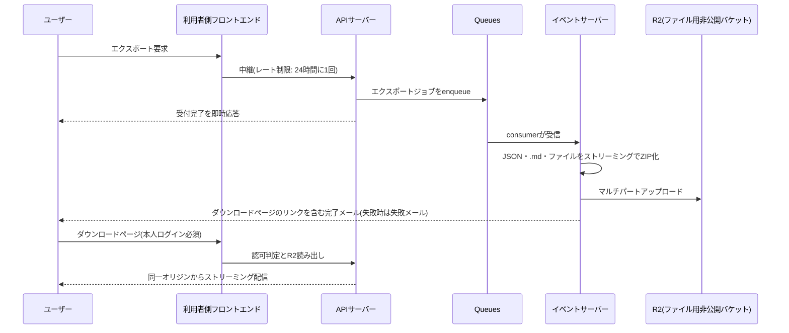

# ユーザーデータエクスポートのJSONスキーマとファイル構造

データポータビリティ機能(FR-UDATA-001〜008、DR-003)でユーザーに提供するZIPアーカイブの構造と、各JSONファイルの項目を定義する。
エクスポートは「ユーザー自身が生成・提供したデータ」と「自身のプロダクトが受けた成績」を対象とし、他ユーザーの行動(フォロワー一覧、自分のプロダクトへの他者のUpvoteやコメント)は含めない。

## 全体方針

| 項目               | 方針                                                                                                     |
| ------------------ | -------------------------------------------------------------------------------------------------------- |
| 形式               | ZIPアーカイブ1つ。JSONはUTF-8(BOMなし)、改行LF                                                           |
| JSONの分割         | エンティティ種別ごとに1ファイル。`manifest.json`で一覧する                                               |
| マークダウン本文   | JSONには相対パスのみを持ち、本文は`.md`ファイルへ分離する                                                |
| 画像・添付ファイル | 原本をそのまま同梱する。ファイル名はアップロード時の元ファイル名                                         |
| 日時               | ISO 8601のUTC表記(`2026-09-07T08:00:00.000Z`)。基準時刻(UTC-08:00)の「日付」は`YYYY-MM-DD`               |
| ID                 | 各エンティティのULID。他ファイルからの参照はULIDで行う                                                   |
| 秘密情報           | パスワードハッシュ、セッション、TOTPシークレット、リカバリコード、APIキー平文、配信停止トークンは含めない |
| 論理削除済みデータ | 自身で削除したコメント等は`deletedAt`付きで含める。管理者により非公開化されたものは本文を含めない         |

## ZIPの構造

ZIPのファイル名は`launch-stadium-export-{handle}-{YYYYMMDD}.zip`(日付は基準時刻での要求日)とする。

```
launch-stadium-export-kurachi_dev-20260915.zip
├── README.txt
├── manifest.json
├── account.json
├── profile.json
├── profile/
│   ├── bio.md
│   └── avatar.png
├── products.json
├── products/
│   └── {productHandle}/
│       ├── description.md
│       ├── logo/
│       │   └── {元ファイル名}
│       └── screenshots/
│           └── {元ファイル名}
├── launches.json
├── comments.json
├── comments/
│   └── {commentId}.md
├── upvotes.json
├── ratings.json
├── follows.json
├── reports.json
├── inquiries.json
├── inquiries/
│   └── {inquiryId}/
│       └── {messageId}/
│           └── {元ファイル名}
├── sponsorships.json
└── payments.json
```

該当データが0件のJSONファイルも空配列`[]`で必ず出力する。プロフィール画像未設定など該当ファイルが無い場合はディレクトリを作らない。

### ファイル名の規則

- 画像・添付ファイルはアップロード時にクライアントが申告した元ファイル名(FR-FILEU-018により保存済み)を用いる
- 保存済みの元ファイル名は既にパス区切り(`/`、`\`)、制御文字、先頭の`.`が除去され255バイト以内に切り詰められている
- 同一ディレクトリ内で名前が衝突する場合、2つ目以降に`-2`、`-3`のように拡張子の前へ連番を付ける(`shot.png`、`shot-2.png`)
- JSON側の`*Path`フィールドは、ZIPルートからの相対パスをそのまま持つ
- `{productHandle}`はエクスポート時点のプロダクトのハンドル文字列。プロダクト論理削除済みの場合も同じ規則で出力する

## README.txt

ユーザーへの感謝と、アーカイブの読み方を平文で記す。UIと同じ日本語とする。

```
Launch Stadiumをご利用いただきありがとうございます。

このアーカイブには、あなたがLaunch Stadiumで登録・投稿したデータと、
あなたのプロダクトが受けた対戦成績が含まれています。

各JSONファイルの内容とファイル一覧はmanifest.jsonをご覧ください。
プロダクトの説明文やコメントなどのマークダウン本文は、JSONから
相対パスで参照される.mdファイルに保存されています。

このアーカイブのダウンロードリンクは生成完了から7日間有効です。
```

## manifest.json

```json
{
  "schemaVersion": 1,
  "service": "Launch Stadium",
  "requestedAt": "2026-09-15T10:12:30.000Z",
  "generatedAt": "2026-09-15T10:13:05.412Z",
  "user": {
    "id": "01J8ZK2W4XN6YQ0V9F3P7HRD5A",
    "handle": "kurachi_dev"
  },
  "files": [
    { "path": "account.json", "kind": "account", "count": 1 },
    { "path": "profile.json", "kind": "profile", "count": 1 },
    { "path": "products.json", "kind": "products", "count": 2 },
    { "path": "launches.json", "kind": "launches", "count": 3 },
    { "path": "comments.json", "kind": "comments", "count": 5 },
    { "path": "upvotes.json", "kind": "upvotes", "count": 40 },
    { "path": "ratings.json", "kind": "ratings", "count": 4 },
    { "path": "follows.json", "kind": "follows", "count": 7 },
    { "path": "reports.json", "kind": "reports", "count": 0 },
    { "path": "inquiries.json", "kind": "inquiries", "count": 1 },
    { "path": "sponsorships.json", "kind": "sponsorships", "count": 1 },
    { "path": "payments.json", "kind": "payments", "count": 3 }
  ]
}
```

| 項目            | 型       | 説明                                                                 |
| --------------- | -------- | -------------------------------------------------------------------- |
| `schemaVersion` | 整数     | 本書で定義する構造のバージョン。後方互換性のない変更時に加算する     |
| `service`       | 文字列   | 固定値`Launch Stadium`                                               |
| `requestedAt`   | 日時     | ユーザーがエクスポートを要求した日時                                 |
| `generatedAt`   | 日時     | ZIP生成が完了した日時                                                |
| `user.id`       | ULID     | ユーザーの主キー                                                     |
| `user.handle`   | 文字列   | エクスポート時点のハンドル文字列                                     |
| `files[]`       | 配列     | 同梱するJSONファイルの一覧。`count`は配列要素数(単一オブジェクトは1) |

## account.json

アカウント設定と契約状態。公開プロフィール(`profile.json`)とは分ける。

```json
{
  "email": "kurachi@mail.example",
  "emailVerifiedAt": "2026-03-02T01:15:00.000Z",
  "registeredAt": "2026-03-01T23:58:41.000Z",
  "mfaEnabled": true,
  "plan": {
    "name": "ultras",
    "status": "active",
    "startedAt": "2026-06-01T15:00:00.000Z",
    "currentPeriodEndsAt": "2026-10-01T15:00:00.000Z",
    "canceledAt": null
  },
  "notificationSettings": {
    "matchPreview": true,
    "matchResult": true,
    "followedUserMatch": false,
    "followedUserAward": true,
    "suppressedReason": null
  },
  "apiKeys": [
    {
      "id": "01J9A1Z3C5E7G9K1M3P5R7T9V1",
      "name": "My dashboard",
      "scopes": {
        "products": "read",
        "launches": "read",
        "upvotes": "read",
        "comments": "none",
        "ratings": "read",
        "profile": "read_write",
        "productDescriptions": "read_write"
      },
      "createdAt": "2026-07-10T09:00:00.000Z"
    }
  ]
}
```

| 項目                                   | 型             | 説明                                                                                       |
| -------------------------------------- | -------------- | ------------------------------------------------------------------------------------------ |
| `email`                                | 文字列         | 確認済みのメールアドレス                                                                   |
| `emailVerifiedAt`                      | 日時           | メールアドレス確認完了日時                                                                 |
| `registeredAt`                         | 日時           | ユーザー登録日時                                                                           |
| `mfaEnabled`                           | 真偽値         | TOTP多要素認証の有効状態。シークレットやリカバリコードは含めない                           |
| `plan`                                 | オブジェクト/null | Ultras加入履歴が無ければ`null`                                                          |
| `plan.name`                            | 文字列         | 固定値`ultras`                                                                             |
| `plan.status`                          | 文字列         | `active`(有効)、`canceled`(解約済みで期間末まで有効)、`ended`(終了)                        |
| `plan.startedAt`                       | 日時           | 加入日時                                                                                   |
| `plan.currentPeriodEndsAt`             | 日時           | 現在の課金期間の終了日時                                                                   |
| `plan.canceledAt`                      | 日時/null      | 解約操作の日時                                                                             |
| `notificationSettings.matchPreview`    | 真偽値         | マッチ開始予告メール(FR-NOTIF-001)の受信可否                                               |
| `notificationSettings.matchResult`     | 真偽値         | 勝敗結果通知メール(FR-NOTIF-002)の受信可否                                                 |
| `notificationSettings.followedUserMatch` | 真偽値       | フォロー中ユーザーのマッチ開催通知(FR-NOTIF-003)の受信可否                                 |
| `notificationSettings.followedUserAward` | 真偽値       | フォロー中ユーザーの受賞結果通知(FR-NOTIF-004)の受信可否                                   |
| `notificationSettings.suppressedReason` | 文字列/null   | バウンス等により送信対象外の場合`bounce`・`complaint`・`rejected`のいずれか。通常は`null`  |
| `apiKeys[].id`                         | ULID           | APIキーのID                                                                                |
| `apiKeys[].name`                       | 文字列         | ユーザーが付けたキーの名前                                                                 |
| `apiKeys[].scopes`                     | オブジェクト   | 機能ごとの権限。値は`none`・`read`・`read_write`(`read_write`は`profile`と`productDescriptions`のみ) |
| `apiKeys[].createdAt`                  | 日時           | 発行日時。キーの平文とハッシュは含めない                                                   |

## profile.json

```json
{
  "handle": "kurachi_dev",
  "nickname": "Kurachi",
  "headline": "個人開発者。SaaSを週1でローンチ中",
  "bioPath": "profile/bio.md",
  "avatarPath": "profile/avatar.png",
  "websites": [
    { "name": "GitHub", "url": "https://github.example/kurachi" },
    { "name": "Blog", "url": "https://blog.example/" }
  ],
  "updatedAt": "2026-08-20T12:00:00.000Z"
}
```

| 項目           | 型          | 説明                                                             |
| -------------- | ----------- | ---------------------------------------------------------------- |
| `handle`       | 文字列      | ハンドル文字列(25文字以内)                                       |
| `nickname`     | 文字列      | ニックネーム(25文字以内)                                         |
| `headline`     | 文字列/null | ヘッドライン(50文字以内)                                         |
| `bioPath`      | 文字列/null | 自己紹介マークダウンのパス。未設定なら`null`                     |
| `avatarPath`   | 文字列/null | プロフィール画像のパス。未設定なら`null`                         |
| `websites[]`   | 配列        | 外部WebサイトURLと表示名                                         |
| `updatedAt`    | 日時        | プロフィール最終更新日時                                         |

## products.json

自身が登録した全プロダクト(論理削除済みを含む)。

```json
[
  {
    "id": "01J9B2Y4D6F8H0K2M4P6R8T0V2",
    "handle": "pitch-notes",
    "name": "Pitch Notes",
    "tagline": "サッカー観戦メモをAIが試合ごとにまとめるアプリ",
    "category": "AI",
    "websiteUrl": "https://pitch-notes.example/",
    "descriptionPath": "products/pitch-notes/description.md",
    "logoPath": "products/pitch-notes/logo/logo.png",
    "screenshotPaths": [
      "products/pitch-notes/screenshots/home.png",
      "products/pitch-notes/screenshots/home-2.png"
    ],
    "createdAt": "2026-08-30T02:10:00.000Z",
    "updatedAt": "2026-09-06T22:45:00.000Z",
    "deletedAt": null,
    "hiddenByAdmin": false
  }
]
```

| 項目                | 型          | 説明                                                                             |
| ------------------- | ----------- | -------------------------------------------------------------------------------- |
| `id`                | ULID        | プロダクトID                                                                     |
| `handle`            | 文字列      | ハンドル文字列(50文字以内)                                                       |
| `name`              | 文字列      | 名称(50文字以内)                                                                 |
| `tagline`           | 文字列      | タグライン(100文字以内)                                                          |
| `category`          | 文字列      | エクスポート時点のカテゴリ名                                                     |
| `websiteUrl`        | 文字列      | 外部WebサイトURL                                                                 |
| `descriptionPath`   | 文字列      | 説明文マークダウンのパス                                                         |
| `logoPath`          | 文字列      | ロゴ画像のパス                                                                   |
| `screenshotPaths[]` | 配列        | スクリーンショットのパス。表示順                                                 |
| `createdAt`         | 日時        | 登録日時                                                                         |
| `updatedAt`         | 日時        | 最終更新日時                                                                     |
| `deletedAt`         | 日時/null   | 自身で論理削除した日時                                                           |
| `hiddenByAdmin`     | 真偽値      | 管理者により非公開化中なら`true`。理由は含めない(通知メールで別途通知済み)       |

## launches.json

ローンチ履歴と、各ローンチに紐付くマッチ結果。対戦相手は公開情報である名称とハンドル文字列のみを持つ。

```json
[
  {
    "id": "01J9C3Z5E7G9J1L3N5Q7S9U1W3",
    "productId": "01J9B2Y4D6F8H0K2M4P6R8T0V2",
    "launchDate": "2026-09-07",
    "status": "finished",
    "matches": [
      {
        "id": "01J9D4A6F8H0K2M4P6R8T0V2X4",
        "kind": "qualifier",
        "round": null,
        "date": "2026-09-07",
        "opponent": { "name": "Tactics Board", "handle": "tactics-board" },
        "upvoteCount": 12,
        "opponentUpvoteCount": 9,
        "lastUpvotedAt": "2026-09-08T05:40:12.000Z",
        "result": "won"
      },
      {
        "id": "01J9E5B7G9J1L3N5Q7S9U1W3Y5",
        "kind": "week",
        "round": 1,
        "date": "2026-09-15",
        "opponent": { "name": "Formation Lab", "handle": "formation-lab" },
        "upvoteCount": 0,
        "opponentUpvoteCount": 0,
        "lastUpvotedAt": null,
        "result": "lost"
      }
    ],
    "awards": []
  }
]
```

| 項目                           | 型            | 説明                                                                                                 |
| ------------------------------ | ------------- | ---------------------------------------------------------------------------------------------------- |
| `id`                           | ULID          | ローンチID                                                                                           |
| `productId`                    | ULID          | `products.json`の`id`                                                                                |
| `launchDate`                   | 日付          | 基準時刻でのローンチ日                                                                               |
| `status`                       | 文字列        | `scheduled`(予定)、`paired`(ペアリング済み)、`in_progress`(マッチ中)、`finished`(終了)、`canceled`(取消) |
| `matches[].kind`               | 文字列        | `qualifier`(予選)、`week`(Weekトーナメント)、`year`(Yearトーナメント)                                |
| `matches[].round`              | 整数/null     | トーナメントのラウンド番号(1回戦=1)。予選は`null`                                                    |
| `matches[].date`               | 日付          | マッチ実施日                                                                                         |
| `matches[].opponent`           | オブジェクト/null | 対戦相手。不戦勝は`null`。相手の退会・非公開化後も当時の名称とハンドルを保持                     |
| `matches[].upvoteCount`        | 整数          | 自プロダクトの確定Upvote数                                                                           |
| `matches[].opponentUpvoteCount` | 整数         | 対戦相手の確定Upvote数。不戦勝は`0`                                                                  |
| `matches[].lastUpvotedAt`      | 日時/null     | 自プロダクトの最終Upvote時刻                                                                         |
| `matches[].result`             | 文字列        | `won`、`lost`、`bye`(不戦勝)、`walkover`(相手の退会・停止・非公開化による勝利)                       |
| `awards[]`                     | 配列          | 受賞。`{"kind": "product_of_the_week", "period": "2026-W37"}`または`{"kind": "product_of_the_year", "period": "2026"}` |

## comments.json

自身が投稿したコメント。本文は`comments/{commentId}.md`に分離する。

```json
[
  {
    "id": "01J9F6C8H0K2M4P6R8T0V2X4Z6",
    "launchId": "01J9G7D9J1L3N5Q7S9U1W3Y5A7",
    "product": { "name": "Tactics Board", "handle": "tactics-board" },
    "parentCommentId": null,
    "bodyPath": "comments/01J9F6C8H0K2M4P6R8T0V2X4Z6.md",
    "ratingScore": 4,
    "createdAt": "2026-09-07T14:20:00.000Z",
    "updatedAt": "2026-09-07T14:25:00.000Z",
    "deletedAt": null,
    "hiddenByAdmin": false
  }
]
```

| 項目              | 型          | 説明                                                                       |
| ----------------- | ----------- | -------------------------------------------------------------------------- |
| `launchId`        | ULID        | コメント先のローンチID                                                     |
| `product`         | オブジェクト | コメント先プロダクトの名称とハンドル                                       |
| `parentCommentId` | ULID/null   | 返信先コメントID。トップレベルは`null`(最大3階層)                          |
| `bodyPath`        | 文字列/null | 本文マークダウンのパス。管理者非公開化中は`null`                           |
| `ratingScore`     | 整数/null   | コメントと併せて付けた5段階評価(1〜5)。付けていなければ`null`              |
| `deletedAt`       | 日時/null   | 自身で削除した日時                                                         |
| `hiddenByAdmin`   | 真偽値      | 管理者により非公開化中なら`true`                                           |

## upvotes.json

自身が行ったUpvote。取り消したものも`canceledAt`付きで含める。

```json
[
  {
    "matchId": "01J9D4A6F8H0K2M4P6R8T0V2X4",
    "matchKind": "qualifier",
    "matchDate": "2026-09-07",
    "product": { "name": "Pitch Notes", "handle": "pitch-notes" },
    "upvotedAt": "2026-09-07T13:02:11.000Z",
    "canceledAt": null
  }
]
```

| 項目         | 型          | 説明                                                    |
| ------------ | ----------- | ------------------------------------------------------- |
| `matchId`    | ULID        | UpvoteしたマッチのID                                    |
| `matchKind`  | 文字列      | `qualifier`・`week`・`year`                             |
| `matchDate`  | 日付        | マッチ実施日                                            |
| `product`    | オブジェクト | Upvoteしたプロダクトの名称とハンドル                    |
| `upvotedAt`  | 日時        | Upvote日時                                              |
| `canceledAt` | 日時/null   | 取り消した日時                                          |

## ratings.json

自身が付けた5段階評価の現在値(上書き後の値)。取り消し済みは含めない。

```json
[
  {
    "product": { "name": "Tactics Board", "handle": "tactics-board" },
    "score": 4,
    "createdAt": "2026-09-07T14:20:00.000Z",
    "updatedAt": "2026-09-09T08:00:00.000Z",
    "invalidatedByAdmin": false
  }
]
```

| 項目                 | 型      | 説明                                             |
| -------------------- | ------- | ------------------------------------------------ |
| `score`              | 整数    | 1〜5                                             |
| `invalidatedByAdmin` | 真偽値  | 管理者により無効化中なら`true`                   |

## follows.json

自身がフォロー中のユーザー(退会・停止中ユーザーは除く)。

```json
[
  {
    "user": { "handle": "maker_ai", "nickname": "Maker AI" },
    "followedAt": "2026-05-11T03:33:00.000Z"
  }
]
```

## reports.json

自身が送信した通報。対象は種別と公開識別子のみを持つ。

```json
[
  {
    "id": "01J9H8E0K2M4P6R8T0V2X4Z6B8",
    "targetType": "comment",
    "targetRef": "01J9I9F1L3N5Q7S9U1W3Y5A7C9",
    "category": "スパム",
    "reason": "同じ宣伝文を複数のローンチに投稿している",
    "createdAt": "2026-09-08T01:00:00.000Z"
  }
]
```

| 項目         | 型     | 説明                                                                              |
| ------------ | ------ | --------------------------------------------------------------------------------- |
| `targetType` | 文字列 | `user`・`product`・`comment`                                                      |
| `targetRef`  | 文字列 | ユーザーとプロダクトはハンドル文字列、コメントはコメントID                        |
| `category`   | 文字列 | 通報時点の通報カテゴリ名                                                          |
| `reason`     | 文字列 | 入力した理由                                                                      |

対応ステータスや管理者の判断結果は含めない。

## inquiries.json

ログイン状態で送信した問い合わせと、そのチャットメッセージ。添付ファイルは`inquiries/{inquiryId}/{messageId}/`へ同梱する。

```json
[
  {
    "id": "01J9J0G2M4P6R8T0V2X4Z6B8D0",
    "category": "決済について",
    "status": "resolved",
    "createdAt": "2026-08-01T10:00:00.000Z",
    "messages": [
      {
        "id": "01J9K1H3N5Q7S9U1W3Y5A7C9E1",
        "sender": "user",
        "adminNickname": null,
        "body": "領収書の宛名を変更できますか?",
        "attachments": [
          {
            "path": "inquiries/01J9J0G2M4P6R8T0V2X4Z6B8D0/01J9K1H3N5Q7S9U1W3Y5A7C9E1/receipt.pdf",
            "contentType": "application/pdf",
            "size": 48213
          }
        ],
        "sentAt": "2026-08-01T10:00:00.000Z"
      },
      {
        "id": "01J9L2J4P6R8T0V2X4Z6B8D0F2",
        "sender": "admin",
        "adminNickname": "サポート担当A",
        "body": "Stripeの領収書ページから変更できます。",
        "attachments": [],
        "sentAt": "2026-08-01T12:30:00.000Z"
      }
    ]
  }
]
```

| 項目                       | 型          | 説明                                                                  |
| -------------------------- | ----------- | --------------------------------------------------------------------- |
| `category`                 | 文字列      | 問い合わせ時点のカテゴリ名                                            |
| `status`                   | 文字列      | `open`(未対応)、`in_progress`(対応中)、`resolved`(対応済)、`rejected`(却下) |
| `messages[].sender`        | 文字列      | `user`(自身)、`admin`(管理者)                                         |
| `messages[].adminNickname` | 文字列/null | 管理者返信時のニックネーム。管理者が削除済みなら`null`                |
| `messages[].body`          | 文字列      | メッセージ本文(プレーンテキスト)                                      |
| `messages[].attachments[]` | 配列        | 添付ファイルのパス・MIMEタイプ・バイト数。管理者の添付も含める        |

## sponsorships.json

```json
[
  {
    "id": "01J9M3K5Q7S9U1W3Y5A7C9E1G3",
    "product": { "name": "Pitch Notes", "handle": "pitch-notes" },
    "tier": "gold",
    "startsOn": "2026-09-20",
    "endsOn": "2026-09-26",
    "days": 7,
    "status": "scheduled",
    "paymentId": "01J9N4L6R8T0V2X4Z6B8D0F2H4",
    "createdAt": "2026-09-15T09:00:00.000Z"
  }
]
```

| 項目        | 型     | 説明                                                                                   |
| ----------- | ------ | -------------------------------------------------------------------------------------- |
| `tier`      | 文字列 | `silver`・`gold`・`legend`                                                             |
| `startsOn`  | 日付   | 掲載開始日(基準時刻)                                                                   |
| `endsOn`    | 日付   | 掲載終了日(含む)                                                                       |
| `days`      | 整数   | 掲載日数(決済の数量)                                                                   |
| `status`    | 文字列 | `pending_payment`(未決済)、`scheduled`(掲載前)、`active`(掲載中)、`ended`(終了)、`terminated`(管理者による強制終了) |
| `paymentId` | ULID/null | `payments.json`の`id`。未決済なら`null`                                             |

## payments.json

決済履歴。返金・チャージバックも個別のレコードとして含める。金額はStripeと同じ最小通貨単位(USDならセント)の整数。

```json
[
  {
    "id": "01J9N4L6R8T0V2X4Z6B8D0F2H4",
    "kind": "one_time",
    "purpose": "sponsorship",
    "amount": 5600,
    "currency": "usd",
    "quantity": 7,
    "status": "succeeded",
    "stripeReference": "cs_test_a1B2c3D4e5F6g7H8i9J0",
    "relatedId": "01J9M3K5Q7S9U1W3Y5A7C9E1G3",
    "occurredAt": "2026-09-15T09:01:12.000Z"
  },
  {
    "id": "01J9O5M7S9U1W3Y5A7C9E1G3J5",
    "kind": "subscription",
    "purpose": "ultras",
    "amount": 900,
    "currency": "usd",
    "quantity": 1,
    "status": "succeeded",
    "stripeReference": "in_1PQRstUvWxYz0123456789",
    "relatedId": null,
    "occurredAt": "2026-09-01T15:00:00.000Z"
  },
  {
    "id": "01J9P6N8T0V2X4Z6B8D0F2H4K6",
    "kind": "refund",
    "purpose": "sponsorship",
    "amount": -2400,
    "currency": "usd",
    "quantity": null,
    "status": "succeeded",
    "stripeReference": "re_3PQRstUvWxYz0123456789",
    "relatedId": "01J9M3K5Q7S9U1W3Y5A7C9E1G3",
    "occurredAt": "2026-09-22T04:10:00.000Z"
  }
]
```

| 項目              | 型          | 説明                                                                                                   |
| ----------------- | ----------- | ------------------------------------------------------------------------------------------------------ |
| `kind`            | 文字列      | `one_time`(都度決済)、`subscription`(定期課金の請求)、`refund`(返金)、`dispute`(チャージバック)       |
| `purpose`         | 文字列      | `week_tournament_entry`・`year_tournament_entry`・`sponsorship`・`ultras`                              |
| `amount`          | 整数        | 最小通貨単位の金額。返金・チャージバックは負数                                                         |
| `currency`        | 文字列      | ISO 4217小文字。`usd`固定                                                                              |
| `quantity`        | 整数/null   | 数量(スポンサー広告は日数)。返金等は`null`                                                             |
| `status`          | 文字列      | `succeeded`・`failed`・`pending`・`disputed`・`dispute_won`・`dispute_lost`                            |
| `stripeReference` | 文字列      | Stripe側のオブジェクトID(Checkout Session・Invoice・Refund・Dispute)。ユーザーがStripe領収書と突合するために持つ |
| `relatedId`       | ULID/null   | 決済対象のローンチID(トーナメント参加費)またはスポンサー広告ID                                         |
| `occurredAt`      | 日時        | Webhookイベントに含まれる発生時刻                                                                      |

## 生成と提供の流れ



- ZIPは生成完了から7日経過後の日次バッチで削除する。ダウンロードページでは有効期限を表示する
- 生成中に再要求してもレート制限により拒否される
- ZIPには`Content-Disposition: attachment`と`Cache-Control: private, no-store`を設定する

## スキーマの変更管理

- 項目の追加は`schemaVersion`を変えずに行える。削除・型変更・意味の変更は`schemaVersion`を加算し、本書の変更履歴に記す
- 列挙値(`status`・`kind`等)の追加も後方互換とみなす。読み手は未知の値を無視できるよう実装する

| schemaVersion | 変更内容 |
| ------------- | -------- |
| 1             | 初版     |
