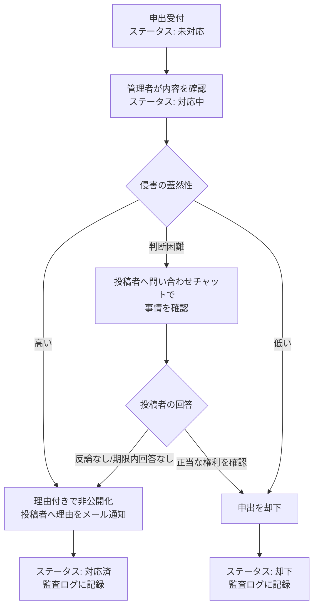

# 侵害コンテンツ削除請求フロー

著作権侵害等の権利侵害を申告された投稿コンテンツ(プロダクト・コメント・ユーザープロフィール)について、受付から判断・通知までのフローを定める(LR-004)。
情報流通プラットフォーム対処法(日本)の義務は法令上、指定を受けた大規模事業者に課されるが、本サービスは同法の枠組み(申出窓口の整備、一定期間内の判断と通知、削除基準の公表)に準拠した運用を行う。

## 申出の受付

| 項目           | 内容                                                                                       |
| -------------- | ------------------------------------------------------------------------------------------ |
| 窓口           | 各コンテンツの通報リンク(ログイン不要)。通報カテゴリ「著作権侵害」を選択する               |
| 必須入力       | 理由(1,000文字以内)。侵害されている権利、権利者との関係、対象箇所を書くよう入力欄に案内する |
| 追加の連絡     | 権利者の連絡先が必要な場合は問い合わせフォームで受け付ける                                 |
| レート制限     | IPアドレス単位で1時間に10回。ログイン中はユーザー単位でも同基準                            |
| 集約           | 同一コンテンツへの複数の申出は1件に集約し、件数と理由の内訳を管理者に表示する              |

「著作権侵害」はシステム標準の通報カテゴリであり削除できない(FR-ADMCF-016)。

## 判断と通知のフロー

| 段階                 | 内容                                                                                                             | 対応要件               |
| -------------------- | ---------------------------------------------------------------------------------------------------------------- | ---------------------- |
| 受付                 | 通報一覧に「未対応」で表示。カテゴリ「著作権侵害」で絞り込める                                                   | FR-ADMUG-014〜015      |
| 確認                 | 管理者(モデレーター以上)が対象コンテンツ・投稿者・過去の通報件数を確認し「対応中」にする                         | FR-ADMUG-006、FR-ADMUG-016 |
| 投稿者への照会       | 判断が難しい場合、投稿者に問い合わせチャットで事情を確認する。回答期限は3日を目安とする                          | FR-ADMAG-019           |
| 非公開化             | 理由を付して非公開化。投稿者へ理由と異議申し立て方法(問い合わせフォーム)をメール通知                             | FR-ADMUG-007、FR-ADMUG-011、FR-ADMUG-018 |
| 却下                 | 申出を却下。申出者への結果通知は行わない(通報フォームに「結果は通知されません」と明記)                           | FR-ADMUG-016           |
| 記録                 | 全ての操作を監査ログに記録。理由欄には個人情報を含めない                                                         | FR-ADMAG-001           |
| 対応期間の可視化     | 受付から対応完了までの経過時間を通報一覧に表示し、目標期間の超過を把握する                                       | FR-ADMUG-019           |

## 目標期間

| 項目                             | 目標                                           |
| -------------------------------- | ---------------------------------------------- |
| 受付から確認開始まで             | 1営業日以内                                    |
| 受付から判断・通知まで           | 7日以内(投稿者への照会を行う場合を含む)        |
| 投稿者からの回答期限             | 照会から3日                                    |

目標を超過した申出は通報一覧の対応期間表示で強調する。

## 非公開化の効果

| 対象               | 効果                                                                                                     |
| ------------------ | -------------------------------------------------------------------------------------------------------- |
| プロダクト         | ディレクトリ・検索・公開API・トップページから除外。未開始のローンチ予定を取り消し。マッチ中なら対戦相手が勝者 |
| コメント           | 「削除された旨」の表示に置き換え。返信は残る                                                             |
| ユーザープロフィール | プロフィール自体の非公開化機能は無いため、内容に応じてユーザー停止(全投稿の非表示)で対応                |

画像に関する申出で画像のみを差し替えれば足りる場合は、投稿者に画像の差し替えを求めることを優先する。

## 復元と異議申し立て

- 投稿者は問い合わせフォームから異議を申し立てられる。管理者は非公開化を取り消して復元できる(FR-ADMUG-007、FR-ADMUG-011)
- 復元時も理由を付し、監査ログに記録する
- 申出者と投稿者の間で権利の帰属が争われる場合、事業者は判断せず、裁判所等の判断が示されるまで非公開化を維持する運用とする

## 繰り返し侵害への対応

同一投稿者に対する非公開化が繰り返される場合、管理者は理由付きでユーザーを停止できる(FR-ADMUG-004)。停止の基準はヘルプ記事で公表する。
