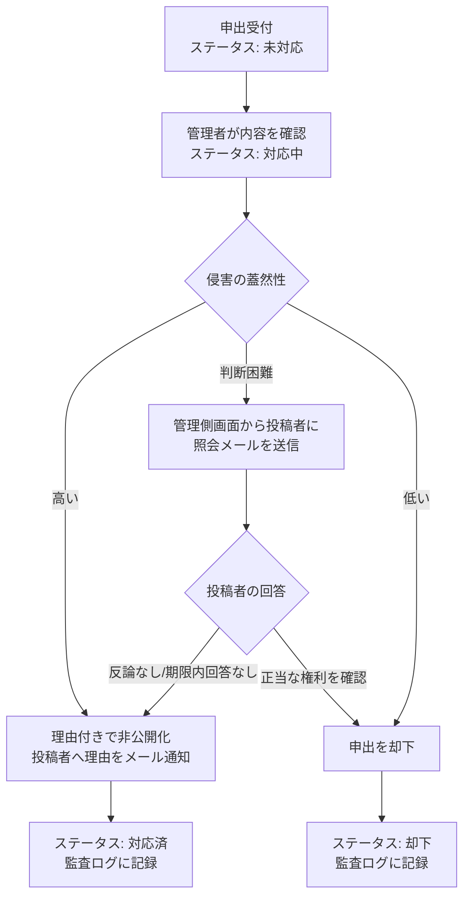

# 侵害コンテンツ削除請求フロー

著作権侵害等の権利侵害を申告された投稿コンテンツ(プロダクト・コメント・ユーザープロフィール)について、受付から判断・通知までのフローを定める(LR-004)。
情報流通プラットフォーム対処法(日本)の義務は法令上、指定を受けた大規模事業者に課されるが、本サービスは同法の枠組み(申出窓口の整備、一定期間内の判断と通知、削除基準の公表)に準拠した運用を行う。

## 申出の受付

| 項目       | 内容                                                                                                 | 対応要件                   |
| ---------- | ---------------------------------------------------------------------------------------------------- | -------------------------- |
| 窓口       | 各コンテンツの通報リンク(ログイン不要)。システム標準で削除不可の通報カテゴリ「著作権侵害」を選択する | FR-REPOT-001、FR-ADMCF-016 |
| 必須入力   | 理由。侵害されている権利、権利者との関係、対象箇所を書くよう入力欄に案内する                         | FR-REPOT-003〜004          |
| 追加の連絡 | 権利者の連絡先が必要な場合は問い合わせフォームで受け付ける                                           | —                          |
| レート制限 | 通報のレート制限                                                                                     | FR-RLMIT-003               |
| 集約       | 同一コンテンツへの複数の申出は1件に集約                                                              | FR-ADMUG-018               |

## 判断と通知のフロー

```mermaid
flowchart TD
    A[申出受付<br>ステータス: 未対応] --> B[管理者が内容を確認<br>ステータス: 対応中]
    B --> C{侵害の蓋然性}
    C -- 高い --> D[理由付きで非公開化<br>投稿者へ理由をメール通知]
    C -- 判断困難 --> E[管理側画面から投稿者に<br>照会メールを送信]
    E --> F{投稿者の回答}
    F -- 反論なし/期限内回答なし --> D
    F -- 正当な権利を確認 --> G[申出を却下]
    C -- 低い --> G
    D --> H[ステータス: 対応済<br>監査ログに記録]
    G --> I[ステータス: 却下<br>監査ログに記録]
```

| 段階             | 内容                                                                                                                                                 | 対応要件                                 |
| ---------------- | ---------------------------------------------------------------------------------------------------------------------------------------------------- | ---------------------------------------- |
| 受付             | 通報一覧に「未対応」で表示。カテゴリ「著作権侵害」で絞り込める                                                                                       | FR-ADMUG-015〜016                        |
| 確認             | 管理者(モデレーター以上)が対象コンテンツ・投稿者・過去の通報件数を確認し「対応中」にする                                                             | FR-ADMUG-006、FR-ADMUG-017               |
| 投稿者への照会   | 判断が難しい場合、管理側画面からのメール送信で投稿者へ事情を照会する。照会した旨は「対応中」への変更理由に記載して監査ログに残す(個人情報は含めない) | FR-ADMUG-020、FR-ADMAG-001               |
| 投稿者からの回答 | 照会リクエストを受けた投稿者は、問い合わせフォームから回答期限(3日を目安)内に回答する                                                                | FR-ADMUG-020、FR-ADMAG-001               |
| 非公開化         | 理由を付して非公開化。投稿者へ理由と異議申し立て方法(問い合わせフォーム)をメール通知                                                                 | FR-ADMUG-007、FR-ADMUG-011、FR-ADMUG-019 |
| 却下             | 申出を却下。申出者(未ログインはFR-REPOT-003で入力されたメールアドレス、ログイン中は登録メールアドレス)へシステム送信メールで結果を通知する           | FR-REPOT-003、FR-ADMUG-017、FR-ADMUG-021 |
| 記録             | 全ての操作を監査ログに記録。理由欄には個人情報を含めない                                                                                             | FR-ADMAG-001                             |
| 対応期間の可視化 | 受付から対応完了までの経過時間を通報一覧に表示し、目標期間の超過を把握する                                                                           | FR-ADMUG-022                             |

## 目標期間

| 項目                   | 目標                                    |
| ---------------------- | --------------------------------------- |
| 受付から確認開始まで   | 1営業日以内                             |
| 受付から判断・通知まで | 7日以内(投稿者への照会を行う場合を含む) |
| 投稿者からの回答期限   | 照会から3日                             |

目標を超過した申出は通報一覧の対応期間表示で強調する。

## 非公開化の効果

| 対象                 | 効果                                                                                                                                    |
| -------------------- | --------------------------------------------------------------------------------------------------------------------------------------- |
| プロダクト           | 一覧・検索・公開APIから除外(FR-DIR-010、FR-PAPI-009)、未開始のローンチ予定を取消(FR-ADMUG-008)、マッチ中なら対戦相手が勝者(FR-GAME-013) |
| コメント             | 「削除された旨」の表示に置き換え(FR-COMNT-007)。返信は残る                                                                              |
| ユーザープロフィール | プロフィール自体の非公開化機能は無いため、内容に応じてユーザー停止(FR-ADMUG-004、全投稿の非表示)で対応                                  |

画像に関する申出で画像のみを差し替えれば足りる場合は、投稿者に画像の差し替えを求めることを優先する。

投稿者本人によるデータエクスポート([ユーザーデータエクスポート](../features/001-user-data-export.md))には、非公開化後も管理者により非公開となったことを示すフラグ付きで本文・画像を含める。例え諸問題により非公開化したデータであっても投稿されたデータであり、投稿者本人が取り戻せるようにする方針に基づく。

## 復元と異議申し立て

- 投稿者は問い合わせフォームから異議を申し立てられる。管理者は非公開化を取り消して復元できる(FR-ADMUG-007、FR-ADMUG-011)
- 復元時も理由を付し、監査ログに記録する
- 申出者と投稿者の間で権利の帰属が争われる場合、事業者は判断せず、裁判所等の判断が示されるまで非公開化を維持する運用とする

## 繰り返し侵害への対応

同一投稿者に対する非公開化が繰り返される場合、管理者は理由付きでユーザーを停止できる(FR-ADMUG-004)。停止の基準はヘルプ記事で公表する。
