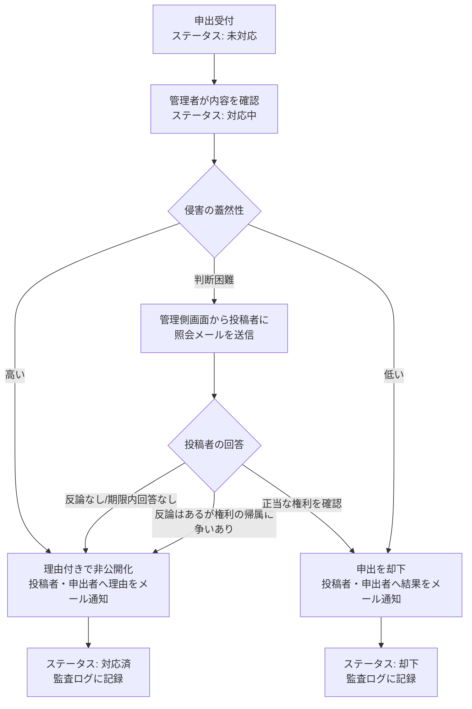

# 侵害コンテンツ削除請求フロー

著作権侵害等の権利侵害を申告された投稿コンテンツ(ユーザー・プロダクト・コメント)について、受付から判断・通知までのフローを定める(LR-004)。
情報流通プラットフォーム対処法(日本)の義務は法令上、指定を受けた大規模事業者に課されるが、本サービスは同法の枠組み(申出窓口の整備、一定期間内の判断と通知、削除基準の公表)に準拠した運用を行う。

## 申出の受付

| 項目       | 内容                                                                                               | 対応要件                   |
| ---------- | -------------------------------------------------------------------------------------------------- | -------------------------- |
| 窓口       | 各コンテンツの通報リンク(ログイン不要)。システム標準で削除不可の通報カテゴリ「権利侵害」を選択する | FR-REPOT-001、FR-ADMCF-016 |
| 必須入力   | 理由。侵害されている権利、権利者との関係、対象箇所を書くよう入力欄に案内する                       | FR-REPOT-003〜004          |
| 追加の連絡 | 権利者の連絡先が必要な場合は問い合わせフォームで受け付ける                                         | —                          |
| レート制限 | 通報のレート制限                                                                                   | FR-RLMIT-003               |
| 集約       | 同一コンテンツへの複数の申出は1件に集約                                                            | FR-ADMUG-018               |

## 判断と通知のフロー

| 段階             | 内容                                                                                                                                                | 対応要件                                 |
| ---------------- | --------------------------------------------------------------------------------------------------------------------------------------------------- | ---------------------------------------- |
| 受付             | 通報一覧に「未対応」で表示。カテゴリ「権利侵害」で絞り込める                                                                                        | FR-ADMUG-015〜016                        |
| 確認             | 管理者(モデレーター以上)が対象コンテンツ・投稿者・過去の通報件数を確認し「対応中」にする                                                            | FR-ADMUG-006、FR-ADMUG-017               |
| 投稿者への照会   | 判断が難しい場合投稿者へ事情を照会する。管理側から送信するメールに対象コンテンツと回答方法を記載し、送信日時を7日間の起算点として監査ログに記録する | FR-ADMUG-020、FR-ADMAG-001               |
| 投稿者からの回答 | 照会メールを受けた投稿者は、問い合わせフォームのメッセージに対象コンテンツを明記し、回答期限である7日以内に回答する                                 | FR-INQRY-001                             |
| 非公開化         | 理由を付して非公開化。投稿者へ理由と異議申し立て方法(問い合わせフォーム)を、申出者へ理由をメール通知                                                | FR-ADMUG-007、FR-ADMUG-011、FR-ADMUG-019 |
| 却下             | 申出を却下。申出者(未ログインはFR-REPOT-003で入力されたメールアドレス、ログイン中は登録メールアドレス)・投稿者へシステム送信メールで結果を通知する  | FR-REPOT-003、FR-ADMUG-017、FR-ADMUG-021 |
| 記録             | 対応ステータスの変更・非公開化・却下・停止・照会を監査ログに記録。理由欄には個人情報を含めない                                                      | FR-ADMAG-001                             |
| 対応期間の可視化 | 受付から対応完了までの経過時間を通報一覧に表示し、目標期間の超過を把握する                                                                          | FR-ADMUG-022                             |

## 目標期間

| 項目                   | 目標                                    |
| ---------------------- | --------------------------------------- |
| 受付から確認開始まで   | 1営業日以内                             |
| 受付から判断・通知まで | 9日以内(投稿者への照会を行う場合を含む) |
| 投稿者からの回答期限   | 照会から7日以内                         |

目標を超過した申出は通報一覧の対応期間表示で強調する。

情報流通プラットフォーム対処法3条2項2号により、投稿者が照会から7日以内に反論しなかった場合は、管理者により削除しても免責される。

## 非公開化・停止の効果

### プロダクトの非公開化

| 対象                     | 効果                                                                            |
| ------------------------ | ------------------------------------------------------------------------------- |
| 当該プロダクトのマッチ   | 未開始のマッチ予定を取消(FR-ADMUG-008)、マッチ中なら対戦相手が勝者(FR-GAME-013) |
| プロダクト一覧           | 一覧・検索・公開APIから除外(FR-DIR-010、FR-PAPI-009)                            |
| プロダクト詳細           | 404([ページ構成](../design/002-page-layouts.md#プロダクト詳細の公開範囲))       |
| ユーザー公開プロフィール | ローンチ履歴から除外                                                            |

### ユーザーの停止

| 対象                                 | 効果                                                                                |
| ------------------------------------ | ----------------------------------------------------------------------------------- |
| ユーザーが投稿したプロダクトのマッチ | [プロダクトの非公開化](#プロダクトの非公開化)と同様                                 |
| プロダクト一覧                       | [プロダクトの非公開化](#プロダクトの非公開化)と同様                                 |
| プロダクト詳細                       | [プロダクトの非公開化](#プロダクトの非公開化)と同様                                 |
| Upvoteしたユーザー一覧               | 一覧から除外(FR-DIR-011)                                                            |
| プロダクトへのコメント               | 「削除された旨」の表示に置き換え(FR-COMNT-007)。返信は残る                          |
| 公開プロフィール                     | 404([ページ構成](../design/002-page-layouts.md#ユーザー公開プロフィールの公開範囲)) |

画像に関する申出で画像のみを差し替えれば足りる場合は、対象画像を隔離バケットへ移動した上で(FR-ADMUG-027)投稿者に新しい画像のアップロードを求める。投稿者が差し替えると隔離済みの旧画像は即時に物理削除される(FR-FILEU-021)。

## 復元と異議申し立て

- 投稿者は問い合わせフォームから異議を申し立てられる。管理者は非公開化を取り消して復元できる(FR-ADMUG-007、FR-ADMUG-011)
- 復元時も理由を付し、監査ログに記録する
- プロダクトの復元時、ロゴ・スクリーンショットがプロダクト非公開化以外の理由でも隔離されている場合、それらの画像は当該理由により非公開のまま(FR-ADMUG-028)
- 申出者と投稿者の間で権利の帰属が争われる場合、事業者は判断せず、裁判所等の判断が示されるまで非公開化を維持する運用とする

## 繰り返し侵害への対応

同一投稿者に対する非公開化が繰り返される場合、管理者は理由付きでユーザーを停止できる(FR-ADMUG-004)。停止の基準はヘルプ記事で公表する。
