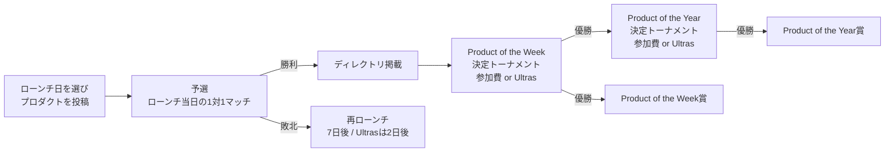

# サービス概要とコンセプト

Launch Stadiumは、作った製品(プロダクト)を投稿し、他のユーザーからのUpvote数を1対1の対戦形式で競い合うローンチプラットフォームである。
本書は要件定義書([README.md](../../../../README.md))のうち、サービスの思想・世界観・登場人物を開発者向けに整理したものである。個々の要件IDの正は要件定義書とする。

## 位置づけ

Product HuntやUneedの競合として位置づけられる。既存サービスが「日毎に多数のプロダクトを順位付けする」のに対し、本サービスは「2つのプロダクトを1対1で戦わせ、必ず半分を勝者にする」点で差別化する。

| 既存サービスの課題                                     | 本サービスの解決策                                                                          |
| ------------------------------------------------------ | ------------------------------------------------------------------------------------------- |
| ランキング上位のみが注目され、成功と見做される         | 1対1勝負のため必ず半分が勝者になる。毎日勝ちプロダクトを量産する                            |
| ランキング内に異なるカテゴリのプロダクトが混在する     | 対戦相手は可能な限り同カテゴリから選ばれ、真っ向勝負できる([予選ルール](003-qualifier-rules.md)) |
| 頻繁な再ローンチが規約やコミュニティから嫌われる       | 頻繁な再ローンチをハングリー精神の表れとして容認する([再ローンチ規則](006-relaunch-rules.md)) |
| 上位を狙うためのローンチ前準備が多すぎる               | 勝てるまで再ローンチできるため、PDCAを回して対策できる                                       |

## 世界観: サッカーの試合

サービス全体をサッカーの試合になぞらえる。名称の「Stadium」、有料プランの「Ultras」(熱狂的サポーター)、Upvoteしたユーザーを「サポーター」と呼ぶ点はこの世界観に由来する。
Product of the Year決定トーナメントの決勝日も、欧州各国リーグの最終節やCL決勝でサッカー熱が最高潮になる時期(イングランドのプレミアリーグ最終節付近)に管理者が設定する。

UI文言における具体的なサッカー用語の使い方は[デザインガイドライン](../design/001-design-principles.md)を参照。

## 勝ち上がりの全体像

- 予選: ローンチ当日に行われる1対1マッチ。勝者はディレクトリに掲載される。詳細は[予選ルール](003-qualifier-rules.md)
- Product of the Week決定トーナメント: 同じ週に予選で勝利したプロダクト同士のトーナメント。詳細は[Weekトーナメント規則](004-week-tournament-rules.md)
- Product of the Year決定トーナメント: 年間のProduct of the Week受賞プロダクト同士のトーナメント。詳細は[Yearトーナメント規則](005-year-tournament-rules.md)
- 全ての時刻はUTC-08:00基準で運用する。詳細は[日次・週次タイムライン](007-daily-timeline.md)

## ユーザークラス

| ユーザークラス   | 主な行動                                                                   | 利用画面             |
| ---------------- | -------------------------------------------------------------------------- | -------------------- |
| プロダクト投稿者 | プロダクトを登録しローンチする。トーナメント参加費やスポンサー広告を支払う | 利用者側サイト       |
| サポーター       | 気に入ったプロダクトにUpvote・コメント・5段階評価をし、投稿者をフォローする | 利用者側サイト       |
| プロダクト探索者 | ディレクトリから優れたプロダクトを検索・閲覧する(未ログインでも可)          | 利用者側サイト       |
| システム管理者   | ユーザー・コンテンツのモデレーション、ヘルプ記事・法務文書の編集、設定管理 | 管理者側サイト       |

同一のユーザーアカウントが投稿者・サポーター・探索者を兼ねる。組織アカウントや共同運用は提供しない。
管理者アカウントは利用者アカウントとは別体系であり、権限ロール(閲覧のみ/モデレーター/最上位管理者)を持つ。

## 収益モデル

収益は全て利用者からのStripe決済であり、以下の3種類から成る。詳細は[料金及びプラン体系](002-pricing-and-plans.md)を参照。

1. 有料プラン「Ultras」(月額定期課金)
2. トーナメント参加費(都度決済、Ultras加入者は免除)
3. スポンサー広告(都度決済、ティア×掲載日数)

## スコープ外

要件定義書1.2節で対象外とされている事項のうち、サービス仕様の議論で特に混同しやすいものを挙げる。

- 組織アカウント・複数ユーザーでの共同運用・共同編集
- UI文言の多言語切替(ブラウザ翻訳でレイアウトが崩れない設計はする)
- OSネイティブアプリ
- 未ログインユーザーからの問い合わせへのシステム上の返信(管理者がメールで手動対応)

## 用語

利用者向けの用語定義は要件定義書1.3節を正とする。本ドキュメント群では以下の略記も用いる。

| 略記               | 意味                                       |
| ------------------ | ------------------------------------------ |
| Weekトーナメント   | Product of the Week決定トーナメント        |
| Yearトーナメント   | Product of the Year決定トーナメント        |
| Ultras             | 月額有料プラン(Ultrasプラン)               |
| 基準時刻           | UTC-08:00固定オフセットの時刻              |
