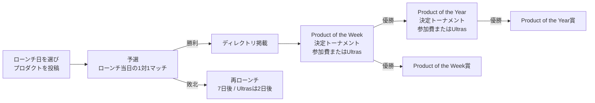

# サービス概要とコンセプト

Launch Stadiumは、作った製品(プロダクト)を投稿し、他のユーザーからのUpvote数を1対1の対戦形式で競い合うローンチプラットフォームである。
本書は[要件定義書](../../../requirements/spec.md)のうち、サービスの思想・世界観を開発者向けに整理したものである。個々の要件IDの正は要件定義書とする。

## 位置づけ

Product HuntやUneedの競合として位置づけられる。既存サービスの課題と本サービスの解決策は要件定義書3.1節・3.2節を正とする。解決策のうち「同カテゴリ優先のペアリング」は[予選ルール](003-qualifier-rules.md)、「頻繁な再ローンチの容認」は[再ローンチ規則](006-relaunch-rules.md)で具体化する。

## 世界観: サッカーの試合

サービス全体をサッカーの試合になぞらえる。名称の「Stadium」、有料プランの「Ultras」(熱狂的サポーター)、Upvoteしたユーザーを「サポーター」と呼ぶ点はこの世界観に由来する。

UI文言における具体的なサッカー用語の使い方は[デザイン原則](../design/001-design-principles.md)を参照。

## 勝ち上がりの全体像

```mermaid
flowchart LR
    L[ローンチ日を選び<br>プロダクトを投稿] --> Q[予選<br>ローンチ当日の1対1マッチ]
    Q -- 勝利 --> D[ディレクトリ掲載]
    Q -- 敗北 --> R["再ローンチ<br>7日後 / Ultrasは2日後"]
    D --> W[Product of the Week<br>決定トーナメント<br>参加費またはUltras]
    W -- 優勝 --> Y[Product of the Year<br>決定トーナメント<br>参加費またはUltras]
    Y -- 優勝 --> POY[Product of the Year賞]
    W -- 優勝 --> POW[Product of the Week賞]
```

- 予選: ローンチ当日に行われる1対1マッチ。勝者はディレクトリに掲載される。詳細は[予選ルール](003-qualifier-rules.md)
- Product of the Week決定トーナメント: 同じ週に予選で勝利したプロダクト同士のトーナメント。詳細は[Weekトーナメント規則](004-week-tournament-rules.md)
- Product of the Year決定トーナメント: 年間のProduct of the Week受賞プロダクト同士のトーナメント。詳細は[Yearトーナメント規則](005-year-tournament-rules.md)
- 全ての時刻はUTC-08:00基準で運用する。詳細は[日次・週次・年次タイムライン](007-daily-timeline.md)

## ユーザークラス

ユーザークラスの定義は要件定義書2.3節を正とする。プロダクト投稿者・サポーター・プロダクト探索者は利用者側サイトを使う同一のユーザーアカウントが兼ね、システム管理者は別体系の管理者アカウントで管理者側サイトを使う(権限ロールはFR-ADMAC-005)。

## 収益モデル

収益は全て利用者からのStripe決済であり、以下の3種類から成る。詳細は[料金及びプラン体系](002-pricing-and-plans.md)を参照。

1. 有料プラン「Ultras」(月額定期課金)
2. トーナメント参加費(都度決済、Ultras加入者は免除)
3. スポンサー広告(都度決済、ティア×掲載日数)

## スコープ外

対象外の要件・機能は要件定義書1.2節を正とする。

## 用語

利用者向けの用語定義は要件定義書1.3節を正とする。本ドキュメント群では以下の略記も用いる。

| 略記             | 意味                                |
| ---------------- | ----------------------------------- |
| Weekトーナメント | Product of the Week決定トーナメント |
| Yearトーナメント | Product of the Year決定トーナメント |
| Ultras           | 月額有料プラン(Ultrasプラン)        |
| 基準時刻         | UTC-08:00固定オフセットの時刻       |
