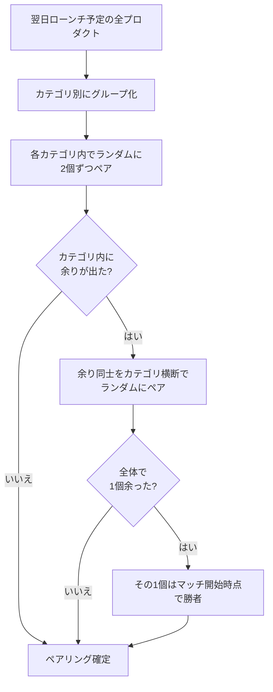

# 予選ルール

予選は、ローンチ当日に行われるプロダクト同士の1対1マッチである。予選に勝利したプロダクトはディレクトリに掲載され、Weekトーナメントへの参加資格を得る候補となる。
時刻は全て基準時刻(UTC-08:00)である。

## ローンチ日の選択

プロダクト登録・編集時にローンチ日を選ぶ。選べる日は以下の制約を全て満たす日に限る(FR-PRDCT-002)。

| 操作時刻(基準時刻)          | 選択可能な最も早いローンチ日 |
| --------------------------- | ---------------------------- |
| 当日23:40未満               | 翌日                         |
| 当日23:40以降               | 翌々日                       |

23:40以降に翌日を選べないのは、23:45にペアリングが確定するためである。加えて[再ローンチ規則](006-relaunch-rules.md)による制限日も選択できない。

## ペアリング(対戦相手の決定)

毎日23:45に、翌日ローンチするプロダクトを対象に以下の手順でペアリングする(FR-GAME-001〜004)。

1. 同じカテゴリのプロダクト同士を、カテゴリ内でランダムにペアにする
2. カテゴリ内のプロダクト数が奇数のためにペアにできなかったプロダクトを集め、カテゴリを問わずランダムにペアにする
3. その日にローンチするプロダクト数が奇数のために最後に1個残った場合、そのプロダクトはマッチ開始時点で勝者となる(不戦勝)

ペアリング後、両プロダクトの投稿者にマッチ開始予告メールを送る(フォロワーへの開催通知はマッチ開始時)。

### ペアリングの例

翌日ローンチ予定が9個の場合。

| カテゴリ   | プロダクト     |
| ---------- | -------------- |
| AI         | A1, A2, A3, A4, A5 |
| 開発ツール | D1, D2, D3     |
| その他     | O1             |

1. AIカテゴリ内でランダムにペア: (A3, A1)、(A5, A2)。余りA4
2. 開発ツールカテゴリ内でランダムにペア: (D2, D3)。余りD1
3. その他カテゴリは1個のみ。余りO1
4. 余りA4・D1・O1をカテゴリ横断でランダムにペア: (D1, O1)。余りA4
5. A4は不戦勝。マッチ開始時点で勝者となりディレクトリに掲載される

翌日のトップページには4つの予選マッチ(A3 vs A1、A5 vs A2、D2 vs D3、D1 vs O1)が表示される。

## マッチの進行

| 時刻      | 事象                                                                           |
| --------- | ------------------------------------------------------------------------------ |
| 0:00      | マッチ開始。Upvote受付開始。投稿者のフォロワーへ開催通知メール                 |
| 0:00〜23:40 | ログインユーザーは1マッチにつき1回Upvoteできる。取り消しも可能                |
| 23:40     | マッチ終了。Upvote数と最終Upvote時刻を確定し、勝敗を判定                       |
| 23:45     | 両投稿者へ勝敗結果通知メール                                                   |

- 自身のプロダクトとその対戦相手にはUpvoteできない
- マッチ開始前・終了後のUpvoteと取り消しは拒否される
- Upvote数はマッチ毎に集計し、同じプロダクトの過去マッチのUpvote数は引き継がない

## 勝敗判定

マッチ終了時点で以下の順に判定する(FR-GAME-010〜012)。

| 条件                                   | 結果                                               |
| -------------------------------------- | -------------------------------------------------- |
| Upvote数が異なる                       | 多い方が勝者                                       |
| Upvote数が同じで1以上                  | 最終Upvote時刻が早い方が勝者                       |
| Upvote数が両者0                        | 両者敗者(ディレクトリ非掲載、再ローンチは敗北扱い) |

最終Upvote時刻は、取り消されたUpvote、退会したユーザー・管理者に停止されたユーザーによるUpvoteを除いた中で最も遅いUpvoteの時刻である。

### 判定の例

| マッチ     | Upvote数 | 最終Upvote時刻   | 結果                                   |
| ---------- | -------- | ---------------- | -------------------------------------- |
| A3 vs A1   | 12 vs 9  | —                | A3の勝利                               |
| A5 vs A2   | 7 vs 7   | 14:02 vs 18:30   | 先に7票目に到達したA5の勝利            |
| D2 vs D3   | 0 vs 0   | —                | 両者敗北                               |
| D1 vs O1   | 3 vs 0   | —                | D1の勝利                               |

「先に到達した」勝者判定により、同数時は早く支持を集めたプロダクトが報われる。

## マッチ中・直前の異常時の扱い

| 状況                                                                                     | 扱い                                                       |
| ---------------------------------------------------------------------------------------- | ---------------------------------------------------------- |
| ペアリング済み(マッチ直前)のプロダクトの投稿者が退会・停止、またはプロダクトが非公開化   | 対戦相手はマッチ開始時点で勝者                             |
| マッチ中のプロダクトの投稿者が退会・停止、またはプロダクトが非公開化                     | 対戦相手は直ちに勝者(マッチはその時点で終了)               |
| Upvoteしたユーザーが管理者に停止された                                                   | そのユーザーのマッチ中Upvoteは即時論理削除され集計から除外 |

ペアリング後からマッチ終了までの間、プロダクトのローンチ日・カテゴリの変更と論理削除はできない。

## 予選の結果がもたらすもの

| 結果 | ディレクトリ掲載 | Weekトーナメント        | 再ローンチ                                 |
| ---- | ---------------- | ----------------------- | ------------------------------------------ |
| 勝利 | あり             | 決済(またはUltras)で参加 | 21日間禁止                                 |
| 敗北 | なし             | なし                    | 7日後(Ultrasは2日後)から可能               |

詳細は[Weekトーナメント規則](004-week-tournament-rules.md)と[再ローンチ規則](006-relaunch-rules.md)を参照。
