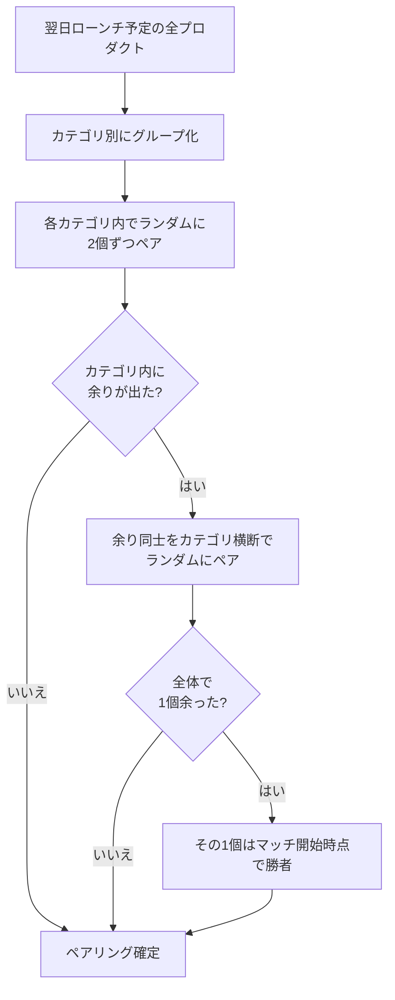

# 予選ルール

予選は、ローンチ当日に行われるプロダクト同士の1対1マッチである。予選に勝利したプロダクトはディレクトリに掲載され、Weekトーナメントへの参加資格を得る候補となる。
規則そのものはFR-PRDCT-002・FR-GAME-001〜014・FR-VOTE-001〜010を正とし、本書は規則の意図と具体例を補う。時刻は全て基準時刻(UTC-08:00)である。

## ローンチ日の選択

選択できるローンチ日はFR-PRDCT-002を正とする。当日23:40以降に翌日を選べないのは、23:45にペアリングが確定するためである。再ローンチの間隔制限は[再ローンチ規則](006-relaunch-rules.md)を参照。

## ペアリング(対戦相手の決定)

毎日23:45に翌日ローンチするプロダクトを対象に、FR-GAME-001〜004の手順でペアリングする。

```mermaid
flowchart TD
    A[翌日ローンチ予定の全プロダクト] --> B[カテゴリ別にグループ化]
    B --> C[各カテゴリ内でランダムに2個ずつペア]
    C --> D{カテゴリ内に<br>余りが出た?}
    D -- はい --> E[余り同士をカテゴリ横断で<br>ランダムにペア]
    D -- いいえ --> G[ペアリング確定]
    E --> F{全体で<br>1個余った?}
    F -- はい --> H[その1個はマッチ開始時点で勝者]
    F -- いいえ --> G
    H --> G
```

### ペアリングの例

翌日ローンチ予定が9個の場合。

| カテゴリ   | プロダクト         |
| ---------- | ------------------ |
| AI         | A1, A2, A3, A4, A5 |
| 開発ツール | D1, D2, D3         |
| その他     | O1                 |

1. AIカテゴリ内でランダムにペア: (A3, A1)、(A5, A2)。余りA4
2. 開発ツールカテゴリ内でランダムにペア: (D2, D3)。余りD1
3. その他カテゴリは1個のみ。余りO1
4. 余りA4・D1・O1をカテゴリ横断でランダムにペア: (D1, O1)。余りA4
5. A4は不戦勝。マッチ開始時点で勝者となりディレクトリに掲載される

翌日のトップページには4つの予選マッチ(A3 vs A1、A5 vs A2、D2 vs D3、D1 vs O1)が表示される。

## マッチの進行と勝敗判定

マッチの開始・終了時刻と通知メールの時刻は[日次タイムライン](007-daily-timeline.md#日次タイムライン)、Upvoteの制約はFR-VOTE-001〜007、勝敗判定はFR-GAME-009〜012、最終Upvote時刻の定義は要件定義書1.3節を正とする。

### 判定の例

| マッチ   | Upvote数 | 最終Upvote時刻 | 結果                         |
| -------- | -------- | -------------- | ---------------------------- |
| A3 vs A1 | 12 vs 9  | —              | A3の勝利                     |
| A5 vs A2 | 7 vs 7   | 14:02 vs 18:30 | 最終Upvote時刻が早いA5の勝利 |
| D2 vs D3 | 0 vs 0   | —              | 両者敗北                     |
| D1 vs O1 | 3 vs 0   | —              | D1の勝利                     |

「先に到達した」勝者判定により、同数時は早く支持を集めたプロダクトが報われる。両者敗北はディレクトリ非掲載となり、再ローンチは敗北扱いになる。

## マッチ中・直前の異常時の扱い

投稿者の退会・停止やプロダクトの非公開化はFR-GAME-013(マッチ中)・FR-GAME-014(マッチ直前)、Upvoteしたユーザーの停止はFR-VOTE-008、ペアリング後の変更制限はFR-PRDCT-012を正とする。

## 予選の結果がもたらすもの

| 結果 | ディレクトリ掲載 | Weekトーナメント                                             | 再ローンチ                                       |
| ---- | ---------------- | ------------------------------------------------------------ | ------------------------------------------------ |
| 勝利 | あり(FR-DIR-001) | 決済またはUltrasで参加([規則](004-week-tournament-rules.md)) | FR-RELCH-004([規則](006-relaunch-rules.md))      |
| 敗北 | なし             | なし                                                         | FR-RELCH-002〜003([規則](006-relaunch-rules.md)) |
