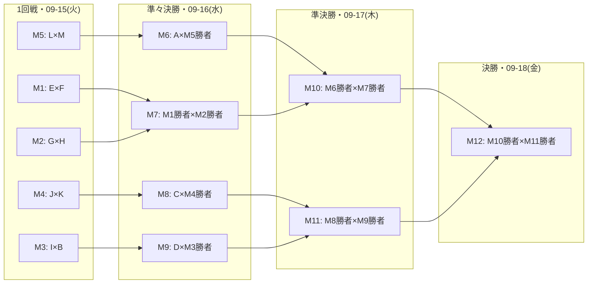

# Product of the Week決定トーナメント規則

同じ週に予選で勝利したプロダクト同士が、シングルエリミネーション(勝ち残り)方式でProduct of the Weekを決めるトーナメントである。本書では「トーナメント」と書けばWeekトーナメントを指す。
規則そのものはFR-TOURW-001〜021を正とし、本書は要件定義書に無い組み合わせ決定の細部と具体例を補う。時刻は全て基準時刻(UTC-08:00)である。

## 参加資格と日程

週の定義は要件定義書1.3節、参加資格と決済期限はFR-TOURW-001〜003、トーナメント組み合わせ決定までに決済を反映できなかった場合の返金はFR-PYMNT-012、組み合わせ決定前のプロダクト削除・退会による参加資格の喪失はFR-TOURW-021(返金はFR-PYMNT-009)、組み合わせ決定から決勝までの日程は[週次タイムライン](007-daily-timeline.md#週次タイムラインweekトーナメント)を正とする。

決済期限はローンチ日を含む週の翌週月曜日23:35(決済セッション作成期限及びUI表示は23:00、[理由](002-pricing-and-plans.md#ui表示において決済期限を35分早める理由))で固定のため、決済に使える時間はローンチ日の曜日で異なる。

| ローンチ日(曜日) | 決済に使える時間 |
| ---------------- | ---------------- |
| 月曜日           | 7日間            |
| 日曜日           | 24時間           |

日曜日ローンチは決済猶予が短いため、UIと結果通知メールでは決済期限を明示する([ページ構成](../design/002-page-layouts.md#トーナメント参加費の導線))。

参加数N≤128であればラウンド数は最大7(火曜日〜翌週月曜日)であり、翌週のトーナメントとは重ならない。N≥129の場合の表示順はFR-TOURW-009を正とする。

## 組み合わせ決定の手順

### 1. シード数の決定

FR-TOURW-005に基づき、2回戦の参加数がN(1回戦の参加プロダクト数)未満で最大の2の冪Pになるよう、シード(1回戦免除)を設ける。Nが2の冪ならS = 0になるので、シードは設けない。

- P(2回戦の参加数) = N未満で最大の2の冪
- S(シード数) = 2P − N
- 1回戦のマッチ数 = (N − S) / 2

| N   | P   | S   | 1回戦マッチ数 | 2回戦参加数 | ラウンド数  |
| --- | --- | --- | ------------- | ----------- | ----------- |
| 1   | —   | —   | —             | —           | 0(即時受賞) |
| 2   | 1   | 0   | 1             | —           | 1           |
| 3   | 2   | 1   | 1             | 2           | 2           |
| 5   | 4   | 3   | 1             | 4           | 3           |
| 6   | 4   | 2   | 2             | 4           | 3           |
| 7   | 4   | 1   | 3             | 4           | 3           |
| 8   | 4   | 0   | 4             | 4           | 3           |
| 13  | 8   | 3   | 5             | 8           | 4           |
| 100 | 64  | 28  | 36            | 64          | 7           |
| 128 | 64  | 0   | 64            | 64          | 7           |
| 129 | 128 | 127 | 1             | 128         | 8           |
| 200 | 128 | 56  | 72            | 128         | 8           |

### 2. シードの選出

参加プロダクトをFR-TOURW-005の順に並べ、なお同順ならローンチのID(ULID)昇順とし、上位S個をシードとする。

シードは1回戦を免除され、2回戦から登場する。

### 3. 非シードの1回戦組み合わせ

非シードのプロダクトをFR-TOURW-006の順に並べ、なお同順ならローンチのID(ULID)昇順とし、先頭から隣接する2個ずつを1回戦の対戦相手とする。

### 4. 2回戦の組み合わせ

2回戦に出場するP個のスロットへ、次の順に1〜Pの番号を振る。

1. シードをシード順に置く。第1シードが1番、第2シードが2番、以下同様にS番まで
2. 続けて1回戦の勝者をマッチ番号順に置く。マッチ1の勝者がS + 1番、以下同様にP番まで

対戦カードは、スロット番号を並べ替えた列で決める。列は[1, 2]から始め、「各番号の直後に、その番号と足すと列の新しい長さ + 1になる番号を挿入する」操作を、長さがPになるまで繰り返す。できた列の先頭から2個ずつが1マッチであり、番号が上位の2個は決勝まで、上位4個は準決勝まで互いに当たらないため、上位シードが早いラウンドで潰し合わない。

例えばP = 8なら、[1, 2]の各番号の直後に4・3を挿入して[1, 4, 2, 3]、さらに8・5・7・6を挿入して[1, 8, 4, 5, 2, 7, 3, 6]となり、1番×8番、4番×5番、2番×7番、3番×6番の4マッチとなる。

### 5. 3回戦以降

固定ブラケットとする。前ラウンドで隣接する2マッチ(マッチ2k−1とマッチ2k)の勝者同士が対戦する。ラウンドごとの並べ直しは行わない。

## 組み合わせの例(N = 13)

2026-09-07(月)〜2026-09-13(日)の週に予選で勝利し、2026-09-14(月)23:35までに参加資格を得たプロダクトが13個の場合。

| プロダクト | ローンチ日 | 予選勝利時Upvote数 | 予選の最終Upvote時間 |
| ---------- | ---------- | ------------------ | -------------------- |
| A          | 09-08(火)  | 42                 | 20:15                |
| B          | 09-11(金)  | 37                 | 22:01                |
| C          | 09-07(月)  | 37                 | 14:02                |
| D          | 09-10(木)  | 37                 | 18:30                |
| E          | 09-07(月)  | 12                 | 21:40                |
| F          | 09-07(月)  | 9                  | 10:05                |
| G          | 09-08(火)  | 20                 | 23:10                |
| H          | 09-09(水)  | 15                 | 09:47                |
| I          | 09-10(木)  | 8                  | 16:22                |
| J          | 09-11(金)  | 11                 | 11:30                |
| K          | 09-12(土)  | 6                  | 19:55                |
| L          | 09-13(日)  | 30                 | 13:08                |
| M          | 09-13(日)  | 4                  | 22:47                |

### シード数

N = 13は2の冪ではない。P = 8、S = 2 × 8 − 13 = 3。1回戦は(13 − 3) / 2 = 5マッチ。

### シードの選出

Upvote数の多い順に並べるとA(42)→B・C・D(37)→...となる。B・C・Dは同数のため最終Upvote時間で並べ、C(14:02)→D(18:30)→B(22:01)。

| シード順 | プロダクト | 根拠                        |
| -------- | ---------- | --------------------------- |
| 1        | A          | Upvote 42                   |
| 2        | C          | Upvote 37、最終Upvote 14:02 |
| 3        | D          | Upvote 37、最終Upvote 18:30 |

Bは同じ37票だが最終Upvote時間が最も遅いため、4番目となりシードから漏れる。

### 非シードの並びと1回戦

非シード10個をローンチ日順(同日はUpvote数順)に並べる。

| 順  | プロダクト | ローンチ日 | Upvote数 | 備考                                      |
| --- | ---------- | ---------- | -------- | ----------------------------------------- |
| 1   | E          | 09-07      | 12       | 同日のFよりUpvote数が多い                 |
| 2   | F          | 09-07      | 9        |                                           |
| 3   | G          | 09-08      | 20       |                                           |
| 4   | H          | 09-09      | 15       |                                           |
| 5   | I          | 09-10      | 8        |                                           |
| 6   | B          | 09-11      | 37       | シード落ちしたが同日のJよりUpvote数が多い |
| 7   | J          | 09-11      | 11       |                                           |
| 8   | K          | 09-12      | 6        |                                           |
| 9   | L          | 09-13      | 30       |                                           |
| 10  | M          | 09-13      | 4        |                                           |

Upvote数が多いBよりも、ローンチ日が早いIが先に並ぶ点に注意する(ローンチ日が第1キー)。2026-09-15(火)の1回戦の組み合わせは以下となる。

| マッチ | 対戦   |
| ------ | ------ |
| M1     | E vs F |
| M2     | G vs H |
| M3     | I vs B |
| M4     | J vs K |
| M5     | L vs M |

### 準々決勝以降のブラケット

2026-09-16(水)の準々決勝のスロットは1番から順に[A, C, D, M1勝者, M2勝者, M3勝者, M4勝者, M5勝者]であり、これを[1, 8, 4, 5, 2, 7, 3, 6]の並びで組み合わせる。

決勝は2026-09-18(金)23:40に終了し、勝者がProduct of the Weekとなる。

## 各マッチの勝敗判定

予選と同じ基準(FR-TOURW-010〜013、[予選ルール](003-qualifier-rules.md#マッチの進行と勝敗判定))で判定する。トーナメントのUpvote数は予選のUpvote数を引き継がず、マッチごとに0から集計する(FR-VOTE-007)。

## 不戦勝と両者敗北の伝播

対戦相手がいないマッチの不戦勝(FR-TOURW-015・FR-TOURW-017)、同ラウンド全滅時の終了(FR-TOURW-019)、マッチ中の退会・停止・非公開化(FR-TOURW-014)、参加数0・1の扱い(FR-TOURW-019・FR-TOURW-020)は要件定義書を正とする。参加数2の場合は火曜日に決勝のみを実施する。

上記の例で、1回戦M4(J vs K)が0対0で両者敗北した場合:

1. 準々決勝M8はM4勝者が存在しないため、Cは09-16の0:00に不戦勝で準決勝へ進む
2. 準決勝M11はC×M9勝者として行われる
3. さらにM9も0対0だった場合、Cは09-17の0:00に再び不戦勝で決勝へ進む

## 受賞後

- 受賞プロダクトの再ローンチ制限はFR-RELCH-004([再ローンチ規則](006-relaunch-rules.md))
- Yearトーナメントの対象となる([Yearトーナメント規則](005-year-tournament-rules.md))
