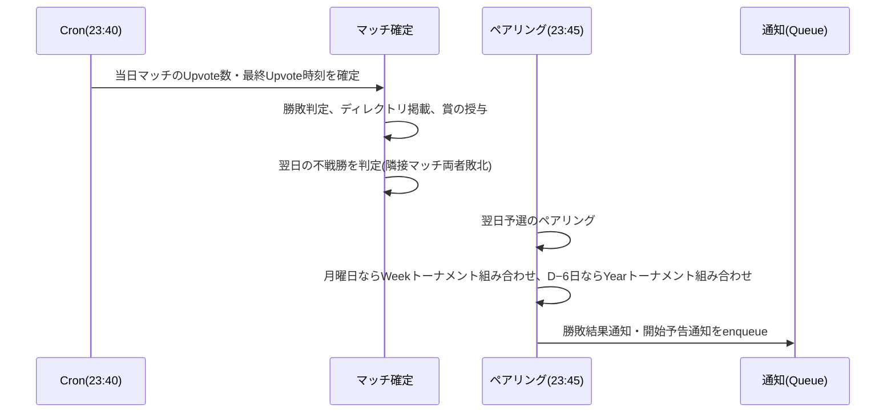

# 日次・週次・年次タイムライン

サービスの定期処理と時刻に依存する仕様を、基準時刻(UTC-08:00)の1日の流れに沿って整理する。
基準時刻は夏時間を持たない固定オフセットであり、日境界はUTCの8:00である。日時データはUTCで保持し、表示時にユーザーのブラウザ設定のタイムゾーンへ変換する。

## 日次タイムライン

| 基準時刻 | UTC   | 事象                                                                                                       | 対応要件                         |
| -------- | ----- | ---------------------------------------------------------------------------------------------------------- | -------------------------------- |
| 0:00     | 8:00  | 当日の予選・トーナメントマッチ開始。不戦勝の確定。投稿者のフォロワーへ開催通知メール                       | FR-GAME-008、FR-TOURW-007、FR-TOURY-008、FR-NOTIF-003 |
| 4:21     | 12:21 | 日次バッチ(下記)                                                                                           | FR-USER-018、DR-004、DR-012、DR-013 |
| 23:40    | 7:40  | 当日のマッチ終了。Upvote数と最終Upvote時刻を確定し勝敗判定。ローンチ日選択の下限が翌々日へ切り替わる       | FR-GAME-009〜012、FR-PRDCT-002   |
| 23:45    | 7:45  | 翌日ローンチ分の予選ペアリング。両投稿者へ勝敗結果通知メール及びマッチ開始予告メール                       | FR-GAME-004、FR-NOTIF-001、FR-NOTIF-002 |

### 日次バッチ(4:21)の内容

| 処理                                       | 条件                                                   |
| ------------------------------------------ | ------------------------------------------------------ |
| 退会ユーザーの個人データ・ファイルの物理削除 | 退会から14日が経過する直前(論理削除から13日後)         |
| データエクスポートZIPの物理削除            | 生成完了から7日経過                                    |
| 監査ログの物理削除                         | 記録日時から3年経過                                    |
| 決済履歴の物理削除                         | 記録日時から7年経過                                    |

## 週次タイムライン(Weekトーナメント)

| 曜日・時刻       | 事象                                                                     |
| ---------------- | ------------------------------------------------------------------------ |
| 月曜日0:00       | 新しい週の開始(ISO週。例: 2026-W37 = 2026-09-07〜09-13)                  |
| 月曜日23:40      | 前週分Weekトーナメントの参加費決済期限                                   |
| 月曜日23:45      | 前週分Weekトーナメントの組み合わせ決定。参加数1なら即時受賞              |
| 火曜日0:00       | Weekトーナメント1回戦開始                                                |
| 以降毎日         | 1日1ラウンド。参加数N≤128なら翌週月曜日までに決勝終了                    |

Weekトーナメントの詳細は[Weekトーナメント規則](004-week-tournament-rules.md)を参照。

## 年次タイムライン(Yearトーナメント)

決勝日Dは最上位管理者が設定する日曜日(既定値は5月の最終日曜日)。

| 時点               | 事象                                                                     |
| ------------------ | ------------------------------------------------------------------------ |
| D − 7日 0:00       | 決勝日の変更期限                                                         |
| D − 6日(月)23:40   | 参加費決済期限。対象はこの日の前日までのWeek優勝プロダクト               |
| D − 6日(月)23:45   | 組み合わせ決定。参加数1なら即時受賞                                      |
| D − 5日〜D         | 参加数に応じた日に1回戦を開始し、1日1ラウンド                            |
| D(日)23:40         | 決勝終了、Product of the Year確定。Week優勝プロダクトの再ローンチ解禁    |

Yearトーナメントの詳細は[Yearトーナメント規則](005-year-tournament-rules.md)を参照。

## 同時刻に走る処理の順序

23:40〜23:45の5分間に複数の処理が連鎖する。実装上は以下の順序を守る。

- マッチ確定(23:40)が完了してからペアリング(23:45)を行う。翌日のトーナメントマッチの対戦相手は当日の勝敗に依存するため
- Weekトーナメントの決済期限(月曜日23:40)とマッチ終了は同時刻だが、決済期限の判定はStripe Webhook受信済みの決済履歴を23:45の組み合わせ決定時に参照する
- 準決勝以前でトーナメントマッチに勝利した投稿者への通知は、勝敗結果と翌日の開始予告を1通に統合する

## 時刻に依存するその他の仕様

| 仕様                               | 基準                                                     |
| ---------------------------------- | -------------------------------------------------------- |
| スポンサー広告の掲載期間           | 基準時刻の日単位。今日以降を選択可                       |
| Ultras解約後の特典継続             | 基準時刻で当該課金期間の末日まで                         |
| ディレクトリのローンチ期間絞り込み | 基準時刻の日付                                           |
| 管理者統計の週毎集計               | ISO週(月曜日始まり)                                      |
| 日時の表示                         | ユーザーのOS・ブラウザのタイムゾーン・ロケール設定に従う |
