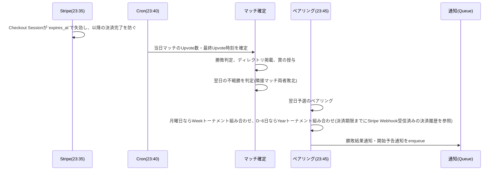

# 日次・週次・年次タイムライン

サービスの定期処理と時刻に依存する仕様を、基準時刻(UTC-08:00)の1日の流れに沿って整理する。各処理の規則は対応要件を正とし、本書は時刻の一覧と処理順序を定める。
基準時刻は夏時間を持たない固定オフセットであり、日境界はUTCの8:00である。日時データの保持と表示はI18N-002・I18N-004を正とする。

## 日次タイムライン

| 基準時刻 | UTC   | 事象                                                                                                         | 対応要件                                                     |
| -------- | ----- | ------------------------------------------------------------------------------------------------------------ | ------------------------------------------------------------ |
| 0:00     | 8:00  | 当日の予選・トーナメントマッチ開始。不戦勝の確定。投稿者のフォロワーへ開催通知メール                         | FR-GAME-008、FR-TOURW-007、FR-TOURY-008、FR-NOTIF-003        |
| 0:07     | 8:07  | 当日開始のスポンサー広告へ掲載開始通知メール、前日終了のスポンサー広告へ掲載終了通知メールを送信             | FR-SPONS-013、FR-SPONS-014                                   |
| 4:21     | 12:21 | 日次バッチ(下記)                                                                                             | FR-USER-018、FR-COMNT-009、FR-PRDCT-015、DR-004、DR-012〜015 |
| 23:40    | 7:40  | 当日のマッチ終了。Upvote数と最終Upvote時刻を確定し勝敗判定。選択可能な最も早いローンチ日が翌々日へ切り替わる | FR-GAME-009〜012、FR-PRDCT-002                               |
| 23:45    | 7:45  | 翌日ローンチ分の予選ペアリング。両投稿者へ勝敗結果通知メール及びマッチ開始予告メール                         | FR-GAME-004、FR-NOTIF-001、FR-NOTIF-002                      |

### 日次バッチ(4:21)の内容

対象データと条件は[データ保持期間の一覧](../legal/001-compliance-policy.md#データ保持期間の一覧)のうち削除方法が「日次バッチ」のものを正とする。退会ユーザーのデータは退会から14日が経過する直前(論理削除から13日後)のバッチで処理し、画像ファイルの物理削除時は[エッジキャッシュを無効化](../features/002-image-variants.md#キャッシュとパージ)する(FR-FILEU-019)。

## 週次タイムライン(Weekトーナメント)

| 曜日・時刻  | UTC        | 事象                                                                                       |
| ----------- | ---------- | ------------------------------------------------------------------------------------------ |
| 月曜日0:00  | 月曜日8:00 | 新しい週の開始(ISO週。例: 2026-W37 = 2026-09-07〜09-13)                                    |
| 月曜日23:35 | 火曜日7:35 | 前週分Weekトーナメントの参加費決済期限(内部締切=Stripeの`expires_at`)。UI表示は月曜日23:00 |
| 月曜日23:45 | 火曜日7:45 | 前週分Weekトーナメントの組み合わせ決定。参加数1なら即時受賞                                |
| 火曜日0:00  | 火曜日8:00 | Weekトーナメント1回戦開始                                                                  |
| 以降毎日    | ―          | 1日1ラウンド。参加数N≤128なら翌週月曜日までに決勝終了                                      |

Weekトーナメントの詳細は[Weekトーナメント規則](004-week-tournament-rules.md)を参照。

## 年次タイムライン(Yearトーナメント)

決勝日Dは最上位管理者が設定する日曜日(FR-ADMCF-001〜004)。

| 時点             | UTC             | 事象                                                                                                                             |
| ---------------- | --------------- | -------------------------------------------------------------------------------------------------------------------------------- |
| D − 7日(日)0:00  | D − 7日(日)8:00 | 決勝日の変更期限                                                                                                                 |
| D − 6日(月)0:00  | D − 6日(月)8:00 | 対象(前日までのWeek優勝プロダクト)の選択可能な最も早いローンチ日がD−5日へ切り替わる([再ローンチ規則](006-relaunch-rules.md)参照) |
| D − 6日(月)23:35 | D − 5日(火)7:35 | 参加費決済期限(内部締切=Stripeの`expires_at`、UI表示はD−6日(月)23:00)。対象はこの日の前日までのWeek優勝プロダクト                |
| D − 6日(月)23:45 | D − 5日(火)7:45 | 組み合わせ決定。参加数1なら即時受賞                                                                                              |
| D − 5日〜D       | ―               | 参加数に応じた日に1回戦を開始し、1日1ラウンド                                                                                    |
| D(日)23:40       | D + 1日(月)7:40 | 決勝終了、Product of the Year確定                                                                                                |

Yearトーナメントの詳細は[Yearトーナメント規則](005-year-tournament-rules.md)を参照。

## 同時刻に走る処理の順序

月曜日(D−6日)は23:35の決済期限から23:45の組み合わせ決定までの10分間に複数の処理が連鎖する。実装上は以下の順序を守る。

```mermaid
sequenceDiagram
    participant S as Stripe(23:35)
    participant C as Cron(23:40)
    participant M as マッチ確定
    participant P as ペアリング(23:45)
    participant N as 通知(Queue)
    S->>S: Checkout Sessionが`expires_at`で失効し、以降の決済完了を防ぐ
    C->>M: 当日マッチのUpvote数・最終Upvote時刻を確定
    M->>M: 勝敗判定、ディレクトリ掲載、賞の授与
    M->>M: 翌日の不戦勝を判定(隣接マッチ両者敗北)
    P->>P: 翌日予選のペアリング
    P->>P: 月曜日ならWeekトーナメント組み合わせ、D−6日ならYearトーナメント組み合わせ(決済期限までにStripe Webhook受信済みの決済履歴を参照)
    P->>N: 勝敗結果通知・開始予告通知をenqueue
```

- マッチ確定(23:40)が完了してからペアリング(23:45)を行う。翌日のトーナメントマッチの対戦相手は当日の勝敗に依存するため
- 決済期限(23:35)をマッチ終了より早め、UI表示をさらに早める理由は[料金及びプラン体系](002-pricing-and-plans.md#ui表示の決済期限を35分早める理由)を参照
- 準決勝以前でトーナメントマッチに勝利した投稿者への通知は、勝敗結果と翌日の開始予告を1通に統合する(FR-NOTIF-002)

## 時刻に依存するその他の仕様

| 仕様                               | 基準                                 | 対応要件           |
| ---------------------------------- | ------------------------------------ | ------------------ |
| スポンサー広告の掲載期間           | 基準時刻の日単位                     | FR-SPONS-003       |
| Ultras解約後の特典継続             | 基準時刻で当該課金期間の末日まで     | FR-PPLAN-003       |
| ディレクトリのローンチ期間絞り込み | 基準時刻の日付                       | FR-DIR-005         |
| 管理者統計の週毎集計               | ISO週(月曜日始まり)                  | FR-ADMUG-001       |
| 日時・数値の表示                   | ユーザーのタイムゾーン・ロケール設定 | I18N-004、I18N-005 |
