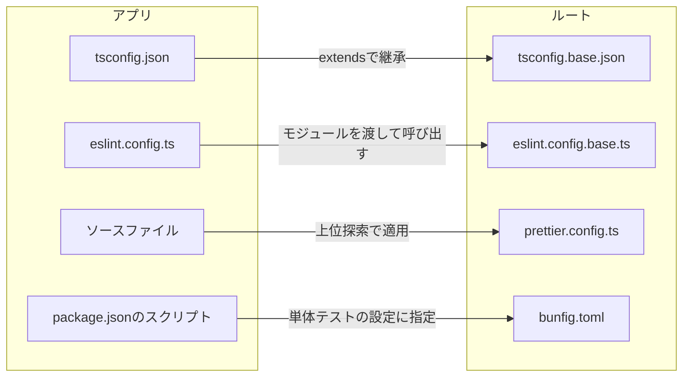

# JavaScript・TypeScriptの記法と設定ファイルの規約

JavaScript・TypeScriptの記法、設定ファイルの記述形式、ルートの基底設定をアプリが継承する方法、整形検査・静的解析・型検査のコマンドの使い方を定める。

## 前提と用語

ワークスペース機能を使わず、ルートと各アプリがそれぞれ`package.json`と`bun.lock`を持つリポジトリを前提とする。

| 用語             | 意味                                                                                                                                                                                                         |
| ---------------- | ------------------------------------------------------------------------------------------------------------------------------------------------------------------------------------------------------------ |
| ルート           | リポジトリのルートディレクトリ。基底設定と一括検査のコマンドを持つ                                                                                                                                           |
| アプリ           | 独自の`package.json`を持ち、`config/workspace-layout.ts`の`APPS`に登録したディレクトリ                                                                                                                       |
| 共有ディレクトリ | 複数のアプリが使うコードを置くディレクトリ。各利用側アプリの中の決まった場所(配置先)に配置して使う。配置先は`config/workspace-layout.ts`の`SHARED_DIRS`の`mounts`で定義する                                  |
| 検査担当         | 共有ディレクトリのコードの静的解析とテストを受け持つ1つのアプリ。他の利用側アプリは型検査だけを行う。`SHARED_DIRS`の`checkedBy`で、利用側アプリの1つか、共有ディレクトリ自身がアプリであれば`self`を指定する |

## 設定ファイルの記述形式

- JavaScriptでも記述できる設定ファイルは、TypeScript形式(`*.ts`)で作成する。`*.js`・`*.mjs`・`*.cjs`では作成しない。
  - 例: `eslint.config.ts`・`prettier.config.ts`・`vite.config.ts`・`vitest.<種別>.config.ts`・`playwright.config.ts`・`commitlint.config.ts`・`lint-staged.config.ts`
- JSON・TOMLなどの形式しか持たない設定ファイルは、その形式のまま記述する。
  - 例: `package.json`・`tsconfig.json`・`bunfig.toml`
- TypeScript形式の設定ファイルの名前は`*.config.ts`とする。静的解析の基底設定は`**/*.config.ts`を型情報付きの検査から外しており、この名前でないと設定ファイルにも型情報付きの規則が適用される。
- 設定値は、ツールが提供する型(`import type`で読み込む)で型注釈や`satisfies`を付けるか、ツールの`defineConfig`などの型付きの補助関数に渡し、型検査で誤りを検出できるようにする。

```typescript
import type { Config } from 'prettier';

const config: Config = {
  singleQuote: true,
};

export default config;
```

- ESLintとPrettierは`bun --bun`で起動する。BunはTypeScript形式の設定ファイルをそのまま読み込める。ESLintはNode上で起動すると、TypeScript形式の設定ファイルの読み込みにjitiなどの追加の準備が要る。

## 新しい記法の選択

同じことを実現する記法やAPIが複数あるときは、新しい標準の記法を選ぶ。非推奨(deprecated)とされた記法やAPIは使わない。

静的解析の基底設定は、次の記法を違反として報告する。

| 使わない記法                                                    | 代わりに使う記法                                                          | 検出する規則                       |
| --------------------------------------------------------------- | ------------------------------------------------------------------------- | ---------------------------------- |
| グローバルの`isNaN`・`isFinite`・`parseInt`・`parseFloat`       | `Number.isNaN`・`Number.isFinite`・`Number.parseInt`・`Number.parseFloat` | `no-restricted-globals`            |
| `escape`・`unescape`                                            | `encodeURIComponent`・`decodeURIComponent`                                | `no-restricted-globals`            |
| 型定義で`@deprecated`が付いたAPI(例: `String.prototype.substr`) | 型定義が案内する代替(例: `String.prototype.slice`)                        | `@typescript-eslint/no-deprecated` |
| `Object.prototype.hasOwnProperty.call(object, key)`             | `Object.hasOwn(object, key)`                                              | `prefer-object-has-own`            |
| `Math.pow(base, exponent)`                                      | `base ** exponent`                                                        | `prefer-exponentiation-operator`   |
| `Object.assign({}, source)`                                     | `{ ...source }`                                                           | `prefer-object-spread`             |
| `var`                                                           | `const`・`let`                                                            | `no-var`                           |
| `arguments`                                                     | 残余引数(`...args`)                                                       | `prefer-rest-params`               |
| `fn.apply(undefined, args)`                                     | スプレッド構文(`fn(...args)`)                                             | `prefer-spread`                    |

- 規則で検出できない場合も同じ方針で選ぶ。例えば、配列を複製してから並べ替えるのではなく`toSorted()`を使い、末尾の要素は`at(-1)`で取り出し、要素の分類には`Object.groupBy`を使う。
- TypeScriptの設定でも非推奨のオプション(`baseUrl`・`moduleResolution: "node"`・`esModuleInterop: false`など)を使わない。
- 例外として、デコレータは標準(TC39)のデコレータではなく従来のデコレータ(`experimentalDecorators`)を使う。理由は「[型検査設定の継承](#型検査設定の継承)」に記す。

## 基底設定の継承

ルートに、型検査・静的解析・整形・単体テストの基底設定を1つずつ置く。各アプリは基底設定を継承し、アプリ固有の差分だけを指定する。

| 種類       | ルートの基底設定                        | アプリでの使い方                                           |
| ---------- | --------------------------------------- | ---------------------------------------------------------- |
| 型検査     | `tsconfig.base.json`                    | アプリの`tsconfig.json`の`extends`で継承する               |
| 静的解析   | `eslint.config.base.ts`                 | アプリの`eslint.config.ts`から`createBaseConfig`を呼び出す |
| 整形       | `prettier.config.ts`・`.prettierignore` | 設定ファイルを置かず、ルートの設定をそのまま適用する       |
| 単体テスト | `bunfig.toml`                           | アプリの単体テストのスクリプトで`--config`に指定する       |



アプリから読み込まれる基底設定のファイル(`eslint.config.base.ts`など)は、npmパッケージを`import type`でのみ参照し、値のimportを持たない。値をimportすると、そのパッケージは基底設定のある位置(ルート)から解決され、アプリが導入した版ではなくルートの版が使われるためである。

### 型検査設定の継承

アプリの`tsconfig.json`は、基底設定を`extends`で継承し、原則として`types`と`include`だけを差分として指定する。次の例は、アプリのディレクトリがルートの2階層下にある場合である。

```json
{
  "extends": "../../tsconfig.base.json",
  "compilerOptions": {
    "types": ["bun"]
  },
  "include": [
    "*.ts",
    "<ソースのディレクトリ>/**/*.ts",
    "<共有ディレクトリの配置先>/**/*.ts"
  ]
}
```

- `types`: 基底設定は`types: []`とし、型を自動では読み込まない。アプリは必要な型だけを指定する。単体テストの`bun:test`と、設定ファイルの`import.meta.dirname`の型のために`bun`を指定する。
- `include`: アプリのソース、アプリ直下の設定ファイル(`*.ts`)、アプリに配置した共有ディレクトリを含める。静的解析の対象になる`.ts`・`.tsx`は、すべて`include`に含める(型情報付きの検査は`tsconfig.json`のプロジェクトを使うため、含まれないファイルは解析エラーになる)。
- `include`に設定ファイルを含めると、設定ファイルから読み込むルートの基底設定やプリセットも型検査の対象になる。それらの型はルートのnode_modulesから解決されるため、ルートで`bun install`を済ませ、ルートとアプリの品質ツールの版を一致させておく。
- フレームワーク固有の差分(JSXの扱いなど)は、そのアプリで追加する。

基底設定は次のオプションを持つ。

| 目的                                  | オプション                                                                                                       |
| ------------------------------------- | ---------------------------------------------------------------------------------------------------------------- |
| 厳格な型検査(暗黙の`any`の禁止を含む) | `strict: true`・`noUncheckedIndexedAccess: true`・`noImplicitOverride: true`・`noFallthroughCasesInSwitch: true` |
| デコレータ                            | `experimentalDecorators: true`                                                                                   |
| 出力と解決                            | `target: "ES2024"`・`module: "ESNext"`・`moduleResolution: "bundler"`                                            |
| 変換の前提                            | `verbatimModuleSyntax: true`・`isolatedModules: true`・`allowImportingTsExtensions: true`・`noEmit: true`        |
| その他                                | `resolveJsonModule: true`・`skipLibCheck: true`・`types: []`                                                     |

#### Workers統合テストを持つアプリの差分

Workersの実行環境で動くアプリは、次の差分を加える。

```json
{
  "extends": "../../tsconfig.base.json",
  "compilerOptions": {
    "lib": ["ES2024"],
    "types": ["bun", "@cloudflare/vitest-pool-workers/types"]
  },
  "include": [
    "*.ts",
    "<ソースのディレクトリ>/**/*.ts",
    "<共有ディレクトリの配置先>/**/*.ts"
  ]
}
```

- `lib: ["ES2024"]`: `target`の既定のlibに含まれるDOMの型は、Workers固有のAPIの型と衝突する(例: `caches.default`が`CacheStorage`に無いという型エラーになる)ため外す。
- `types`: Workers統合テストの`cloudflare:test`モジュールの型を加える。
- `include`: アプリ直下の`*.ts`により、`wrangler types`が出力する`worker-configuration.d.ts`(実行時の型と環境の型)も含まれる。

#### デコレータの設定

デコレータの設定は基底設定が持ち、アプリの`tsconfig.json`では`experimentalDecorators`を指定しない(`true`も`false`も書かない)。標準(TC39)のデコレータを使うアプリは置かない。

- 理由: Bun 1.4.2は、`extends`を持つtsconfigの`experimentalDecorators`を継承元の値だけで決め、継承する側の指定を無視する。
  - 継承する側だけで`true`にすると、`tsc`とesbuildは従来のデコレータとして扱う一方、Bunの`bun test`・`bun build`は標準のデコレータとして変換する。その結果、パラメータデコレータ(コンストラクタ引数への注入の指定など)がエラーも警告も無く消える。
  - 継承する側で`false`にしても、Bunは基底設定の値で従来のデコレータとして変換し、esbuildとViteのOxcは標準のデコレータとして変換する。変換経路ごとに結果が黙って食い違う。
- パラメータデコレータは標準のデコレータに存在しないため、コンストラクタ引数への注入を指定するライブラリを使うには従来のデコレータが必要になる。
- `emitDecoratorMetadata`は使わない。esbuild系のバンドラが型情報のメタデータを出力しないため、注入先はデコレータの引数で明示する。

### 静的解析の基底設定へのモジュールの受け渡し

`eslint.config.base.ts`は、静的解析の設定を組み立てるファクトリ関数`createBaseConfig`を提供する。アプリは自分のnode_modulesからimportしたモジュールを引数で渡す。

```typescript
import js from '@eslint/js';
import type { Linter } from 'eslint';
import prettierConfig from 'eslint-config-prettier/flat';
import tseslint from 'typescript-eslint';

import { createBaseConfig } from '../../eslint.config.base.ts';

const config: Linter.Config[] = createBaseConfig({
  js,
  tseslint,
  prettierConfig,
  tsconfigRootDir: import.meta.dirname,
});

export default config;
```

- 引数: `js`は`@eslint/js`、`tseslint`は`typescript-eslint`、`prettierConfig`は`eslint-config-prettier/flat`の設定、`tsconfigRootDir`はアプリのディレクトリ(`import.meta.dirname`)を渡す。
- 基底設定は、次の順に設定を並べる。
  1. 対象外のパターン(後述)
  2. `js.configs.recommended`
  3. `tseslint.configs.strictTypeChecked`(`parserOptions.projectService: true`と、渡された`tsconfigRootDir`で型情報を得る)
  4. 共通規則(`@typescript-eslint/no-deprecated`・`no-restricted-globals`・`prefer-object-has-own`・`prefer-exponentiation-operator`・`prefer-object-spread`・`no-console`)
  5. `**/*.config.ts`への`tseslint.configs.disableTypeChecked`(設定ファイルはBun上で読み込まれ、アプリのコードとは使える型が異なるため)
  6. `prettierConfig`(書式に関する規則を無効にするため最後に置く)
- 対象外のパターン
  - ビルドやツールの出力先: `**/dist/**`・`**/.output/**`・`**/.tanstack/**`・`**/.wrangler/**`・`**/coverage/**`・`**/storybook-static/**`
  - 自動生成コード: `**/*.gen.ts`・`**/generated/**`
  - `wrangler types`の出力: `**/worker-configuration.d.ts`
- 自動生成コードは、`*.gen.ts`という名前か`generated/`ディレクトリの下に出力する。これにより静的解析・整形・カバレッジの対象から外れる。
- アプリ固有の規則とプラグインは、`createBaseConfig`の戻り値の後に並べる。書式に関する規則は有効にしない(整形と衝突するため)。書式の規則を含むプラグインの推奨設定を加える場合は、その後に`prettierConfig`をもう一度置く。
- ESLintは、ファイルごとに最も近い設定ファイルを使う。そのため、ルートから複数のアプリのファイルを1度に渡しても、各ファイルはそれぞれのアプリの設定とモジュールで検査される。

### 整形設定の継承

- ルートの`prettier.config.ts`(`singleQuote: true`)は、Prettierの設定ファイルの上位探索により全アプリのファイルに適用される。アプリには原則としてPrettierの設定ファイルを置かない。
- 整形検査はルートで1回だけ実行する。対象外にするファイルはルートの`.prettierignore`に書く。
  - 原文のまま保つ外部由来の文書と拡張ファイル
  - ロックファイル(`bun.lock`)
  - 適用済みのマイグレーション履歴
  - 自動生成コード(`**/*.gen.ts`・`**/generated/**`・`**/worker-configuration.d.ts`)
  - ローカル開発で蓄積されるデータ
- Prettierは`.prettierignore`に加えて、実行したディレクトリの`.gitignore`だけを読む。整形検査はルートで実行するため、アプリ固有の出力先(ビルドの出力など)は、アプリの`.gitignore`ではなくルートの`.gitignore`に書く。
- アプリ固有のPrettierプラグインが必要な場合に限り、アプリに`prettier.config.ts`を置き、ルートの設定を展開してからプラグインを加える。整形はルートのPrettierで実行されるため、プラグインがアプリの設定ファイルの位置から解決できることを確かめる。

```typescript
import type { Config } from 'prettier';

import baseConfig from '../../prettier.config.ts';

const config: Config = {
  ...baseConfig,
  plugins: ['<プラグイン名>'],
};

export default config;
```

## 一括検査への参加

新しいアプリは、アプリと共有ディレクトリの配置を1箇所で定義する`config/workspace-layout.ts`の`APPS`に、名前(`name`)とディレクトリ(`dir`)を登録し、`AppName`型にも名前を加える。

- `APPS`に登録しないアプリは、品質ゲート(コミット時の検査と一括検査)の対象にならない。特にコミット時は、未登録のアプリのTypeScriptファイルには整形だけが適用され、静的解析は黙って省かれる。
- 一括検査は、`APPS`に並べた順にアプリのスクリプトを実行する。
- アプリに共有ディレクトリを配置する場合は、同じファイルの`SHARED_DIRS`に、配置元(`source`)、利用側アプリごとの配置先(`mounts`)、検査担当(`checkedBy`)を定義する。配置先は、開発コンテナで共有ディレクトリをマウントする先と一致させる。

アプリは、次の3点を満たせば一括検査に参加できる。

1. 「[基底設定の継承](#基底設定の継承)」のとおりに`tsconfig.json`と`eslint.config.ts`を置く。
2. 「[スクリプト契約](#スクリプト契約)」のスクリプトを`package.json`に定義する。
3. 「[導入する品質ツール](#導入する品質ツール)」をアプリに導入する。

### スクリプト契約

一括検査は、ルートと各アプリで同じ名前のスクリプトを`bun run`で実行する。アプリは次のスクリプトを定義する。

| スクリプト     | 定義するアプリ                | 内容                                                                 |
| -------------- | ----------------------------- | -------------------------------------------------------------------- |
| `lint`         | 全アプリ                      | `bun --bun eslint .`                                                 |
| `typecheck`    | 全アプリ                      | `tsc -p tsconfig.json`(共有ディレクトリの配置先を`include`に含める)  |
| `test:unit`    | 全アプリ                      | `bun test --config=../../bunfig.toml --pass-with-no-tests unit.test` |
| `test:browser` | ブラウザテストを持つアプリ    | `vitest run --config vitest.browser.config.ts`                       |
| `test:worker`  | Workers統合テストを持つアプリ | `vitest run --config vitest.worker.config.ts`                        |

```json
{
  "name": "<アプリ名>",
  "private": true,
  "type": "module",
  "scripts": {
    "lint": "bun --bun eslint .",
    "typecheck": "tsc -p tsconfig.json",
    "test:unit": "bun test --config=../../bunfig.toml --pass-with-no-tests unit.test"
  }
}
```

- 定義していないスクリプトは、一括検査で「飛ばした(スクリプト未定義)」として扱われ、失敗にはならない。ブラウザテストもWorkers統合テストも持たないアプリは、`test:browser`・`test:worker`を定義しない。
- 整形検査はルートで1回だけ実行するため、アプリに整形のスクリプトは要らない。
- `test:unit`の`--config=../../bunfig.toml`は省略できない。Bunはアプリのディレクトリからルートの`bunfig.toml`をさかのぼって読まないため、省略すると他の種別のテストの除外・カバレッジ閾値・lcovの出力のいずれも適用されない。相対パスは、アプリのディレクトリがルートの2階層下にある場合の例である。
- テストの種別と命名、実行コマンド、カバレッジの規約は、「[テスト戦略](../testing/001-test-strategy.md)」に従う。

### 導入する品質ツール

各アプリは、次のパッケージをdevDependenciesとして、[依存パッケージの版管理](002-dependency-versions.md)の主要パッケージの一覧にある版で導入する。

- `eslint`・`@eslint/js`・`typescript-eslint`・`eslint-config-prettier`・`prettier`・`typescript`
- `types`に`bun`を指定するため、`@types/bun`をルートと同じ版で導入する。
- テストの種別に応じたVitest系のパッケージ(ブラウザテスト・Workers統合テストを持つアプリのみ)

```sh
bun add --dev --exact eslint@<版> @eslint/js@<版> typescript-eslint@<版> eslint-config-prettier@<版> prettier@<版> typescript@<版> @types/bun@<版>
```

- 静的解析はアプリのnode_modulesのESLintとモジュールで実行される。コミット時の検査も、ステージ済みファイルを所有するアプリのESLintを使うため、アプリに依存が導入されていないとコミットが中止される。
- アプリのPrettierは、エディタ連携での整形に使われる。ルートと版が異なると、エディタでの整形結果が整形検査と食い違う。
- 共有ディレクトリのコードが実行時に使うパッケージは、利用側アプリが宣言する。版は共有ディレクトリ側と同じにする。

### 検査担当でないアプリでの共有ディレクトリの除外

同じ共有ディレクトリを配置する利用側アプリのうち、検査担当でないアプリは、配置先を静的解析とテストの対象から外す。同じファイルが別の設定で重ねて検査されることを防ぐためである。型検査は、共有ディレクトリのコードが各利用側アプリの設定と依存で成り立つことを確かめるため、外さずに`include`へ含める。配置の方式と依存の解決は「[共有ディレクトリの配置方式](003-shared-directories.md)」に従う。

| 検査                        | 外し方                                                                      |
| --------------------------- | --------------------------------------------------------------------------- |
| 静的解析                    | `eslint.config.ts`の`ignores`に配置先を加える                               |
| 単体テスト                  | `test:unit`の`--path-ignore-patterns`に配置先を加える                       |
| ブラウザ・Workers統合テスト | Vitestの設定の`exclude`に配置先を加え、`coverage.include`に配置先を含めない |

静的解析では、`ignores`だけを持つ要素を設定の配列に加える。

```typescript
const config: Linter.Config[] = [
  {
    name: '<アプリ名>/ignores',
    ignores: ['<共有ディレクトリの配置先>/'],
  },
  ...createBaseConfig({
    js,
    tseslint,
    prettierConfig,
    tsconfigRootDir: import.meta.dirname,
  }),
];
```

単体テストでは、配置先に加えて`bunfig.toml`の`pathIgnorePatterns`(他の種別のテストの除外)をすべて書き写す。Bun 1.4.2では、コマンドラインの`--path-ignore-patterns`は`bunfig.toml`の`pathIgnorePatterns`に追加されず、置き換えるためである。

```json
{
  "scripts": {
    "test:unit": "bun test --config=../../bunfig.toml --pass-with-no-tests --path-ignore-patterns='<共有ディレクトリの配置先>/**' --path-ignore-patterns='**/*.browser.test.{ts,tsx}' --path-ignore-patterns='**/*.worker.test.{ts,tsx}' --path-ignore-patterns='**/*.e2e.test.ts' unit.test"
  }
}
```

Vitestでは、既定の除外を失わないよう`configDefaults.exclude`を展開してから配置先を加える。次の例は除外の指定だけを示し、プリセットの取り込みなど他の設定を省いている。

```typescript
import { configDefaults, defineConfig } from 'vitest/config';

export default defineConfig({
  test: {
    exclude: [...configDefaults.exclude, '<共有ディレクトリの配置先>/**'],
  },
});
```

## 検査コマンド

| コマンド               | 実行場所       | 内容                                                                                         |
| ---------------------- | -------------- | -------------------------------------------------------------------------------------------- |
| `bun run format`       | ルート         | リポジトリ全体を整形して書き換える                                                           |
| `bun run format:check` | ルート         | 整形が必要なファイルを`[warn] <リポジトリからの相対パス>`の形で表示し、あれば失敗する        |
| `bun run lint`         | ルート・アプリ | 実行したディレクトリの設定で静的解析を行う。ルートではルートが所有するファイルだけを検査する |
| `bun run typecheck`    | ルート・アプリ | `tsc -p tsconfig.json`で型検査を行う                                                         |
| `bun run check`        | ルート         | 一括検査(後述)                                                                               |

- 自動修正できる静的解析の違反は、アプリのディレクトリで`bun --bun eslint --fix <ファイル>`を実行して直す。整形の違反は`bun run format`で直す。
- コミット時には、ステージ済みのファイルだけに、所有するアプリのESLintによる自動修正とルートのPrettierによる整形が適用され、修正後の内容がそのコミットに含まれる。自動修正できない違反が残るとコミットが中止される。

### ルートが所有するファイルの型検査

ルートの`tsconfig.json`は、アプリ・品質ゲートの対象外・外部由来のディレクトリを除く、ルートが所有するすべてのTypeScriptを型検査の対象にする。

```json
{
  "extends": "./tsconfig.base.json",
  "compilerOptions": {
    "types": ["bun"]
  },
  "include": ["**/*.ts"],
  "exclude": [
    "apps",
    "<品質ゲートの対象外のディレクトリ>",
    "<外部由来のディレクトリ>"
  ]
}
```

- コミット時の検査は、どのアプリにも属さないファイルをルートの静的解析へ渡す。型情報を使う規則は、型検査の対象外のファイルを`was not found by the project service`という解析エラーにするため、ルートが所有するファイルはすべて型検査の対象にする。
- `exclude`には`config/workspace-layout.ts`の`QUALITY_GATE_EXCLUDED_DIRS`・`EXTERNAL_SOURCE_DIRS`の値を書き写す。ルートの単体テストが一致を確かめる。
- TypeScriptの`**`は、ドットで始まるディレクトリ(`.github`など)に一致しない。そこへルートが所有するTypeScript(CIのワークフローが使うスクリプトなど)を置く場合は、`include`に`.github/**/*.ts`のように明示する。ルートの単体テストが、リポジトリにあるルート所有のTypeScriptがすべて型検査の対象に入っていることを確かめる。

### 一括検査

`bun run check`は、次の段階を順に実行する。途中で失敗しても止めずに最後まで実行し、1つでも失敗があれば終了コード1で終える。

1. 共有ディレクトリの配置確認(`shared-dirs:verify`)
2. テスト命名の検査(`check:test-names`)
3. 整形検査(ルートの`format:check`)
4. 静的解析(ルートと各アプリの`lint`)
5. 型検査(ルートと各アプリの`typecheck`)

- 配置の不備は、後段の静的解析や型検査では依存の解決エラーとして現れるため、最初の段階で確かめて原因を先に示す。
- `check`は追加の引数を受け取らない。テストの一括実行(`bun run test:all:unit`など)は同じ仕組みでルートと各アプリの同名スクリプトを実行し、追加の引数(`--coverage`など)をそれぞれへ渡す。

最後に、段階・対象・結果の表と件数を表示する。

```text
段階                                            対象        結果
共有ディレクトリの配置確認(shared-dirs:verify)  ルート      成功
テスト命名の検査(check:test-names)              ルート      成功
整形検査(format:check)                          ルート      失敗(終了コード1)
静的解析(lint)                                  ルート      成功
静的解析(lint)                                  <アプリ名>  失敗(終了コード1)
静的解析(lint)                                  <アプリ名>  飛ばした(プロジェクト未作成)
型検査(typecheck)                               ルート      成功
型検査(typecheck)                               <アプリ名>  成功
型検査(typecheck)                               <アプリ名>  飛ばした(プロジェクト未作成)
成功5件・失敗2件・飛ばした2件
```

- 失敗したアプリと検査の種類は表の「失敗」の行で分かる。違反の内容は、表の前に流れる各コマンドの出力で確かめる。
- 整形検査はルートで1回だけ実行するため、表の対象は「ルート」になる。違反したファイルとアプリは、Prettierの`[warn]`行のパスで特定する。
- `package.json`の無いアプリは「飛ばした(プロジェクト未作成)」、スクリプトの無いアプリは「飛ばした(スクリプト未定義)」となり、失敗にはならない。
- `package.json`を読めない場合や、コマンドを起動できない場合は、その段階と対象を失敗として記録して残りを続け、表の後に原因を表示する。
