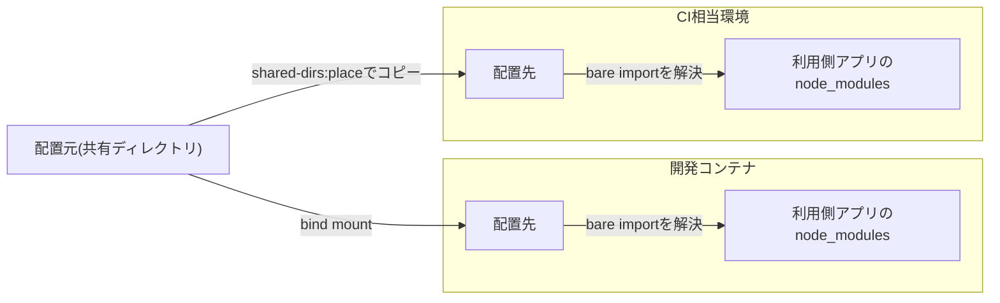

# 共有ディレクトリの配置方式

複数のアプリが使うコードを置く共有ディレクトリを、パッケージマネージャーのワークスペース機能を使わずに各アプリへ配置する方式を定める。あわせて、依存パッケージを利用側アプリで解決する規則、共有ディレクトリ直下に型検査設定を置かない規則、CIでのコピー配置、開発コンテナとCI相当環境で解決結果が一致することの検証の手順と結果を記す。

## 用語

ルート・アプリ・共有ディレクトリ・検査担当は、「[JavaScript・TypeScriptの記法と設定ファイルの規約](001-javascript-typescript-conventions.md#前提と用語)」の用語に従う。本文書では、さらに次の用語を使う。

| 用語         | 意味                                                                                                  |
| ------------ | ----------------------------------------------------------------------------------------------------- |
| 配置元       | 共有ディレクトリの実体があるディレクトリ                                                              |
| 利用側アプリ | 共有ディレクトリを自分の中に配置して使うアプリ                                                        |
| 配置先       | 利用側アプリの中で共有ディレクトリを配置する場所                                                      |
| CI相当環境   | 新しいcloneから始め、ローカルにある依存パッケージやホストからのbind mountを前提としない実行環境       |
| bare import  | 相対パスではなくパッケージ名で指定するimport(例: `import { Hono } from 'hono'`)                       |
| 二重実体     | 同じパッケージが別々のディレクトリから2回読み込まれ、型や`instanceof`、モジュールの状態が食い違う状態 |

## 配置方式

ワークスペース機能を使わず、共有ディレクトリをパッケージとしてリンクしない。共有ディレクトリは、各利用側アプリの中の配置先にディレクトリごと配置し、利用側アプリのコードから相対パスでimportする。

| 環境         | 配置の方法                                                                                |
| ------------ | ----------------------------------------------------------------------------------------- |
| 開発コンテナ | Docker Composeのbind mountで、配置元を各配置先へマウントする                              |
| CI相当環境   | ルートの`bun run shared-dirs:place`で、配置元を`node_modules`を除いて各配置先へコピーする |

- 配置元、利用側アプリごとの配置先、検査担当は、`config/workspace-layout.ts`の`SHARED_DIRS`に定義する。登録の方法は「[一括検査への参加](001-javascript-typescript-conventions.md#一括検査への参加)」に従う。配置先は、開発コンテナのbind mount先と完全に一致させる。一致は`config/workspace-layout.unit.test.ts`が`compose.yaml`と突き合わせて確かめる。
- 配置先はルートの`.gitignore`に書き、Gitの管理対象から外す。配置先の内容は配置元と同じであり、二重に管理しないためである。そのため、新しいcloneには配置先が存在しない。
- bind mountの配置先は、`realpath`で実パスを求めても配置先のパスのままになる。ツールから見ると配置先に実体のコピーがある場合と同じになるため、bind mountとコピーで解決結果が一致する。
- シンボリックリンクでは配置しない。ツールがリンクを実パス(配置元)へ解決し、配置元の位置から依存パッケージと型検査設定を探すため、「[依存は利用側アプリで解決する](#依存は利用側アプリで解決する)」が成り立たない。

### 依存は利用側アプリで解決する

共有ディレクトリのコードのbare importは、配置先から親ディレクトリをさかのぼって、利用側アプリの`node_modules`へ解決させる。

- 利用側アプリは、共有ディレクトリのコードが実行時に使うパッケージを、自分の`package.json`に宣言する。版は共有ディレクトリ側と同じにする(「[依存パッケージの版管理](002-dependency-versions.md)」)。
- 配置先の`node_modules`には中身を持たせない。中身があると、共有ディレクトリのコードのbare importが配置先の`node_modules`へ解決され、二重実体になる。
- 共有ディレクトリ自身が`package.json`と依存パッケージを持つ場合(マイグレーション生成ツール・Storybook・ブラウザテストを共有ディレクトリの位置で実行するためなど)、その`node_modules`は共有ディレクトリの位置で動かすツール専用とする。開発コンテナでは、名前付きボリュームを配置元の`node_modules`にだけマウントし、配置先の`node_modules`へはマウントしない。

### 利用側アプリで解決する理由

「[検証の手順と結果](#検証の手順と結果)」とは別の最小構成で、次の3つの方式を比べた。この最小構成は、検査担当が利用側アプリである共有ディレクトリ(パラメータデコレータとWebフレームワークのbare import、ORMのスキーマ)に加えて、UIライブラリのコンポーネントを持つ共有ディレクトリと、2つ目の利用側アプリを含む。型検査・単体テスト・バンドルのすべてで各パッケージが1つの実体になったのは、利用側アプリの`node_modules`だけで解決する方式だけだった。

| 方式                                               | 実測の結果                                                                                                                                                                    |
| -------------------------------------------------- | ----------------------------------------------------------------------------------------------------------------------------------------------------------------------------- |
| 共有ディレクトリの`node_modules`を配置先にも見せる | 共有ディレクトリのコードと利用側アプリのコードが、同じパッケージを別々の実体として読み込んだ。ORMは型が非互換になって型検査が失敗し、UIライブラリはバンドルに2つ含まれた      |
| 利用側アプリの`node_modules`だけで解決する(採用)   | 型検査・単体テスト・バンドルのすべてで、各パッケージが1つの実体になった                                                                                                       |
| シンボリックリンクで配置する                       | 実パス(配置元)で解決されたため、単体テストは共有ディレクトリのbare importを解決できずに失敗し、バンドルは利用側アプリの型検査設定が適用されずにパラメータデコレータで失敗した |

- 代わりに、利用側アプリが共有ディレクトリの依存パッケージも宣言する必要があり、共有ディレクトリ側と利用側アプリの版をそろえる規約が要る。版の一致は自動では検査しないため、「[依存パッケージの版管理](002-dependency-versions.md)」の手順でそろえる。

## 共有ディレクトリ直下に`tsconfig.json`を置かない

検査担当が利用側アプリである共有ディレクトリ(`SHARED_DIRS`の`checkedBy`に利用側アプリを指定したもの)は、直下に`tsconfig.json`を置かない。配下のディレクトリに置いた場合も、同じ理由でその配下のファイルに利用側アプリの設定が適用されなくなる。

共有ディレクトリのコードは、利用側アプリの`tsconfig.json`の`include`に配置先を含めて型検査する(「[型検査設定の継承](001-javascript-typescript-conventions.md#型検査設定の継承)」)。

- `tsc -p tsconfig.json`は、指定したプロジェクトの設定を、`include`に含まれるすべてのファイルへ適用する。
- esbuild(Wranglerのバンドル)とViteの変換は、ファイルごとに親ディレクトリをさかのぼって最も近い`tsconfig.json`を探し、その設定で変換する。
- 共有ディレクトリ直下に`tsconfig.json`が無ければ、配置先のファイルから最も近い設定は利用側アプリの`tsconfig.json`になる。型検査と変換の両方が、利用側アプリの設定(デコレータの扱いなど)で行われる。
- 直下に置くと、配置先のファイルは変換のときだけその設定で扱われ、利用側アプリの差分が適用されない。さらに、その`tsconfig.json`の相対パスの`extends`は配置先の位置から解決されるため、配置元と配置先でディレクトリの深さが異なると、別のファイルを指すか解決できなくなる。
- 「[利用側アプリで解決する理由](#利用側アプリで解決する理由)」の最小構成では、基底設定にデコレータの設定を持たせず、利用側アプリの差分でデコレータを有効にした構成で、共有ディレクトリ直下に`extends`で基底設定を指す(配置元からの相対パス)だけの`tsconfig.json`を置くと、型検査は成功し、esbuildのバンドルだけがパラメータデコレータで失敗した。`extends`で利用側アプリの`tsconfig.json`を指すと成功した。

検査担当が`self`の共有ディレクトリ(それ自体がアプリ)は、アプリとして直下に`tsconfig.json`を持つため、この規則の対象外である。

- 注意(本文書の検証の対象外): 配置先のファイルは、変換のときに共有ディレクトリの`tsconfig.json`で扱われ得る。採用する前に、その`tsconfig.json`(相対パスの`extends`を含む)が配置先の位置から解決できることと、変換に関わる設定が利用側アプリと一致することを確かめる。

### デコレータ設定を基底設定に置く理由

デコレータの設定は、利用側アプリの差分ではなく基底設定(`tsconfig.base.json`の`experimentalDecorators: true`)が持つ。アプリの`tsconfig.json`では`experimentalDecorators`を指定しない。

- `tsc`とesbuildは、共有ディレクトリのパラメータデコレータを、利用側アプリの`tsconfig.json`(継承した値を含む)のデコレータ設定で検査・変換する。
- Bun 1.4.2は、`extends`を持つ`tsconfig.json`の`experimentalDecorators`を継承元の値だけで決め、継承する側の指定を無視する。利用側アプリの差分だけで有効にすると、`bun test`・`bun build`はパラメータデコレータをエラーも警告も無く消す。
- この挙動は利用側アプリ自身のソースでも同じであり、配置方式とは関係が無い。基底設定に置けば、`tsc`・esbuild・Bunのどの経路でも、共有ディレクトリのデコレータが従来のデコレータとして検査・変換される。
- ルートの`tsconfig.base.unit.test.ts`は、基底設定を継承したアプリでBunがパラメータデコレータを実行することを確かめる。
- 詳しい前提(標準(TC39)のデコレータを使わないこと、`emitDecoratorMetadata`を使わないこと)は「[デコレータの設定](001-javascript-typescript-conventions.md#デコレータの設定)」に従う。

## CIでのコピー配置

CI相当環境には配置先が存在しない。ルートの次のスクリプトで、開発コンテナと同じ配置を再現して確かめる。CIのワークフローは、これらを呼び出すだけでよい。

| スクリプト                   | 内容                                                                                                                      |
| ---------------------------- | ------------------------------------------------------------------------------------------------------------------------- |
| `bun run shared-dirs:place`  | bind mountされていない配置先へ、配置元を`node_modules`を除いてコピーし、続けて配置状態を確認する                          |
| `bun run shared-dirs:verify` | 各配置先の配置状態を表で表示し、問題があれば案内文を表示して失敗する。一括検査(`bun run check`)の最初の段階でも実行される |

CIでは次の順に実行する。

1. ルートと各アプリで`bun install --frozen-lockfile`を実行する。`CI`環境変数が空でなければ、Gitフックの導入は飛ばされる。
2. ルートで`bun run shared-dirs:place`を実行する。依存パッケージのインストールの前後どちらでもよい。
3. ルートで`bun run check`を実行する。
4. テスト(`bun run test:all:unit`など)を実行する。

- テストより先に`check`を実行する。配置の不備を依存の解決エラーより先に示すのは、`check`の最初の段階だけである。アプリのスクリプトや`test:all:*`を単独で実行すると、配置は確かめられず、`Cannot find module`などの解決エラーだけが表示される。
- 二重実体は型検査を通過する場合がある。配置先の`node_modules`の中身は、配置確認(`non-empty-node-modules`)で検出する。

### 配置状態

`shared-dirs:verify`は、各配置先を次のいずれかに判定する。表には`<表示>(<状態>)`の形で表示される。

| 状態                     | 表示                       | 意味                                                                                                  | 案内                                                                        |
| ------------------------ | -------------------------- | ----------------------------------------------------------------------------------------------------- | --------------------------------------------------------------------------- |
| `bind-mounted`           | bind mount                 | 配置先と配置元のinode・デバイスが一致する                                                             | なし                                                                        |
| `copied`                 | コピー                     | 配置先のファイルの一覧(`node_modules`を除く種別・パス・サイズ)が配置元と一致する                      | なし                                                                        |
| `consumer-missing`       | 利用側アプリ未作成で対象外 | 利用側アプリに`package.json`が無いため確かめない。問題としない                                        | なし                                                                        |
| `missing`                | 欠落                       | 配置先が無い                                                                                          | CIでは`bun run shared-dirs:place`を実行し、ローカルではbind mountを確かめる |
| `content-mismatch`       | 内容不一致                 | 配置先の内容が配置元と一致しない。配置先がシンボリックリンクの場合も含む                              | `missing`と同じ                                                             |
| `mount-mismatch`         | マウント不一致             | 配置先がマウントポイント(Linuxの`/proc/self/mountinfo`に載るマウント先)だが、配置元と同じ実体ではない | `compose.yaml`のマウントを確かめ、修正後にコンテナを再作成する              |
| `non-empty-node-modules` | node_modulesの中身あり     | 配置先の`node_modules`に中身があり、二重実体の原因になる。bind mountの配置先でも問題とする            | `compose.yaml`の変更後にコンテナを再作成する                                |

### コピー配置が書き込む配置先

`shared-dirs:place`は、利用側アプリに`package.json`がある配置先のうち、次のものにだけ書き込む。

- 配置先が無い場合は、作成してコピーする。
- 配置先がシンボリックリンクの場合は、リンク自体だけを削除し(リンク先は辿らない)、作成してコピーする。
- 配置先の内容が配置元と一致しない場合は、`node_modules`を残して中身を削除し、コピーし直す。

次の配置先には書き込まない。削除によってホスト側の実体や配置元を消すことを防ぐためである。

- マウントポイント(bind mountの配置先を含む)
- 同一性(inode・デバイス)を読めない配置先
- 配置元と同じ実体の配置先
- すでに`copied`と判定される配置先

その他の振る舞いは次のとおり。

- 配置元がGit管理下のファイルを持たず、新しいcloneに存在しない場合は、空のディレクトリとして扱い、空の配置先を作成する。
- 配置先の`node_modules`は、ボリュームのマウント先のことがあるため削除しない。中身があれば`non-empty-node-modules`として報告される。

### 制約

- `copied`の判定と、コピー配置で書き込みを省く判定は、ファイルの種別・パス・サイズだけで比べ、内容は比べない。配置元のファイルを同じサイズの内容に書き換えた場合や、シンボリックリンクを同じ長さのリンク先へ張り替えた場合は、2回目の`shared-dirs:place`が古い内容を残し、`shared-dirs:verify`も成功する。
  - CIでは新しいcloneに配置先が無く、毎回コピーするため影響しない。開発コンテナでは配置先がbind mountであり、`shared-dirs:place`は書き込まないため影響しない。
  - 同じ作業ツリーで配置元を変更してから配置し直す場合は、配置先を削除してから`shared-dirs:place`を実行する。
- 配置先の内側(`node_modules`以外)にある入れ子のマウントは検出しない。

## 検証の手順と結果

共有ディレクトリのコードが利用側アプリの依存パッケージを読み込む最小構成を、開発コンテナ(bind mount)とCI相当環境(コピー配置)の両方に置き、各コマンドの成否と解決結果を比べた。品質ツールとDrizzle ORMは[主要パッケージの一覧](002-dependency-versions.md)の版、esbuildは一覧のWranglerが固定する版、Bunと`@types/bun`は1.4.2を使った。一覧に無いHonoは、利用側アプリで版を完全に固定して宣言した。

配置方式・Bun・バンドラを変える場合は、同じ手順で再検証する。再検証では「[デコレータの設定](001-javascript-typescript-conventions.md#デコレータの設定)」に従い、利用側アプリの`tsconfig.json`で`experimentalDecorators`を指定しない。

### 最小構成

両環境に同じファイルを置いた。共有ディレクトリは2つで、どちらも利用側アプリを検査担当とする。

- 利用側アプリ
  - `package.json`: 「[スクリプト契約](001-javascript-typescript-conventions.md#スクリプト契約)」の`lint`・`typecheck`・`test:unit`を持ち、「[導入する品質ツール](001-javascript-typescript-conventions.md#導入する品質ツール)」を導入する。共有ディレクトリのコードが使うHonoとDrizzle ORMを`dependencies`に宣言する(共有ディレクトリ自身は`package.json`を持たない)。バンドルの確認のために、Wranglerが固定する版のesbuildを導入する。
  - `tsconfig.json`: 基底設定を継承し、`types: ["bun"]`と、`include`への2つの配置先の追加を差分とする。デコレータの設定は、下記の測定の条件による。
  - `eslint.config.ts`: `createBaseConfig`へモジュールを渡すだけにする。
  - ソース: 利用側アプリのDrizzle ORMの比較関数(`eq`)に共有ディレクトリのテーブルの列を渡し、利用側アプリの`Hono`に共有ディレクトリで作った`Hono`を`route`で結合する。パッケージが二重実体になると、型や`instanceof`が合わなくなる箇所である。
- 共有ディレクトリ
  - Drizzle ORMでテーブルを定義するスキーマ
  - パラメータデコレータの定義と、コンストラクタ引数にそれを付けて`hono`をbare importするクラス(依存性注入のライブラリと同じ形)
  - 共有ディレクトリの位置から`import.meta.resolve`を呼ぶ関数
- 単体テスト: 共有ディレクトリと利用側アプリの間で、`Hono`とDrizzle ORMのテーブルの`instanceof`が成り立つことを確かめる。共有ディレクトリの位置からの`import.meta.resolve`が利用側アプリの位置からと一致することも確かめ、解決先の版と実体パスを出力する。
- バンドル: Wranglerの`bundleWorker`がesbuildへ渡す既定値(`format: "esm"`・`target: "es2024"`・`conditions: ["workerd", "worker", "browser"]`・`keepNames: true`。`tsconfig`は指定しない)を再現し、esbuildのAPIでエントリーポイントをバンドルして、metafileの入力を集計する。

測定の条件として、「[結果](#結果)」の表は、基底設定にデコレータの設定を持たせず、利用側アプリの`tsconfig.json`の差分で`experimentalDecorators: true`を指定した構成で得た。この構成ではBunがパラメータデコレータを実行しない(「[デコレータ](#デコレータ)」)が、表の単体テストはデコレータの実行に依存しない。

### 手順

CI相当環境では、次の順に実行した。

1. リポジトリを一時ディレクトリへ`git clone`し、ルートで`CI=true bun install --frozen-lockfile`を実行する(Gitフックは導入されない)。
2. 最小構成を置き、利用側アプリで`bun install`を実行する。ここで生成した利用側アプリの`bun.lock`を、両環境で使う。
3. 配置前に、ルートで`bun run shared-dirs:verify`と`bun run check`を実行する。
4. ルートで`bun run shared-dirs:place`と`bun run shared-dirs:verify`を実行した後、利用側アプリで`bun run typecheck`・`bun run lint`・`bun run test:unit`とバンドルを、ルートで`bun run check`・`bun run test:all:unit`を実行する。
5. 配置先を1つ削除し、ルートで`bun run check`、利用側アプリで`bun run test:unit`、ルートで`bun run test:all:unit`を実行する。その後、`bun run shared-dirs:place`で配置し直す。
6. 対照として、配置先の`node_modules`へ利用側アプリのパッケージを1つ複製し、`bun run shared-dirs:verify`・単体テスト・型検査・バンドルを実行する。確かめた後に複製を削除する。

開発コンテナでは、次の順に実行した。

1. Linuxのマウント情報(`/proc/self/mountinfo`)で、共有ディレクトリの`node_modules`を配置先へ見せるマウントが無いことを確かめる。
2. 最小構成のうち共有ディレクトリのファイルを配置元に置き(bind mountにより配置先にも見える)、利用側アプリのファイルとCI相当環境で生成した`bun.lock`を置く。利用側アプリで`bun install --frozen-lockfile`を実行し、CI相当環境の4と同じコマンドを実行する(`shared-dirs:place`は使わない)。
3. 置いたファイルを削除し、利用側アプリの`node_modules`(名前付きボリューム)の中身を空に戻す。`git status`が検証前と同じであることを確かめる。

両環境の結果は、次の項目をリポジトリのルートからの相対パスに直して、diffで比べた。

| 経路     | 比べた項目                                                                   |
| -------- | ---------------------------------------------------------------------------- |
| 実行時   | 共有ディレクトリの位置からの`import.meta.resolve`の解決先と、その`realpath`  |
| 型検査   | `tsc --listFilesOnly`が読み込んだファイルの、パッケージごとのルート          |
| バンドル | metafileの入力ファイルの一覧と、パッケージごとのルート・版・ファイル数の集計 |
| 依存     | `bun pm ls --all`の出力と、利用側アプリの`bun.lock`のハッシュ                |

### 結果

各コマンドの成否は次のとおりだった。利用側アプリが無い配置先は、両環境とも`consumer-missing`で対象外になった。

| コマンド                                       | CI相当環境                           | 開発コンテナ                   |
| ---------------------------------------------- | ------------------------------------ | ------------------------------ |
| 配置前の`shared-dirs:verify`                   | 失敗(配置先が`missing`)              | 該当なし(bind mountで配置済み) |
| 配置前の`check`                                | 失敗(最初の段階が`missing`を案内)    | 該当なし(bind mountで配置済み) |
| `shared-dirs:place`                            | 成功(配置先をコピーで配置)           | 使わない                       |
| 配置後の`shared-dirs:verify`                   | 成功(`copied`)                       | 成功(`bind-mounted`)           |
| 利用側アプリの`typecheck`・`lint`              | 成功                                 | 成功                           |
| 利用側アプリの`test:unit`                      | 成功(3件)                            | 成功(3件)                      |
| バンドル                                       | 成功(エラー・警告0件)                | 成功(エラー・警告0件)          |
| ルートの`check`・`test:all:unit`               | 成功                                 | 成功                           |
| 配置先を欠落させた`check`                      | 失敗(最初の段階が`missing`を案内)    | 該当なし(bind mountで配置済み) |
| 配置先を欠落させた`test:unit`・`test:all:unit` | 失敗(`Cannot find module`だけを表示) | 該当なし(bind mountで配置済み) |

#### 解決結果

解決されたパッケージの版と実体パスは、両環境で一致した。

- 版: 両環境とも、利用側アプリの`bun.lock`に記録された版に解決された。`bun pm ls --all`の出力と`bun.lock`のハッシュも両環境で一致した。
- 実行時: 共有ディレクトリのコードのbare importは、利用側アプリの位置からと同じく利用側アプリの`node_modules`配下へ解決され、`realpath`も同じパスだった。
- 型検査: 各パッケージの型定義は、利用側アプリの`node_modules`からだけ読み込まれた。
- バンドル: 各パッケージは、利用側アプリの`node_modules`の1つの実体だけが入力に含まれた。入力ファイルの一覧とmetafileの集計は、両環境でdiffが無かった。
- 共有ディレクトリのファイルは、型検査とバンドルに配置先のパスで入り、配置元のパスでは入らなかった。
- 共有ディレクトリ側の`node_modules`へ解決されたファイルは、実行時・型検査・バンドルのいずれにも無かった。
- 開発コンテナでは、配置元の`node_modules`に名前付きボリュームをマウントしている共有ディレクトリの配置先に、空の`node_modules`ディレクトリが見えた。配置元の`node_modules`を名前付きボリュームにしているため、ホスト側に作られたマウント先の空のディレクトリがbind mount越しに見えるものである。空のため、解決結果に差は出なかった。

#### 配置の不備の表示

- 配置前と配置先を欠落させた状態の`check`は、終了コード1で終わった。最初の段階(`shared-dirs:verify`)が`欠落(missing)`と案内文を表示し、その後に利用側アプリの静的解析(`@typescript-eslint/no-unsafe-*`)と型検査(TS2307)の解決エラーが続いた。
- 利用側アプリの`test:unit`とルートの`test:all:unit`は、配置を確かめず、`Cannot find module`だけを表示して失敗した。CIで`check`をテストより先に実行するのは、このためである。

#### 二重実体の対照

配置先の`node_modules`にパッケージを複製した対照では、次の結果になった。

| 確認                 | 結果                                                                                                                |
| -------------------- | ------------------------------------------------------------------------------------------------------------------- |
| `shared-dirs:verify` | 失敗(`non-empty-node-modules`。コンテナの再作成を案内)                                                              |
| 単体テスト           | 失敗。共有ディレクトリのbare importが配置先の`node_modules`へ解決され、`instanceof`と解決先の一致が成り立たなかった |
| 型検査               | 成功。2つの実体の型が構造的に互換だった                                                                             |
| バンドル             | 成功。ただし同じパッケージが2つの実体として含まれた                                                                 |

型検査だけでは二重実体を検出できない場合がある。検出は配置確認が担う。

#### デコレータ

- `tsc`とesbuildは、共有ディレクトリのパラメータデコレータを、利用側アプリの`tsconfig.json`のデコレータ設定で検査・変換した。基底設定にも利用側アプリにもデコレータ設定が無い構成では、`tsc`はTS1206、esbuildは`Parameter decorators only work when experimental decorators are enabled`で失敗した。
- 利用側アプリの差分だけで`experimentalDecorators: true`を指定した構成では、Bun 1.4.2の`bun test`・`bun build`がパラメータデコレータを標準(TC39)のデコレータとして変換し、エラーも警告も無く消した。利用側アプリ自身のソースでも同じであり、配置方式とは関係なく両環境で同じ結果だった。
- 基底設定に`experimentalDecorators: true`を加えた構成(CI相当環境のみ。利用側アプリの差分の指定は残した)では、Bunも従来のデコレータとして変換してパラメータデコレータを実行し、単体テスト・型検査・バンドルがすべて成功した。利用側アプリで指定しない構成では、`tsc`とesbuildは基底設定の値を継承する。Bunがパラメータデコレータを実行することは、ルートの`tsconfig.base.unit.test.ts`が確かめる。これが「[デコレータ設定を基底設定に置く理由](#デコレータ設定を基底設定に置く理由)」の根拠である。

#### 結論

- 利用側アプリで解決する方式では、開発コンテナ(bind mount)とCI相当環境(`shared-dirs:place`のコピー)で、各コマンドの成否と、解決されるパッケージの版・実体パスが一致した。
- 配置の不備は、一括検査の最初の段階で依存の解決エラーより先に示された。
- Bunのデコレータの扱いは配置方式とは別の課題であり、デコレータの設定を基底設定に置いて対処する。
