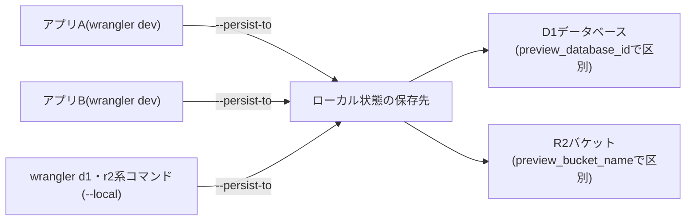

# Wranglerの設定とコマンドの規約

Cloudflare WorkersのアプリをWranglerで開発するときの、ローカル状態(D1・R2などのローカルモードの実データ)の永続化先と複数Worker間での共有方法、及び互換性日付の定め方を定める。

## 前提と用語

1つのリポジトリに、同じD1データベースやR2バケットを使う複数のWorkerアプリがある構成を前提とする。

| 用語                     | 意味                                                                                                                  |
| ------------------------ | --------------------------------------------------------------------------------------------------------------------- |
| Wrangler設定             | 各アプリの`wrangler.jsonc`(または`wrangler.toml`)。ルートの設定と、デプロイ先ごとの`env.<環境種別>`の設定を持つ       |
| ローカル状態             | `wrangler dev`やD1・R2系コマンドのローカルモードが読み書きする、D1データベース・R2バケットなどの実データ              |
| `<ローカル状態の保存先>` | ローカル状態を置くディレクトリ。全アプリで共通の1つの絶対パスを決め、Gitの管理対象外にする                            |
| リソースID               | Wrangler設定のバインディングで、ローカル状態とデプロイ先のリソースを特定する値(D1の`database_id`、R2のバケット名など) |
| `<互換性日付>`           | Wrangler設定の`compatibility_date`に指定する日付。全アプリで共通の1つの日付を決める                                   |

## ローカル状態の永続化と共有

- Wranglerのコマンドのうち`--persist-to`オプションを持つもの(`wrangler dev`、`wrangler d1 execute`、`wrangler d1 migrations apply`、`wrangler r2 object put`など)では、必ず`--persist-to <ローカル状態の保存先>`を付ける。
  - `--persist-to`を付けないと、Wranglerは各アプリ(Wrangler設定のあるディレクトリ)直下の`.wrangler/state`にローカル状態を置く。アプリごとに別々のローカル状態ができ、あるアプリで適用したマイグレーションや投入したデータが他のアプリから見えなくなる。
  - 各コマンドが`--persist-to`を持つかどうかは`wrangler <コマンド> --help`で確かめる。
- 上記のうちローカル状態を操作するD1・R2系のコマンド(`--persist-to`を持つ`wrangler d1 ...`・`wrangler r2 ...`)では、さらに`--local`を付ける。ローカルとデプロイ先(リモート)のどちらを操作するかをコマンドの既定値に任せず明示し、デプロイ先のデータを誤って操作しないようにする。

```sh
wrangler dev --persist-to <ローカル状態の保存先>
wrangler d1 migrations apply <データベース名> --local --persist-to <ローカル状態の保存先>
wrangler d1 execute <データベース名> --local --persist-to <ローカル状態の保存先> --command "SELECT 1"
wrangler r2 object put <バケット名>/<オブジェクトキー> --file <ファイル> --local --persist-to <ローカル状態の保存先>
```

- `@cloudflare/vite-plugin`で起動するアプリも、同じ`<ローカル状態の保存先>`を使うよう設定する。設定方法は[フロントエンドの技術資料](../frontend/README.md)に従う。

### 複数Worker間でのリソースIDの共有

ローカル状態の中のデータベースやバケットは、リソースIDで区別される。同じ`<ローカル状態の保存先>`を使っても、アプリごとにリソースIDが異なると別々のデータベース・バケットとして扱われる。そのため、同じリソースを使う全アプリのWrangler設定で、次の値を同一にする。

| リソース | 同一にする値                         | 備考                                                                                         |
| -------- | ------------------------------------ | -------------------------------------------------------------------------------------------- |
| D1       | `database_id`・`preview_database_id` | `wrangler dev`は`preview_database_id`があればそれを優先して使い、無ければ`database_id`を使う |
| R2       | `bucket_name`・`preview_bucket_name` | `wrangler dev`は`preview_bucket_name`があればそれを優先して使い、無ければ`bucket_name`を使う |
| KV       | `preview_id`                         | `wrangler dev`が優先して使う、KV名前空間のプレビュー用のID                                   |

- デプロイ先ごとの設定(`env.<環境種別>`)でリソースIDを上書きする場合も、同じリソースを使うアプリ間で同一の値にする。環境種別は「[環境種別](002-environments.md#デプロイ先の環境種別)」に従う。



## 互換性日付

- 全アプリのWrangler設定で、ルートの`compatibility_date`に同一の`<互換性日付>`を定義する。`@cloudflare/vite-plugin`でビルドするアプリのWrangler設定も対象に含める。
  - 互換性日付は、Workersのランタイムのどの版の振る舞いを使うかを決める。アプリ間で日付が異なると、同じ共有コードがアプリによって異なる振る舞いをし得る。
  - `compatibility_date`は`env.<環境種別>`へ継承される。`env.<環境種別>`で上書きしない。
- `<互換性日付>`には、互換性フラグ`nodejs_compat`・`nodejs_compat_v2`が既定で有効になる日付以降の日付を選ぶ。その日付以降では両フラグが自動で有効になり、Node.jsの組み込みAPI(`node:crypto`・`node:buffer`など)を追加の設定なしに使える。既定で有効になる日付は、Cloudflareの公式ドキュメント「[Compatibility flags](https://developers.cloudflare.com/workers/configuration/compatibility-flags/)」の、フラグの履歴にある「Node.js compatibility」の項の「Default as of」で確かめる。
  - その日付以降では両フラグは使われないため、`compatibility_flags`に`nodejs_compat`・`nodejs_compat_v2`を指定する必要は無い(指定しても無視される)。
- `<互換性日付>`を変更するときは、全アプリのWrangler設定を同じコミットで変更する。

```jsonc
{
  "compatibility_date": "<互換性日付>",
}
```
