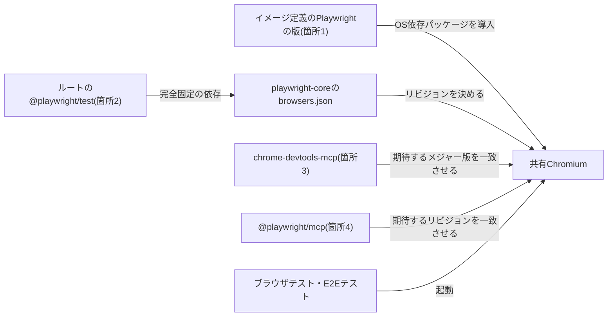

# E2Eテストツールの版の更新手順

E2Eテストツール(Playwright)を更新するときに版を合わせる4箇所、更新の順序、各箇所が期待するChromiumの調べ方、2つのブラウザ操作MCPサーバーの起動確認の手順を定める。

## 前提と用語

| 用語                    | 意味                                                                                                                                                                                                                                                                                                                                                                                                |
| ----------------------- | --------------------------------------------------------------------------------------------------------------------------------------------------------------------------------------------------------------------------------------------------------------------------------------------------------------------------------------------------------------------------------------------------- |
| 共有Chromium            | 開発コンテナに1つだけ導入し、ブラウザテスト・E2Eテスト・ブラウザ操作MCPサーバーが共用するChromium。ルートのPlaywrightが導入したChromiumの実行ファイルへのシンボリックリンクを、環境変数`<共有Chromiumのパスを示す環境変数>`で示す。実際の変数名は、`config/vitest/browser.ts`の`resolveBrowserLaunchOptions`が読む環境変数で、MCPサーバーの設定が実行ファイルのパスの引数で参照する変数と同じである |
| リビジョン              | Playwrightが導入するChromiumのビルドの番号。導入先のディレクトリ名`chromium-<リビジョン>`に現れる。`playwright-core`の`browsers.json`に、リビジョンとChromiumの版(`browserVersion`)が書かれている                                                                                                                                                                                                   |
| ブラウザ操作MCPサーバー | AIエージェントがブラウザを操作するためのMCPサーバー。`playwright-core`に依存する`@playwright/mcp`と、`puppeteer-core`を同梱する`chrome-devtools-mcp`の2つを使う                                                                                                                                                                                                                                     |
| MCPサーバーの設定       | AIエージェントがMCPサーバーを起動するコマンドと引数を書いた設定ファイル                                                                                                                                                                                                                                                                                                                             |

- 共有Chromiumは、ルートの`@playwright/test`が依存する`playwright-core`の版が決めるリビジョンで導入する。導入先はPlaywrightの環境変数`PLAYWRIGHT_BROWSERS_PATH`で決まる。
- 開発コンテナのイメージは、Chromiumが動くために必要なOSのパッケージ(共有ライブラリ)だけを導入する。Chromium本体は、コンテナの中でルートの依存を導入した後に導入する。
- 両MCPサーバーは、共有Chromiumの実行ファイルを起動オプション(`@playwright/mcp`は`--executable-path`、`chrome-devtools-mcp`は`--executablePath`)で受け取り、ブラウザを自分では導入しない。

## 同期すべき4箇所

E2Eテストツールを更新するときは、次の4箇所の版を互いに整合させる。

| 箇所                                                                          | 役割                                                                                                    | 合わせ方                                                                                                                                                                 |
| ----------------------------------------------------------------------------- | ------------------------------------------------------------------------------------------------------- | ------------------------------------------------------------------------------------------------------------------------------------------------------------------------ |
| 1. 開発コンテナのイメージ定義にある、OS依存パッケージを導入するPlaywrightの版 | `playwright install-deps chromium`で、共有Chromiumが使う共有ライブラリを導入する                        | ルートの`@playwright/test`と同じ版にする                                                                                                                                 |
| 2. ルートの`package.json`の`@playwright/test`の版                             | 共有Chromium本体のリビジョンを決める。`playwright`・`playwright-core`は完全固定の依存により同じ版になる | 主要パッケージの一覧の版にする。4箇所の起点になる                                                                                                                        |
| 3. MCPサーバーの設定にある`chrome-devtools-mcp`の版                           | 同梱する`puppeteer-core`が、対応するChromeの版(Chrome DevTools Protocolの世代)を決める                  | 同梱する`puppeteer-core`が期待するChromeのメジャー版を、共有Chromiumのメジャー版と一致させ、実際に起動して確かめる                                                       |
| 4. MCPサーバーの設定にある`@playwright/mcp`の版                               | 依存する`playwright-core`が、期待するChromiumのリビジョンを決める                                       | 依存する`playwright-core`の`browsers.json`のリビジョンを、共有Chromiumのリビジョンと一致させる。一致する版が無ければ最も近いリビジョンの版を選び、実際に起動して確かめる |

- ブラウザテストを持つアプリが導入する`playwright`も、ルートの`@playwright/test`と同じ版にする(「[依存パッケージの版管理](../coding/002-dependency-versions.md#主要パッケージの一覧)」)。



## 更新の順序

Chromiumのリビジョンはルートの`@playwright/test`が決めるため、ルートを起点にして次の順に更新する。4箇所の変更と、変更した`package.json`・`bun.lock`は1つのコミットにまとめる。

1. ルートで`@playwright/test`を、版を明示して更新する。ブラウザテストを持つアプリの`playwright`も、「[全アプリの版をそろえる手順](../coding/002-dependency-versions.md#全アプリの版をそろえる手順)」に従って同じ版にそろえる。

   ```sh
   bun add --dev --exact @playwright/test@<版>
   ```

2. 開発コンテナのイメージ定義で、OS依存パッケージを導入するPlaywrightの版を同じ版にする。イメージのビルドでは、管理者権限で次のコマンドを実行する。イメージを再ビルドし、コンテナを作り直す。

   ```sh
   bunx --bun playwright@<版> install-deps chromium
   ```

3. コンテナの中のルートで、ルートのPlaywrightを使って共有Chromiumを導入し、`<共有Chromiumのパスを示す環境変数>`が示すシンボリックリンクを張り直す。コンテナの起動時にこの処理を行う仕組みがあれば、手順2でコンテナを作り直した時点で済んでいる。

   ```sh
   bunx --bun playwright install chromium
   ln -sfn "$(bun -e "process.stdout.write(require('playwright-core').chromium.executablePath())")" "$<共有Chromiumのパスを示す環境変数>"
   ```

   「[共有Chromium](#共有chromium)」と「[ルートのPlaywright](#ルートのplaywright)」のコマンドで、共有Chromiumの版・リビジョンが、ルートの`playwright-core`の期待する値と一致することを確かめる。

4. `@playwright/mcp`の版を選ぶ。候補の版ごとに「[@playwright/mcp](#playwrightmcp)」のコマンドで期待するリビジョンを調べ、共有Chromiumのリビジョンと一致する版を選ぶ。一致する版が無ければ、リビジョンの差が最も小さい版を選ぶ。
   - `@playwright/mcp`は、ルートと同じ版番号の正式版ではなく、次の版の開発版(alpha)の`playwright-core`に依存することが多い。版番号ではなくリビジョンで突き合わせる。
   - 最新の版は、ルートより新しいリビジョンを期待することが多い。新しい版の`@playwright/mcp`を使いたいときは、先にルートの`@playwright/test`を上げる。
5. `chrome-devtools-mcp`の版を選ぶ。候補の版ごとに「[chrome-devtools-mcp](#chrome-devtools-mcp)」のコマンドで期待するChromeの版を調べ、メジャー版が共有Chromiumと一致する版を選ぶ。一致する版が複数あれば、新しい版を選ぶ。
   - PuppeteerはChromeの安定版を、PlaywrightはChrome for Testingの別のビルドを採るため、ビルド番号まで一致する版は通常無い。メジャー版の一致と、実際の起動で判断する。
6. MCPサーバーの設定に2つのMCPサーバーの版を書き、「[両MCPサーバーの起動確認](#両mcpサーバーの起動確認)」を行う。
7. 実行中のAIエージェントのセッションは、MCPサーバーを再接続するまで古い版を使い続ける。Claude Codeでは`/mcp`で再接続するか、セッションを再起動する。
8. 「[更新後の確認](#更新後の確認)」を行う。

## 期待するChromiumの調べ方

コマンドはリポジトリのルートで実行する。`bun pm view`は、カレントディレクトリに`package.json`が無いと失敗する。

### 共有Chromium

```sh
"$<共有Chromiumのパスを示す環境変数>" --version
readlink -f "$<共有Chromiumのパスを示す環境変数>"
```

- 1行目のコマンドは版(例: `Google Chrome for Testing <版>`)を表示する。2行目のコマンドが表示する実体のパスの`chromium-<リビジョン>`がリビジョンを示す。
- 1行目のコマンドが共有ライブラリの不足で失敗する場合は、OS依存パッケージとChromium本体の版が食い違っている。手順2からやり直す。

### ルートのPlaywright

```sh
bun -e "const { browsers } = await Bun.file('node_modules/playwright-core/browsers.json').json(); const chromium = browsers.find((browser) => browser.name === 'chromium'); console.log(chromium.revision, chromium.browserVersion)"
```

- ルートに導入した`playwright-core`が期待するChromiumのリビジョンと版を表示する。共有Chromiumのリビジョン・版と一致すれば、共有Chromiumはルートの版で導入されている。

### @playwright/mcp

```sh
version=$(bun pm view @playwright/mcp@<版> dependencies.playwright-core)
curl -fsSL "$(bun pm view "playwright-core@$version" dist.tarball)" | tar -xzO package/browsers.json | bun -e "const { browsers } = JSON.parse(await Bun.stdin.text()); const chromium = browsers.find((browser) => browser.name === 'chromium'); console.log(chromium.revision, chromium.browserVersion)"
```

- 1行目のコマンドで依存する`playwright-core`の版を得て、2行目のコマンドでその版のパッケージの`browsers.json`から、期待するChromiumのリビジョンと版を表示する。
- 公開済みの版の一覧は`bun pm view @playwright/mcp versions`、配布タグ(`latest`など)が指す版は`bun pm view @playwright/mcp dist-tags`で得られる。

### chrome-devtools-mcp

```sh
tarball=$(bun pm view chrome-devtools-mcp@<版> dist.tarball)
curl -fsSL "$tarball" | tar -xzO package/build/src/third_party/bundled-packages.json | grep '"puppeteer-core"'
curl -fsSL "$tarball" | tar -xzO package/build/src/third_party/index.js | grep -A1 'const PUPPETEER_REVISIONS'
```

- `chrome-devtools-mcp`は`puppeteer-core`を依存として宣言せず、ビルド済みのファイルに同梱するため、パッケージの中身を読む。2行目のコマンドが同梱する`puppeteer-core`の版を、3行目のコマンドが`PUPPETEER_REVISIONS`の`chrome:`として期待するChromeの版を表示する。
- ファイルの配置はパッケージの版によって変わり得る。見つからない場合は、`curl -fsSL "$tarball" | tar -tz`でファイルの一覧から探す。

## 両MCPサーバーの起動確認

両MCPサーバーを、MCPサーバーの設定と同じ起動コマンドと引数で起動し、共有Chromiumでページを開けることを確かめる。MCPのstdioの通信は1行1メッセージのJSON-RPCのため、要求を標準入力へ順に送り、応答を標準出力で読む。

- 版は、手順4・5で選んだ版にする。
- 成果物の出力先を指定する引数がある場合は、一時ディレクトリに置き換える。リポジトリ内に確認の成果物を残さないためである。
- 次のコマンドの`<MCPサーバーの設定にある他の引数>`には、MCPサーバーの設定にあり、コマンドに書いていない引数(サンドボックスを無効にする引数など)をそのまま書く。

### @playwright/mcpの起動確認

```sh
browser="$<共有Chromiumのパスを示す環境変数>"
{
  printf '%s\n' \
    '{"jsonrpc":"2.0","id":1,"method":"initialize","params":{"protocolVersion":"2025-06-18","capabilities":{},"clientInfo":{"name":"launch-check","version":"1.0.0"}}}' \
    '{"jsonrpc":"2.0","method":"notifications/initialized"}'
  sleep 2
  printf '%s\n' '{"jsonrpc":"2.0","id":2,"method":"tools/call","params":{"name":"browser_navigate","arguments":{"url":"data:text/html,<title>launch-check</title>"}}}'
  sleep 10
  printf '%s\n' '{"jsonrpc":"2.0","id":3,"method":"tools/call","params":{"name":"browser_evaluate","arguments":{"function":"() => navigator.userAgent"}}}'
  sleep 5
} | bunx --bun @playwright/mcp@<版> --executable-path "$browser" --isolated --headless --output-dir "$(mktemp -d)" <MCPサーバーの設定にある他の引数>
```

### chrome-devtools-mcpの起動確認

```sh
browser="$<共有Chromiumのパスを示す環境変数>"
{
  printf '%s\n' \
    '{"jsonrpc":"2.0","id":1,"method":"initialize","params":{"protocolVersion":"2025-06-18","capabilities":{},"clientInfo":{"name":"launch-check","version":"1.0.0"}}}' \
    '{"jsonrpc":"2.0","method":"notifications/initialized"}'
  sleep 2
  printf '%s\n' '{"jsonrpc":"2.0","id":2,"method":"tools/call","params":{"name":"new_page","arguments":{"url":"data:text/html,<title>launch-check</title>"}}}'
  sleep 10
  printf '%s\n' '{"jsonrpc":"2.0","id":3,"method":"tools/call","params":{"name":"evaluate_script","arguments":{"function":"() => navigator.userAgent","pageId":2}}}'
  sleep 5
} | bunx --bun chrome-devtools-mcp@<版> --executablePath "$browser" --isolated --headless <MCPサーバーの設定にある他の引数>
```

- `chrome-devtools-mcp`のページを扱うツールは`pageId`が必須である。新しいセッションでは最初の空白ページが`1`、`new_page`で開いたページが`2`になる。`id`が`2`の応答に表示されたページの番号が異なる場合は、その番号で`evaluate_script`をやり直す。

### 判定

各コマンドの標準出力に、`id`が`1`〜`3`の応答が1行ずつ出る。次をすべて満たせば、そのMCPサーバーは共有Chromiumで起動できている。

| 応答の`id` | 確かめること                                                                                                                                      |
| ---------- | ------------------------------------------------------------------------------------------------------------------------------------------------- |
| `1`        | `serverInfo.version`が起動した版を示す(`@playwright/mcp`は依存する`playwright-core`の版、`chrome-devtools-mcp`は自身の版)                         |
| `2`        | 開いたページのタイトル`launch-check`が含まれ、`"isError":true`が無い                                                                              |
| `3`        | `HeadlessChrome/<メジャー版>.0.0.0`のメジャー版が、共有Chromiumの`--version`のメジャー版と一致する。User-Agentはメジャー版以外が0に縮約されている |

- 応答が出揃う前にコマンドが終わる場合は、`sleep`の秒数を延ばす。初回は`bunx`がパッケージを取得するため時間がかかる。
- 標準入力を閉じると、MCPサーバーは終了し、起動したブラウザも終了する。`--isolated`により、ブラウザは一時的なプロファイルで起動する。

### 失敗時の表示

| MCPサーバー           | 表示                                                                   | 原因と対処                                                                                                 |
| --------------------- | ---------------------------------------------------------------------- | ---------------------------------------------------------------------------------------------------------- |
| `@playwright/mcp`     | `Failed to launch chromium because executable doesn't exist at <パス>` | 共有Chromiumのパスが誤っているか、Chromiumが導入されていない。手順3からやり直す                            |
| `@playwright/mcp`     | `Chromium sandboxing failed!`                                          | コンテナでChromiumのサンドボックスを使えない。`--no-sandbox`を付ける                                       |
| `chrome-devtools-mcp` | `Browser was not found at the configured executablePath (<パス>)`      | 共有Chromiumのパスが誤っているか、Chromiumが導入されていない。手順3からやり直す                            |
| `chrome-devtools-mcp` | `Protocol error (Target.setDiscoverTargets): Target closed`            | ブラウザが起動直後に終了した。コンテナでサンドボックスを使えない場合は、`--chromeArg=--no-sandbox`を付ける |
| `chrome-devtools-mcp` | `Input validation error`と`pageId`                                     | ページを扱うツールに`pageId`を渡していない                                                                 |

## 更新後の確認

- ルートで`bun run test:e2e`が成功する。
- ブラウザテストを持つアプリがあれば、ルートで`bun run test:all:browser`が成功する。
- ルートで`bun run check`が成功する。
- テストの書き方と実行方法は「[テスト戦略](001-test-strategy.md)」に従う。
